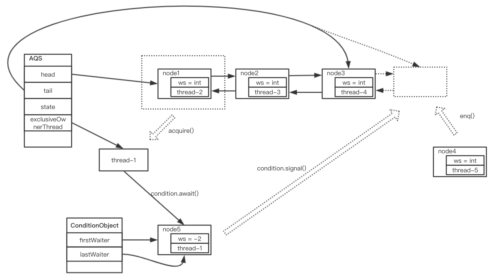

## 简介
AQS 全称 AbstractQueuedSynchronizer，抽象队列同步器，是实现锁和同步器的框架。Java 提供了 `synchronized` 关键字完成同步任务，而且在 Java 1.6 版本对 synchronized 添加了大量优化机制，比如(自适应)自旋锁、锁消除、锁粗化、轻量级锁、偏向锁等，使得 `synchronized` 在线程吞吐量上已不输于 JUC 提供的锁，而且后续 JVM 会不断对 `syncrhonized` 进行优化，它的性能肯定会更加优秀，所以如果可以使用 `synchronized` 尽量使用它。但是遇到某些场景如果单纯地使用 `synchronized` 会显得十分臃肿，比如线程间不同方法有序执行问题(leetcode:1116)时，可以 JUC 提供的信号量锁可以简化同步逻辑，增强代码可读性，比单纯使用 `synchronized` 更具表达力；还有其它使用 `synchronized` 无法完成的情况，比如尝试获取锁，如果获取不到则执行其它逻辑等，所以学习 JUC 还是很有必要的。JUC 提供了丰富的同步工具类，如 ReentrantLock(重入锁)、ReentrantReadWriteLock(读写锁)、Semaphore(信号量)、CountDownLatch(计数锁)。这些锁都是以 AQS 为基础建立起来的，深入了解各种锁的原理 AQS 是一个绕不过的槛儿。本文将以 ReentrantLock 非公平锁(java-1.8.0)为主线介绍 AQS 是如何完成同步工作的，并且会简要介绍其它锁是如何通过扩展 AQS 实现的。

## ReentrantLock
ReentrantLock 与 `synchronized` 都属于排他锁、可重入锁，但它们都有各自特性，如 `synchronized` 不需要手动加锁释放锁，可作用在方法或代码块上，语法简单直观；ReentrantLock 可以根据传入参数选择使用公平锁还是非公平锁，加锁时可以选择跳过加锁还是继续等待，同一个锁可以使用多个条件进行挂起或唤醒。下面会介绍 ReentrantLock 是如何实现 `synchronized` 功能的，然后简要了解 ReentrantLock 其它扩展功能。
### lock 和 unlock
首先，看一下 ReentrantLock 的基本用法

```java
ReentrantLock mLock = new ReentrantLock();

void funSample() {
    // 注意：不要将 lock 写入 try...catch... 中，防止出现加锁失败但在 finally 块中释放锁
    mLock.lock();
    try {
        ...
    } finally {
        // 注意：要将 unlock 放入 finally 方法中，防止出现异常时不释放锁
        mLock.unlock();
    }
    ...
}
```
是不是很眼熟，其实它与下面的代码是一致的
```java
final Object mLock = new Object();

void funSample() {
    synchronized (mLock) {
        ...
    }
    ...
}
```
它们都完成了相同的功能，如果有多个线程同时访问 `funSample()` 方法，第一个获取锁的线程会执行同步块中的代码，其它线程会等待锁释放后再尝试获取锁，获取成功后再执行该代码块。

下图是 ReetrantLock 非公平锁的主要过程


主要过程其实很简单，AQS 内部维护一个等待队列，当遇到 `lock()` 方法时，就去判断当前线程是否可以获取锁，有两种情况：

1. 如果能获取锁，就将当前线程设置到 AQS 内部变量 `exclusiveOwnerThread` 上，代表当前 ReentrantLock 已经有线程持有了，根据名字也可以知道这个锁属于排他锁，其它线程再次获取锁时会加入到等待队列
2. 如果获取不到锁，就代表当前锁被某个线程持有，此线程会加入到等待队列中，等待锁被释放后，再次执行加锁操作

下面是 AQS 内部等待队列模型


等待队列是由 node 链表构成的，起初队列为空，当线程 thread-1 需要锁时，检查 AQS 同步状态（检查内部变量 state）为 0，代表可以获取锁，此时对 state 进行原子性更新，然后将 thread-1 设置到 exclusiveOwnerThread 变量上，代表 thread-1 持有锁。有其它线程如 thread-2 获取锁时，由于 AQS 同步状态为非 0，所以会将此线程封装到一个 node 中（如图中 node1），然后添加到等待队列，其它线程如图中 thread-3、 thread-4、thread-5 会依次尾插添加到队列中。直到 thread-1 释放锁后会从等待队列取出头结点再次加锁，注意，在thread-1 释放锁到队列头获取锁之间是需要时间的，如果在此时间内有其它线程如 thread-5 执行加锁操作，那么 thread-5 就会持有锁，node1 则继续处于等待状态。这个抢占过程就是非公平锁的实现原理。公平锁就没有这个抢占机制，它会依次从队列头取出线程进行加锁处理。

从模型中看出 AQS 工作原理并不复杂，现在可以扎进源码看模型中省略的细节了。

从起点处 `mLock.lock()` 看起，`lock()` 方法最终执行的代码为
```java
// NonfairSync.lock()
final void lock() {
    if (compareAndSetState(0, 1))
        setExclusiveOwnerThread(Thread.currentThread());
    else
        acquire(1);
}
```
这里提一下 `campareAndSetState(0, 1)` 工作作用及原理，它的原型为 
```java
// this 代表 AQS 对象
// stateOffset 为 AQS 成员变量 state 相对于 AQS 对象在内存中的地址偏移量
// expect 为期望值，update 为更新值
unsafe.compareAndSwapInt(this, stateOffset, expect, update);
```
这句话代表，如果 AQS 对象的 state 变量值为 expect 的话，就其设置为 update，返回值为 true，如果 state 变量值不是 expect 的话，则不做处理，直接返回 false，整个过程是原子性的。这种机制就是 CAS(campare-and-swap)，它的原子性是由硬件提供的。比如 java 中的一条代码可能对应 java 字节码中的多条指令，一个字节码中的指令可能对应汇编中的多个指令，一个汇编指令可能对应多个机器指令，所以 java 中的一条代码编译成最终的机器指令时可能对应多个指令，多个指令有同步问题。而 `unsafe.compareAndSwapInt(...)` 就能保证此 java 代码只对应一个机器指令，所以它肯定是原子性的。题题外话，unsafe 类不能通过 `Unsafe.getUnsafe()` 直接获取，会有权限异常，可以通过反射来获取 `Unsafe.theUnsafe` 对象。

回归主题，执行 lock 方法会先尝试更新 AQS 状态，如果更新成功就代表当前线程抢占锁成功，方法结束，然后执行同步块中的代码。抢占失败就会执行获取锁操作 `acquire(1)`，它的最终执行逻辑如下：

```java
public final void acquire(int arg) {
    if (!tryAcquire(arg) &&
        acquireQueued(addWaiter(Node.EXCLUSIVE), arg))
        selfInterrupt();
}
```

方法中先尝试获取锁，如果获取失败则将向等待队列中添加一个 waiter 结点，并根据 waiter 当前位置及其前趋状态执行自旋或挂起处理。先看条件语句中的第一个条件 `tryAcquire(arg)`，跳过中间方法，直接看其执行体
```java
// ReentrantLock.Sync.nonfairTryAcquire
final boolean nonfairTryAcquire(int acquires) {
    final Thread current = Thread.currentThread();
    int c = getState();
    if (c == 0) {
        if (compareAndSetState(0, acquires)) {
            setExclusiveOwnerThread(current);
            return true;
        }
    }
    else if (current == getExclusiveOwnerThread()) {
        int nextc = c + acquires;
        if (nextc < 0) // overflow
            throw new Error("Maximum lock count exceeded");
        setState(nextc);
        return true;
    }
    return false;
}
```
这里可以看到如果 AQS 状态为 0 会直接执行加锁处理，加锁失败直接返回 false；如果 state 为非 0 则判断当前持有锁的线程是不是自身，如果是就在原来的基础上加 acquires，代表重入次数，如果重入次数超出 int 能表示的最大值会出现溢出现象，此处主动抛出一个 error，如果没有溢出则更新 AQS 状态。注意此处更新 AQS 状态没有使用 CAS 机制，原因在于当前线程就是自身线程且持有锁，所以不会出现线程竞争问题。

`addWaiter(Node.EXCLUSIVE), arg)` 创建一个等待排他结点 Node，并使用 CAS 机制把它尾插到等待队列中，并将 node 对象返回。`acquireQueued(node)` 方法如下

```java
// AbstractQueuedSynchronizer.acquireQueued
final boolean acquireQueued(final Node node, int arg) {
    boolean failed = true;
    try {
        boolean interrupted = false;
        for (;;) {
            final Node p = node.predecessor();
            if (p == head && tryAcquire(arg)) {
                setHead(node);
                p.next = null; // help GC
                failed = false;
                return interrupted;
            }
            if (shouldParkAfterFailedAcquire(p, node) &&
                parkAndCheckInterrupt())
                interrupted = true;
        }
    } finally {
        if (failed)
            cancelAcquire(node);
    }
}
```
这个方法有个循环条件，如果新加入的 node 的前趋为 head 且执行 `tryAcquire(arg)` 加锁成功，此时这个 node 就没有必要保留在等待队列中了，将此 node 更新为 head，并将其前趋及持有的线程置空，循环结束，同时不需要 cancel 处理。其它情况，当 node 前趋不是 head 时，进入条件判断，检查是否需要挂起当前线程，`shouldParkAfterFailedAcquire(p, node)` 方法如下：
```java
private static boolean shouldParkAfterFailedAcquire(Node pred, Node node) {
    int ws = pred.waitStatus;
    if (ws == Node.SIGNAL)
        return true;
    if (ws > 0) {
        do {
            node.prev = pred = pred.prev;
        } while (pred.waitStatus > 0);
        pred.next = node;
    } else {
        compareAndSetWaitStatus(pred, ws, Node.SIGNAL);
    }
    return false;
}
```
可以看出，是否挂起当前线程与前趋的等待状态(waitStatus)有关，waitStatus 共有 5 个状态：

1. -1，即 SIGNAL: 如果结点的 waitStatus 为 -1 的话，代表此结点的后继会被挂起，当此结点的被释放后，会对它的后继执行唤醒（unpark）处理。
2. 1，即 CANCELLED: 代表此结点持有的线程被取消，超时或被中断都会导致结点变为取消状态。结点状态一旦变为 1，则会一直处于此状态。
3. -2，即 CONDITION: 代表此结点处于条件队列，指明此结点线程处于等待状态。`condition.await()` 方法会产生此状态的结点，详细过程后文会有介绍。
4. -3，即 PROPAGATE: 此状态在共享锁模式（shared）中使用，表示释放共结点时会传递给其它结点。ReentrantLock 属于排他锁，不会用到这种状态，下文介绍 Semaphore 时会讨论 -3 的作用。
5. 0: 如果结点不属于上面的任何一种状态，它的状态就是 0。

回过头来看 `shouldParkAfterFailedAcquire(pred, node)` 方法，它会先判断 pred（ node 的前趋） 的 waitStatus，如果为 SIGNAL，根据 SIGNAL 状态定义可知应该直接返回 true，表示应该挂起当前线程，其它情况均返回 false 表示不挂起当前线程。其它情况如下，一、 waitStatus 大于 0， 代表 pred 结点处于 CANCELLED 状态，则将 pred 前移直到 pred 状态不大于 0 为直，然后将 node 更新为新 pred 的后继；二、 pred 状态不大于 0 并且不是 -1，则将 pred 状态原子更新为 -1。

回到 `acquireQueued(node, int)` 方法
```java
final boolean acquireQueued(final Node node, int arg) {
    ...
        for (;;) {
            ...
            if (shouldParkAfterFailedAcquire(p, node) &&
                parkAndCheckInterrupt())
                interrupted = true;
        }
    ...
}
```
如果 `shouldParkAfterFailedAcquire(...)` 方法一直返回 false，那么当前线程会一直处于 for 循环中，实现了自旋锁逻辑；如果返回 true，就会进入 `parkAndCheckInterrupt()` 方法执行挂起
```java
// AbstractQueuedSynchronizer.parkAndCheckInterrupt()
private final boolean parkAndCheckInterrupt() {
    LockSupport.park(this);
    // 有两种操作可以结束 park 状态
    // 调用 LockSupport.unpark(thisThread)，此时 Thread.interrupted() 为 false
    // 发送中断信号 thisThread.interrupt()，此时 Thread.interrupted() 为 ture
    return Thread.interrupted();
}
```
到此，`mLock.lock()` 整个过程基本结束了，当前线程要么获取到了锁，执行同步块中的代码；要么处理等待状态，等待前趋释放锁。下面看一个 `mLock.unlock()` 都做了哪些处理，以下为 `unlock()` 方法执行内容
```java
// AbstractQueuedSynchronizer.release
public final boolean release(int arg) {
    if (tryRelease(arg)) {
        Node h = head;
        if (h != null && h.waitStatus != 0)
            unparkSuccessor(h);
        return true;
    }
    return false;
}

// ReentrantLock.Sync.tryRelease
protected final boolean tryRelease(int releases) {
    int c = getState() - releases;
    // 如果 unlock 所处的线程与 lock 时的线程不一致，证明在 lock 与 unlock 之前发生了线程切换，
    // 同步块代码的原子性就会失效，所以要及时抛出异常。这种情况一般是 lock 与 unlock 没有成对出现造成的。
    // 一般写法为：mLock.lock(); try {...} finally {mLock.unlock();}
    if (Thread.currentThread() != getExclusiveOwnerThread())
        throw new IllegalMonitorStateException(); 
    boolean free = false;
    if (c == 0) {
        free = true;
        setExclusiveOwnerThread(null);
    }
    setState(c);
    return free;
}
```
`release()` 方法处于锁中，所以变量更新操作不需要使用 CAS 方法。由于 ReentrantLock 是重入锁，可能会对同一个线程多次加锁，所以会进行多次释放锁，直到释放完所有锁后，才会将 exclusiveOwnerThread 线程置空。然后根据等待队列头结点状态去唤醒其它线程，如果头结点为 null 证明等待队列中没有元素，头结点 waitStatus 为 0 代表头结点后继不需要唤醒，其它情况会进入 `unparkSuccessor()` 方法
```java
private void unparkSuccessor(Node node) {
    int ws = node.waitStatus;
    if (ws < 0)
        compareAndSetWaitStatus(node, ws, 0);
    Node s = node.next;
    if (s == null || s.waitStatus > 0) {
        s = null;
        for (Node t = tail; t != null && t != node; t = t.prev)
            if (t.waitStatus <= 0)
                s = t;
    }
    if (s != null)
        LockSupport.unpark(s.thread);
}
```
此处 node 结点为 head 结点，正常情况会是直接将 head 的后继结点线程唤醒，但是执行 unparkSuccessor 方法时，其它线程可能正在向等待队列添加元素，也有可能此后继处于取消状态。如果 head 后继处于不可唤醒状态，则从队尾向队头遍历，找出最后一个（从队头数第一个）可唤醒的线程，然后将其唤醒。如果没有需要唤醒的线程且等待队列中有元素，这段代码可以保证队列中元素要么是取消状态，要么处于自旋状态。`unparkSuccessor(node)` 方法与之前的 `acquireQueued(addWaiter(Node.EXCLUSIVE), arg))` 方法协作过程如下：


队列中的每个结点都处于 `for(;;)` 循环内，`acquireQueued(...)` 工作时会把队尾 `ws > 0` 的结点清除，比如尾插入 node-new-tail 后发现它的前趋 not-tail 状态为 1，就会向前遍历，直到找到 ws 为 -1 的结点，比如队列中的 node-n，然后将 node-n 后继设为 node-new-tail，node-new-tail 前趋设为 node-n，此时 node-tail 就被删除了，并且 node-new-tail 线程会被挂起。

unparkSuccessor 方法唤醒线程时，根据 head 指示应该唤醒 node-1，但 node-1 状态为 1，所以不会被唤醒，要在队列中寻找能被唤醒的结点，使用的方法如上面所说，从队尾遍历最终找到 node-2，node-2 被唤醒时还处于 acquireQueued 方法的循环中，继续执行循环逻辑，再次尝试获取锁，如果此时锁被其它线程抢占，最终会再次挂起，等待下次唤醒。

### await 和 signal

在 ReentrantLock 中，await/signal 的作用相当于 synchronized 的 wait/notify。它们用法如下
```java
ReentrantLock mLock = new ReentrantLock();
Condition mCondition = mLock.newCondition();

void funSample() {
    mLock.lock();
    try {
        ...
        try {
            mCondition.await();
        } catch (InterruptedException e) {}
        ...
    } finally {
        mLock.unlock();
    }
    ...
}

void otherThreadFun(){
    mLock.lock();
    try {
        ...
        mCondition.signal();
    } finally {
        mLock.unlock();
    }
}
```
synchronized 对应的写法如下
```java
final Object mLock = new Object();

void funSample() {
    synchronized (mLock) {
        ...
        try {
            mLock.wait();
        } catch (InterruptedException e) {}
        ...
    }
    ...
}

void otherThreadFun(){
    synchronized (mLock) {
        ...
        mLock.notify();
    }
}
```
将 `await() / signal()` 方法添加到 AQS 内部等待模型大致如下



图中下半部分的 ConditionObject 就是示例代码中的 mCondition 对象，每个 mCodition 内部会持有一个单向队列，用于保存执行 `await()` 方法的线程。当执行 `signal()` 方法时，会将该结点，如图中 node5，添加到 AQS 的等待队列中等待唤醒。下面将从源码角度查看，线程如何从运行到挂起再到运行的。从起点开始 `mCondition.await()`

```java
// AbstractQueuedSynchronizer.ConditionObject.await
public final void await() throws InterruptedException {
    ...
    Node node = addConditionWaiter();
    int savedState = fullyRelease(node);
    int interruptMode = 0;
    while (!isOnSyncQueue(node)) {
        LockSupport.park(this);
        if ((interruptMode = checkInterruptWhileWaiting(node)) != 0)
            break;
    }
    ...
}
```
方法调用 `addConditionWaiter()` 方法向 `ConditionObject` 对象的condition 队列中尾插一个 `waiter` 结点，如上图的 node5。fullyRelease(node) 作用是释放当前线程锁，fully 的含意是如果此线程有多个锁（重入锁），会将所有的锁一起释放，并保存锁状态（savedState）等待下次获取锁时重新使用 savedState 恢复锁的状态。`fullyRelease(node)` 方法最终会调用 `tryRelease(int)` 方法，tryRelease 方法会检测当前 release 的线程是否为 exclusiveOwnerThread，如果不是则会抛出 `IllegalMonitorStateException` 异常，如果 release 失败也会抛出 `IllegalMonitorStateException` 异常，正常情况，此步骤还处于同步块中，不会出现同步器问题。

`isOnSyncQueue(node)` 判断 node 是否在同步队列（AQS 的等待队列）中，第一次循环时等待队列中肯定没有 node，所以代码会执行到 `LockSupport.park(this)` 此时当前线程会被挂起。问题来了，当前线程挂起后后面的代码就不会执行，此后程序是如何运行的呢？答案在上面的 `fullRelease(node)` 方法，fullRelease 最终会执行下面的方法
```java
// AbstractQueuedSynchronizer.release
public final boolean release(int arg) {
    if (tryRelease(arg)) {
        Node h = head;
        if (h != null && h.waitStatus != 0)
            unparkSuccessor(h);
        return true;
    }
    return false;
}
```
可以看出 `unparkSuccessor(h)` 方法会将等待队列 head 的后继唤醒，说明在执行 `LockSupport.park(this)` 之前会唤醒其它线程。过程大致如下


`fullyRelease()` 方法作用如图中绿线，它推动线程切换，将当前执行的线程 thread-1 放入 ConditionObject 条件队列，将 thread-2 设为当前执行线程，并将 node2 置为 head 的新后继。从这个过程可以看出，`await()` 不会持有锁，挂起当前线程前会主动尝试唤醒其它线程。（注意，此处的唤醒并不代表一定会执行同步块，唤醒后还会尝试加锁操作，加锁成功后才会执行同步块代码。）

如果此时 thread-2 中有个方法 `otherThreadFun()` 方法体如下 (上面提到的)
```java
void otherThreadFun(){
    mLock.lock();
    try {
        ...
        mCondition.signal();
    } finally {
        mLock.unlock();
    }
}
```
`mCondition.signal()` 会对之前某 1 个执行 `mCondition.await()` 的线程进行唤醒，如图中 `condition.signal()` 所示，它会条件队列中的结点（node5）转移到 AQS 等待队列中，在其它前趋线程释放锁后，就轮到 node5 线程执行了（不考虑抢占及加锁失败）。`signal()` 调用方法如下
```java
// AbstractQueuedSynchronizer.ConditionObject.signal
public final void signal() {
    ...
    Node first = firstWaiter;
    if (first != null)
        doSignal(first);
}

// AbstractQueuedSynchronizer.ConditionObject.doSignal
private void doSignal(Node first) {
    do {
        if ( (firstWaiter = first.nextWaiter) == null)
            lastWaiter = null;
        first.nextWaiter = null;
    } while (!transferForSignal(first) &&
                (first = firstWaiter) != null);
}

// AbstractQueuedSynchronizer.transferForSignal
final boolean transferForSignal(Node node) {
    if (!compareAndSetWaitStatus(node, Node.CONDITION, 0)){
        return false;
    }
    Node p = enq(node);
    int ws = p.waitStatus;
    if (ws > 0 || !compareAndSetWaitStatus(p, ws, Node.SIGNAL)){
        LockSupport.unpark(node.thread);
    }
    return true;
}
```

`doSignal(node)` 方法作用是从条件队列中转移一个结点到等待队列中，因为此方法可能同时有多个线程在执行，所以使用到 CAS + while(true) 这对黄金搭档进行转移。`transferForSignal(node)` 方法的作用是将 node 结点添加到 AQS 等待队列中，如果 node 的前趋为取消状态或者不能将 node 的前趋状态更新为 SIGNAL 的话会对 node 的线程唤醒。

可以看出 `signal()` 方法比较简单直接，现在再回到 `await()` 方法中看线程唤醒后是如何处理的
```java
public final void await() throws InterruptedException {
    ...
    while (!isOnSyncQueue(node)) {
        LockSupport.park(this);
        if ((interruptMode = checkInterruptWhileWaiting(node)) != 0)
            break;
    }
    if (acquireQueued(node, savedState) && interruptMode != THROW_IE)
        interruptMode = REINTERRUPT;
    if (node.nextWaiter != null) // clean up if cancelled
        unlinkCancelledWaiters();
    if (interruptMode != 0)
        reportInterruptAfterWait(interruptMode);
}
```
使用 `LockSupport.park(this)` 挂起的线程除了会被 `LockSupport.unpark(theThread)` 正常唤醒外，还会被 `theThread.interrupt()` 中断唤醒。正常情况，此处是被 `signal()` 方法唤醒，下面的 `acquireQueued(node, savedState)` 方法最终也会获取到锁，并恢复当前线程锁状态。非正常情况，比如 thread1 执行 `await()` 方法挂起后，其它线程立即向 thread1 发送中断信号或者在 `acquireQueued(node, savedState)` 过程中接收到中断信号，最后都会根据中断模式做相应处理（REINTERRUPT: 重新标记中断信号，THROW_IE: 向调用者抛出异常）。

至此，ReentrantLock 基本功能部分已经全部分析完毕了，与 `synchronized` 关键字功能一致，在 Java 1.6 之前 ReentrantLock 相对有较大的性能提升。当今版本 `synchronized` 性能已经很高了，如果 ReentrantLock 只有这些功能的话，完全可以从 JUC 包中去除了。下面会介绍 ReentrantLock 提供的其它功能以及 AQS 在其中扮演的角色。

### tryAcquire 与多条件等待
因为 `synchronized` 是关键字，功能所见及所得，程序无法对其功能进行扩展。ReentrantLock 是个类非 final 的类，所以有较大的灵活性，可以对它进行功能扩充。比如 tryAcquire 方法可以在获取锁时如果获取不到可以选择继续等待还是执行其它逻辑，其用法如下
```java
// ReentrantLock mLock = new ReentrantLock(true);
void fun() {
    final boolean locked = mLock.tryLock();
    if (!locked) {
        ...
    } else {
        try {
            ...
        } finally {
            mLock.unlock();
        }
    }
}
```
`mLock.tryLock()` 原理很简单，就是调用上文说的 `ReentrantLock.Sync.nonfairTryAcquire()` 方法，先去抢占锁，成功就返回 true，如果获取不到就返回 false，调用者根据抢占状态做应该处理。更高级的用法是使用 `tryLock(long, TimeUnit)` 指定等待时间，超时后直接放弃加锁操作。指定等待时间代码关键步骤是使用 `LockSupport.parkNanos(obj, nanosTimeout)` 方法添加一个自唤醒挂起。
```java
// AbstractQueuedSynchronizer.doAcquireNanos
private boolean doAcquireNanos(int arg, long nanosTimeout)
        throws InterruptedException {
    ...
    try {
        for (;;) {
            ...
            if (shouldParkAfterFailedAcquire(p, node) &&
                nanosTimeout > spinForTimeoutThreshold)
                LockSupport.parkNanos(this, nanosTimeout);
            ...
        }
    } finally {
        ...
    }
}
```

相对于 `synchronized` 一个锁只有一个条件等待，ReentrantLock 可以有多个条件进行等待和唤醒。ReentrantReadWriteLock 锁就使用了多条件机制，根据当前执行的是读逻辑还是写逻辑使用不同的锁，比如，线程 A 加读锁时发现锁已经被线程 B 持有并且持有的也是读锁，此时，线程 A 不需要等待线程 B 释放锁，可直接进行读操作。读写有三种情况：读读，读写/写读，写写。其它读读不需要等待释放锁。这种功能来自 AQS 框架提供的共享锁实现，方便起见，我们先通过 Semaphore 了解共享锁机制之后再回过头查看 ReentrantReadWriteLock 内部实现。

## Semaphore
与 ReentrantLock 不同，Semaphore 属于共享锁，获取与释放锁过程使用到 AQS 提供的 `xxxSharedxxx()` 相关方法。主要作用为

1. 控制并发量
2. 协同各线程执行顺序

Semaphore 简单模型如下所示


可以看出 AQS 处已经没有 `exclusiveOnwerThread` 变量了，只使用到 state，此处 state 含意代表许可（permit），只有当线程获取到许可后才可能运行，否则会进入等待状态（自旋或挂起）。锁资源、线程和许可的关系类似车间、工人和工位钥匙。比如，车间中有 3 个工位，有很多工人在排队进入车间，前三个工作顺利拿到钥匙，其它工人只能在车间外等待车间内工人工作完并把钥匙归还后才能获取钥匙进行车间工作。下面代码可以体现这个过程
```java
public class ConcurrencyTest {
    // 初始有 3 个许可的信号量对象
    private static Semaphore semaphore = new Semaphore(3);

    public static void main(String[] args) {
        for (int i = 0; i < 10; i++) {
            new Thread(ConcurrencyTest::work, "t" + i).start();
        }
    }

    private static void work() {
        final String name = Thread.currentThread().getName();
        try {
            semaphore.acquire();
            System.out.println(name + " working.");
            Thread.sleep(1000);
            semaphore.release();
        } catch (InterruptedException e) {
            System.out.println(name + " interrupted.");
        }
    }
}
```
注意，与 ReentrantLock 不同，此处 `semaphore.release()` 不要放到 finally 块中，避免出现 `acquire()` 出现异常未获取许可最后却无故释放了一个许可，有可能会引起其它逻辑错误。

Semaphore 在解决不同线程间有序执行方面特别方便，比如线程 1 执行方法 A，线程 2 执行方法 B，如何保证方法 A 在方法 B 之前执行。下面是参考代码

```java
public class ConcurrencyTest {
    private static Semaphore semaphoreA = new Semaphore(0);

    public static void main(String[] args) {
        new Thread(ConcurrencyTest::B, "thread-2").start();

        new Thread(() -> {
            A();
            semaphoreA.release();
        }, "thread-1").start();
    }

    private static void A() {
        System.out.println("function A");
    }

    private static void B() {
        try {
            semaphoreA.acquire();
            System.out.println("function B");
        } catch (InterruptedException ignore) {
        }
    }
}
```
这里只有两个线程，比如有超过两个线程执行多个方法，可以使用多个信号量进行控制。

### acquire 和 release
与 ReentrantLock 相似的是，Semaphore 也不公平非公平之分，也提供了 tryXXX() 方法用于处理获取许可时的策略，还提供了很多其它方法，但最基础莫过于 `acquire` 与 `release` 方法，了解这两个方法的运行机制后，其它方法的思路就一通百通了。

Semaphore 默认是非公平锁，下面就查看 `acquire()` 方法在非公平锁中是如何实现的，它会调用 AQS 的 `acquireSharedInterruptibly()` 方法
```java
// AbstractQueuedSynchronizer.acquireSharedInterruptibly
public final void acquireSharedInterruptibly(int arg)
        throws InterruptedException {
    if (Thread.interrupted())
        throw new InterruptedException();
    if (tryAcquireShared(arg) < 0)
        doAcquireSharedInterruptibly(arg);
}

// tryAcquireShared(arg) 执行体如下
// Semaphore.Sync.nonfairTryAcquireShared
final int nonfairTryAcquireShared(int acquires) {
    for (;;) {
        int available = getState();
        int remaining = available - acquires;
        if (remaining < 0 ||
            compareAndSetState(available, remaining))
            return remaining;
    }
}
```
从 `nonfairTryAcquireShared(int)` 方法看出，获取共享锁只与 AQS 状态（state）有关，使用 CAS 更新 state 如果更新成功就代表加锁成功，更新失败或 remaining 值小于 0 就会进入 `doAcquireSharedInterruptibly(arg)` 方法
```java
private void doAcquireSharedInterruptibly(int arg)
    throws InterruptedException {
    final Node node = addWaiter(Node.SHARED); // tag-1
    boolean failed = true;
    try {
        for (;;) {
            final Node p = node.predecessor();
            if (p == head) {
                int r = tryAcquireShared(arg); // tag-2
                if (r >= 0) {
                    setHeadAndPropagate(node, r); // tag-3
                    p.next = null; // help GC
                    failed = false;
                    return;
                }
            }
            if (shouldParkAfterFailedAcquire(p, node) &&
                parkAndCheckInterrupt())
                throw new InterruptedException();
        }
    } finally {
        if (failed)
            cancelAcquire(node);
    }
}
```
可以看出此方法与之前分析的 `acquireQueued(addWaiter(Node.EXCLUSIVE), arg)` 十分相似，不同点在于等待队列 node 模式为 SHARED（图中 tag-1 处）与 tag-2、tag-3 三处。tag-2 最终执行的是上面 `nonfairTryAcquireShared(int)` 方法，获取失败会进入等待状态，过程与 `acquireQueued(...)` 方法一样。这里主要看下成功时 `setHeadAndPropagate(node, r)` 做了什么处理
```java
// AbstractQueuedSynchronizer.setHeadAndPropagate
private void setHeadAndPropagate(Node node, int propagate) {
    Node h = head; // Record old head for check below
    setHead(node);
    if (propagate > 0 || h == null || h.waitStatus < 0 ||
        (h = head) == null || h.waitStatus < 0) {
        Node s = node.next;
        if (s == null || s.isShared())
            doReleaseShared();
    }
}
```
要理解为什么要使用 `setHeadAndPropagate(node, int)` 而非像 ReentrantLock 那样直接使用 `setHead()`，就要了解 Semaphore 释放许可运行机制。并发下有可能调用多次 `release()` 释放多个许可，也可能调用 `release(arg)` 一次性释放多个许可，但是 `release` 方法只会唤醒一次 AQS head 的后继。以下是 `semaphore.release()` 最终执行代码
```java
// AbstractQueuedSynchronizer.releaseShared
public final boolean releaseShared(int arg) {
    if (tryReleaseShared(arg)) {
        doReleaseShared();
        return true;
    }
    return false;
}

// AbstractQueuedSynchronizer.doReleaseShared
private void doReleaseShared() {
    for (;;) {
        Node h = head;
        if (h != null && h != tail) {
            int ws = h.waitStatus;
            if (ws == Node.SIGNAL) {
                if (!compareAndSetWaitStatus(h, Node.SIGNAL, 0))
                    continue; 
                unparkSuccessor(h);
            }
            else if (ws == 0 &&
                        !compareAndSetWaitStatus(h, 0, Node.PROPAGATE))
                continue;                
        }
        if (h == head)
            break;
    }
}
```
代码证实 `release(arg)` 不管消耗多少个许可，最终都只唤醒一个 head 的后继。回到问题，把 `setHeadAndPropagate()` 换成 `setHead()` 后，就会出现 semaphore 中有许可，等待队列中的线程一直处于等待状态，程序进入死锁状态。现在再看 `setHeadAndPropagate()` 方法应该顺眼很多
```java
private void setHeadAndPropagate(Node node, int propagate) {
    Node h = head; // Record old head for check below
    setHead(node);
    if (propagate > 0 || h == null || h.waitStatus < 0 ||
        (h = head) == null || h.waitStatus < 0) {
        Node s = node.next;
        if (s == null || s.isShared())
            doReleaseShared();
    }
}
```
这个方法做的就是获取许可后，将当前 node 设置为 head，根据一定条件判断是否要唤醒下一个等待队列中的元素。这里的一连串条件是为了保证等待队列中有合适的唤醒对象。

至此，Semaphore 基本功能及实现都已经理清了，同时也了解 AQS 提供的共享锁相关实现。接下来简要查看 Semaphore 提供的其它方法及实现

### 其它方法
- tryAcquire: 尝试获取许可，可立即返回结果也可以指定超时时间
- drainPermits: 清空所有许可
- availablePermits: 查看目前许可个数
- getQueueLength: 获取 AQS 中等待队列长度
- hasQueuedThreads: 等待队列中是否有正在等待的线程
- isFair: 当前共享锁模式是否为公平锁模式

## ReentrantReadWriteLock

不同于 ReentrantLock 只用到了 AQS 的排他锁，Semaphore 只用到了 AQS 的共享锁，ReentrantReadWriteLock 同时使用了两种模式，并通过 WriteLock 和 ReadLock 将 AQS 的两种模式分开处理。WriteLock 原理与 ReentrantLock 一致，只要有线程加锁后，其它线程就会处于等待状态。ReadLock 处理过程就相对复杂许多，因为它需要处理读多写少时写锁‘饥饿’问题，还有写锁重入状态下添加读锁，此时写锁‘降级’问题。ReentrantReadWriteLock 涉及细节较多，后续会结合 StampedLock 一起出一篇文章详细介绍。