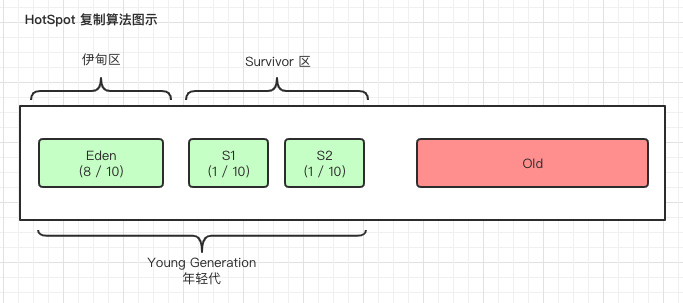

### 垃圾回收过程
1. 标记内存中哪些是垃圾对象
2. 清除垃圾对象

#### 标记算法
1. 计数法
2. 可达性分析

#### 垃圾回收算法
1. 标记-清除算法
2. 复制算法（对新生代对象执行复制算法，因为此区内绝大多数对象都垃圾对象，复制效率高）
3. 标记-整理算法（对老年代执行标记-整理算法，因为此区少部分对象为垃圾对象，复制效率会很低，而且使用复制算法还必须分配额外空间用于转移对象，使用率也会变低）

#### 复制算法模型
