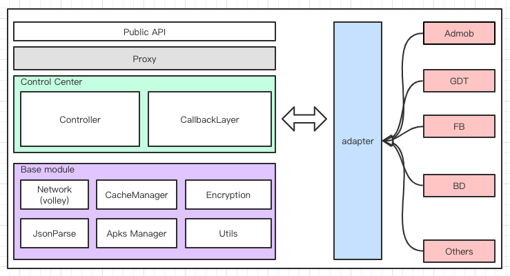

## 项目架构图

## 项目中遇到什么问题
1. 开发者方面的问题
    1. 小白用户，有时需要
    2. 不仔细查看文档的开发者，使用 jar 包方式接入后没有在 Manifest 中配置相应 provider，导致广告正常播放，推广 apk 正常下载，但是一个激活也没有。
2. 三方 Network 方面的问题
    1. 崩溃问题，很多 SDK 在做容错处理时选择抛出异常，处理不当会使用户感觉是我们的 SDK 不稳定
    2. 回调异常，偶现点击一次会给两次点击
3. API 广告源问题
    1. 需要明确定位问题，然后找出解决方案 比如，viewport 设置问题，iframe 加载问题

## 项目优点是什么
对外来说：
1. 接口简单，接入简单

对内来说
1. 模块分层浅析
2. 扩展性
3. 较完善的工作流程

## 项目中遇到哪些挑战
1. 从快速响应用户请求说，将如何缓存（304 机制）。
2. 从提升广告转化率说（本地安装有推广 apk 就不去展示安装类广告），转化率与收益之间的平衡。
3. 快速帮助开发者定位问题，很多开发者描述问题能力有限，甚至描述的带有误导性，一般我们会向它们日志，如果他们提供不了日志，我们会拿到他们有问题的 apk 进行反编译进行排查

遇到的问题及解决方案：
#### 方向旋转问题，
素材不支持屏幕旋转，锁定屏幕为竖屏，素材支持屏幕后，SDK 放开对屏幕的锁定。需求是广告 Activity 与打开这个 Activity 的方向保持一致并且锁定这个方向。

解决方法
setRequestedOrientation(lock) -> onResume -> setRequestedOrientation(getResource().getConfiguration().orientation)