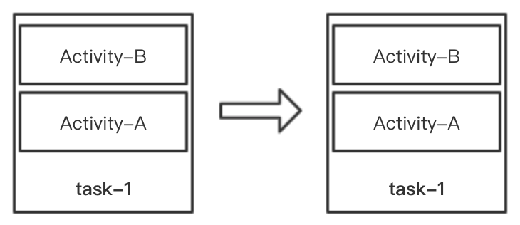

## 概述
最近在看 aosp 源码，Activity 启动流程中涉及到大量 Activity 处理细节，如果不从模型上掌握 Task, affinity 等概念，很容易看迷失在代码里。本文意在从模型上梳理 Activity 启动模式以及对应的设置代表的含意，为继续阅读源码打基础。

## Task，回退栈
一般情况，每个应用包含多个 Activity，这些 Activity 都放到一个栈中。对于一个打开多个 Activity 的应用来说，处于栈顶的 Activity 就是正在显示的页面，点击“返回”按钮时，这个当前栈顶元素被弹出，然后显示新的栈顶 Activity，一直点击“返回”键直接该应用栈中所有元素都被弹出，最后会展示桌面或应用的启动者页面。这个“返回”按钮在英语里叫 Back Button，所以这个栈就叫作 Back-Stack，中文翻译为“回退栈”，回退栈是自然语言中的叫法，在 Android 系统层次称一个回退栈为一个 task。上面说的都是一般情况，可以通过设置 Activity 的启动模式或添加 flags 显示“二般”情况。比如，一个应用可以有多个 Task，一个 Task 中包含多个应用的 Activity 等。下面说说影响 task 的几个属性和几个主要的 flags，看看它们具体直到什么作用。

### `<activity>` 相关属性
* **alwaysRetainTaskState：** 保存整个 task 状态，默认情况下，如果一个 task 长期（比如 30 分钟）处于不可见状态，系统会将这个 task 的非 root 元素全部清空，对应于应用来说就是会只保留“首页”。将此属性置为 true 后，系统就不会清除 task 元素。注意，此属性只对 task 中 root 元素（不一定是 MainActivity）启作用。
* **clearTaskOnLaunch：** 与上面 alwaysRetainTaskState 相反，每次点击启动图标都会清除 task 的非 root 元素，只对 root 元素起作用。
* **finishOnTaskLaunch：** 这个属性比较有意思，它作用在 task 的非 root 元素，比如 task 中有三个 Activity，A-B-C，C 为栈顶元素，B 的 finishOnTaskLaunch 属性为 true，当点击 home 键隐藏此 task，然后在桌面点击此应用的图标展示 task 时，task 元素为 A-C，B 被移除了。
* **launchModel：** 有四种情况，standard, singleTop, singleTask, singleInstance，下面结合图片说明各 model 不同之处

### `<activity>` launchModel
默认情况 launchModel 属性值为 standard，代表每调用调用 `startActivity()` 都会在当前 task 中添加一个 Activity 实例。比如下图向 task-1 中添加 Activity-B

相同情况下，如下 launchModel 属性值为 singleTop 或 singleTask，就会出现以下情况

发现前后 task 没有发生变化，Activity-B 不会创建新的实例，但是会调用 `onNewInstance()` 方法。从这点上区分不开 singTop 和 singleTask，可以从下面两种情况区分，对于同一个 task，如上图，调用 `startActivity()` 方法添加 Activity-A 时，会出现如下情况

可以看出，如果要加入的实例与栈顶元素不同，singleTop 表现就与 standard 没有不同了，但 singleTask 却将历史中的实例之上的 Activity 全部弹出，使实例处于栈顶位置，保证一个 task 中只有一个实例。下面图片可以看出 singleTask 在不同 task 中的表现

task-1 为当前显示的 task，task-2 为退到后台的 task，Activity-X 为 singleTask，当 Activity-B 启动 Activity-X 时，task-2 全栈都会移到 task-1 之上，此时按返回键会显示 Activity-Y，再次点击返回键时才会显示 Activity-B。如果只将 Activity-X 显示到 task-1 之上可以添加 `FLAG_ACTIVITY_CLEAR_TASK` 标识，这样会将 task-2 中非目标元素全部清除。

最后一种模式 singleInstance 最简单了，它一个实例（Activity）占用一个 task。

### affinity
在 AndroidManifest.xml 通过 taskAffinity 可以设置 `<activity>` 的“亲密值”。默认情况下，同一个 task （应用）中所有的 Activity 的亲密值同是同一个字符串--包名。可以设置 affnity 值完成一些特殊的要求。。。

比如使用当前应用 Activity（称为源 Activity）打开目标应用的 Activity（称为目标 Activity）时，目标 Activity 的 launchMode 值为 singleTask，当前应用与目标应用包名不同，默认 taskAffinity 自然不同，这时从源 Activity 打开目标 Activity 就会是从一个 task 跳转到另外一个 task，从表现上来看就像离开了应用一样。这时就可以设置源 Activity 的 taskAffinity 值，使它与目标 Activity 的 taskAffinity 值一样，然后再打开时就不会有离开应用的动画效果了。原因是打开 singleTask 或 FLAG_ACTIVITY_NEW_TASK 属性的 Activity 时，会先确定是否存在一个 task（栈顶） 与 Activity 有相同的 affinity，如果有此 Activity 就添加到这个 task 中，如果没有就新建一个 task。task 之间有跳转会有显示的过渡动效，task 内部跳转过渡动效比较缓和。

affinity 的另一种作用是与 `allowTaskReparenting` 属性配合使用。比如有两个应用，一个是邮件 app，另一个是浏览器 app。邮件中有个链接，点击后使用浏览器打开，正常情况下，点击浏览器打开的会是浏览器首页。如果将邮件所属的 Activity 的 affinity 属性值设置为浏览器的包名，并且浏览器展示链接所属的 Activity 的 allowTaskReparenting 属性为 true，这时再点击浏览器进入的话，就是显示的在邮件中打开的链接的 Activity。图示如下

## 参考
> [Understand Tasks and Back Stack](https://developer.android.com/guide/components/activities/tasks-and-back-stack) 
> [`<activity>`](https://developer.android.com/guide/topics/manifest/activity-element)