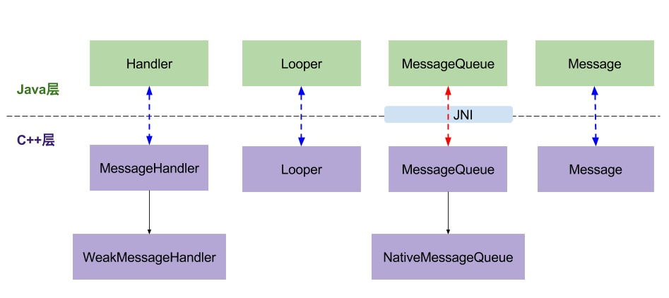

## 概要
Handler 主要有两个作用

1. 定时执行消息或 Runnable 任务
2. 向其它线程发送消息或 Runnable 任务


Handler 是 Android 消息分发处理机制中的一个组件。与 Looper、MessageQueue、Message 共同完成消息发送与处理。它们之间关系如下：每个线程对应一个 Looper、MessageQueue，Handler 对象可以有多个，使用 Handler 对象向 MessageQueue 发送 Message。

工作流程大致如下

1. 执行 `Looper.prepare()` 准备线程消息循环和消息队列（MessageQueue）
2. 执行 `Looper.loop()` 开起无限循环处理消息队列里的任务
3. 创建 `Handler` 对象，使用 sendXxx 或 postXxx 向 MessageQueue 中发送 Message
4. loop 发现 MessageQueue 中有 Message 对象并且到达执行时间，则取出 Message
5. 调用 Message.target.dispatchMessage(msg)，此处的 target 就是步骤 3 中创建的 Handler 对象，`dispatchMessage(msg)` 根据 msg 对象是否有 `callback` 对象（Runnable 对象）
6. 有 `callback` 对象，就直接执行 `callback.run()`
7. 无 `callback` 对象，就进行 `Handler.handleMessage(msg)` 方法进行处理

上面流程中，有两个问题相对复杂
- 问题 1：为什么要调用 Looper.prepare()，它的作用是啥
- 问题 2：MessageQueue 中无消息或消息未到执行时间时是怎么处理的

## 源码分析
本节源码来 Android-8.0.0_r36 和 jdk1.8.0_144

### Looper.prepare() 作用及实现方式

```java
// http://aospxref.com/android-8.0.0_r36/xref/frameworks/base/core/java/android/os/Looper.java#89
89      public static void prepare() {
90          prepare(true);
91      }
92  
93      private static void prepare(boolean quitAllowed) {
94          if (sThreadLocal.get() != null) {
95              throw new RuntimeException("Only one Looper may be created per thread");
96          }
97          sThreadLocal.set(new Looper(quitAllowed));
98      }
```

97 行 sThreadLocal 对象的类型为 `ThreadLocal<Looper>`，其 set(T) 方法如下
```java
 public void set(T value) {
    Thread t = Thread.currentThread();
    ThreadLocalMap map = getMap(t);
    if (map != null)
        map.set(this, value);
    else
        createMap(t, value);
}
```
这里总共出现了三个类：Thread, ThreadLocal, ThreadLocalMap。三者关系 Thread 中内置 ThreadLocalMap 对象，ThreadLocalMap 的 key 为 ThreadLocal<?>，value 为 Object。ThreadLocal 负责初始化 Thread 中 ThreadLocalMap 对象。换句话说就是：每个 ThreadLocal 相当于给 Thread 的附加一个字段数据，并且通过 ThreadLocal 操作当前线程的此字段值。

比如，给 Thread 添加一个字段 `extraName`，可以这样写
```java
public class Sample {

    private static final ThreadLocal<String> sExtraName = new ThreadLocal<>();

    public static void main(String[] args) {
        sExtraName.set("main");

        Thread t1 = new Thread(() -> {
            sExtraName.set("t1");
            printExtraName();
        });

        Thread t2 = new Thread(() -> {
            sExtraName.set("t2");
            printExtraName();
        });

        t1.start();
        t2.start();

        printExtraName();
    }

    private static void printExtraName() {
        System.out.println(sExtraName.get());
    }
}

// 输出值为：
// 
// t2
// t1
// main
```
注意此处 `sExtraName` 应是一个静态常量（避免 `Thread.ThreadLocalMap` 的 key 发生变动），表示所有线程都增加了一个叫 `extraName` 的字段，通过 `sExtraName.set()/get()` 方法处理当前线程的 `extraName`。如果需要添加另外一个变量只需要新建一个 `ThreadLocal<T>` 静态常量就可以。

现在可以回答 1 了，Looper 类中有个静态常量字段 **sThreadLocal** (声明：`static final ThreadLocal<Looper> sThreadLocal = new ThreadLocal<Looper>()`)，执行 `Looper.prepare()` 是为了调用确保当前线程有且只有一个 Looper 对象。添加 Looper 对象方法为 `sThreadLocal.set(new Looper(quitAllowed))`，此时 Looper 对象就附加到线程中了，使用 Handler 发送任务后，Looper 就会从 MessageQueue 中获取 Message 进行处理。如果从线程 A 调用线程 B 中初始化的 Handler 发送任务，就完成了跨线程协作（即文章开头写的 Handler 第二个主要功能）。

### loop 如何实现等待功能

所有的消息都会被添加到 MessageQueue 中，然后 Looper 会不停地从 MessageQueue 中取出 Message 进行处理，处理过程从 `Looper.loop()` 方法开始，代码如下
```java
// http://aospxref.com/android-8.0.0_r36/xref/frameworks/base/core/java/android/os/Looper.java#129
129      public static void loop() {
130          final Looper me = myLooper();
131          if (me == null) {
132              throw new RuntimeException("No Looper; Looper.prepare() wasn't called on this thread.");
133          }
134          final MessageQueue queue = me.mQueue;
             ...
141          for (;;) {
142              Message msg = queue.next(); // might block
143              if (msg == null) {
144                  // No message indicates that the message queue is quitting.
145                  return;
146              }
                 ...
163              try {
164                  msg.target.dispatchMessage(msg);
                     ...
166              } ...
                 ...
195              msg.recycleUnchecked();
196          }
197      }
```
把所有跟踪类信息屏蔽后 loop 工作流程就很清晰了，`msg.target` 就是 Handler 对象，`msg.recycleUnchecked()` 方法是回收 msg 对象，方便 Message.obtain() 重用。这里主要看 `queue.next()` 方法，它可能会造成线程阻塞，代表 loop 进入等待状态

```java
// http://aospxref.com/android-8.0.0_r36/xref/frameworks/base/core/java/android/os/MessageQueue.java#309
309      Message next() {
             ...
320          for (;;) {
                 ...
325              nativePollOnce(ptr, nextPollTimeoutMillis);
326  
327              synchronized (this) {
                     ...
339                  if (msg != null) {
340                      if (now < msg.when) {
341                          // Next message is not ready.  Set a timeout to wake up when it is ready.
342                          nextPollTimeoutMillis = (int) Math.min(msg.when - now, Integer.MAX_VALUE);
343                      } else {
344                          // Got a message.
345                          mBlocked = false;
                             ...
354                          return msg;
355                      }
356                  } else {
357                      // No more messages.
358                      nextPollTimeoutMillis = -1;
359                  }
                     ...
384              }
                 ...
412          }
413      }
```
`nativePollOnce(ptr, nextPollTimeoutMillis)` 方法字面含义是在 native 层轮询一次消息队列，从这里可以看出 Looper 优先处理 native 层的消息。c++ 层与 Java 层 Handler 等对应关系如下



在 Java MessageQueue 的构造方法中会初始化 c++ 中的 MessageQueue、Looper 等相关类。回到 `next()` 方法中，获取 msg 时有三种情况，分别对应三种处理方式

1. 消息队列中有需要立即执行的 msg，如代码 354 行所示，消息队列立即返回 msg，程序回到 loop 循环执行此 msg
2. 消息队列中有 msg 但是当前时间不能执行（msg 为定时任务），如代码 342 行所示，进入 next 的下次循环
3. 消息队列中没有任何 msg，如代码 358 行所示，进入 next 的下次循环

情况 2 和 3 都会再次执行 `nativePollOnce(ptr, nextPollTimeoutMillis)` 方法，不同的时 nextPollTimeoutMillis 不一样，情况 2 为具体值，代表需要等待时间，如果 native 层在此时间内未完成任务会导致超时，然后回到 java 层，此时情况 2 就变成情况 1 了。情况 3 时 nextPollTimeoutMillis 为 -1 代表等待时间为无限大，此时就需要其它方法唤醒了，比如向消息队列发送新消息。

```java
boolean enqueueMessage(Message msg, long when) {
    ...
    synchronized (this) {
        ...
        if (needWake) {
            nativeWake(mPtr);
        }
    }
    return true;
}
```
此处 `nativeWake(mPtr)` 会唤醒 `nativePollOnce(...)` 方法中的等待状态。这两个方法到是 c++ 实现的，基本原理是：
调用 `epoll_wait(mEpollFd, eventItems, EPOLL_MAX_EVENTS, timeoutMillis)` 方法进行等待，代码位置：http://aospxref.com/android-8.0.0_r36/xref/system/core/libutils/Looper.cpp#242 。如果 timeoutMillis 为 -1 时，会由 ` TEMP_FAILURE_RETRY(write(mWakeEventFd, &inc, sizeof(uint64_t)))` 进行唤醒，代码位置：http://aospxref.com/android-8.0.0_r36/xref/system/core/libutils/Looper.cpp#404 。这个唤醒原理是用的 Linux epoll机制中的管道（pipe），对 pipe 读取时，如果 pipe 为空则当前线程阻塞，直到其它线程对此 pipe 写入数据才会唤醒此线程。

现在回答 2，loop 处理无限循环中，它会从 MessageQueue 中调用 `next()` 方法获取 msg，如果当前 MessageQueue 中没有 msg 就会调用 c++ 层中的 epoll_wait 方法阻塞线程，直到 `enqueueMessage(msg, when)` 方法向 MessageQueue 中添加新的 msg，c++ 层会通过 `write` 将阻塞的线程唤醒。