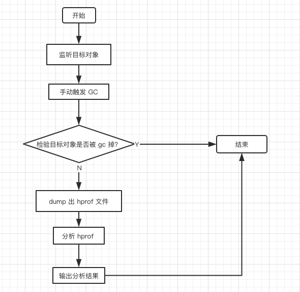

Leakcanary [版本 1.6.3](https://github.com/square/leakcanary/tree/v1.6.3)

## 主要流程



### 使用到的 API 或 工具

#### 监听 Activity onDestroy 回调
```java
application.registerActivityLifecycleCallbacks(new ActivityLifecycleCallbacks(){
    ...
    @Override
    public void onActivityDestroyed(@NonNull Activity activity) {
    }
    ...
});
```

#### 触发 gc
```java
Runtime.getRuntime().gc();
Thread.sleep(100L);
System.runFinalization();
```

#### 监听是否回收
```java
ReferenceQueue<Object> queue = new ReferenceQueue<>();
WeakReference<Object> weakRef = new WeakReference<>(someObject, queue);

// 触发 gc 后，使用 queue 检测 someObject 是否进入回收队列
// 如果 weakRef == queue.poll() 成立，则代表此 weakRef 中的对象被回收了，否则就存在泄露
```

#### 导出 dump.hprof 文件
```java
android.os.Debug.dumpHprofData(directoryPath);
```

#### 分析 hprof 文件
使用工具包 [HAHA](https://github.com/square/haha)
