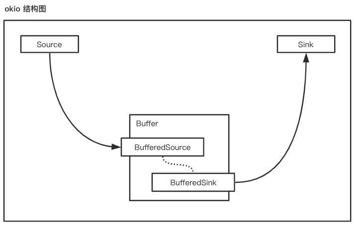
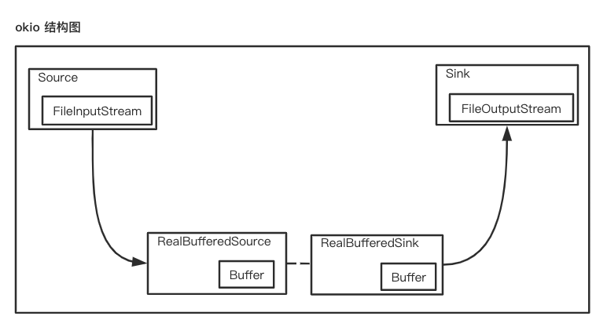
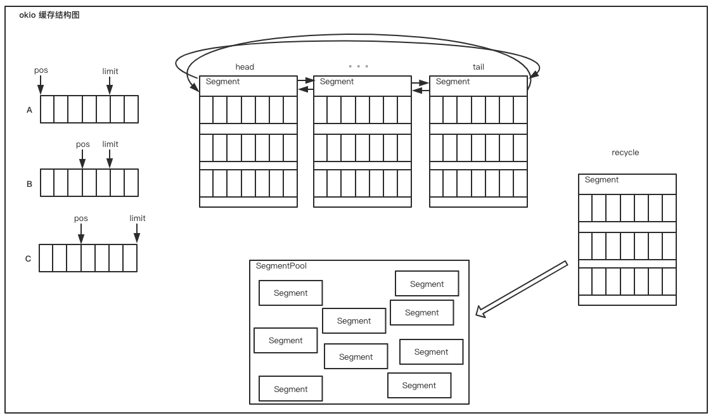
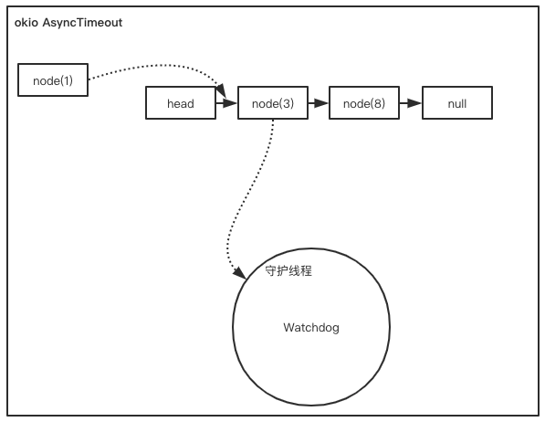

## 1 okio 概念
以下三小节翻译自 [okio 文档](https://github.com/square/okio/tree/okio-parent-1.17.5#okio)。
### 1.1 okio
okio 是对传统 io 和 nio 的扩展库，使数据访问、数据存储及相应处理更加简单。

### 1.2 ByteStrings 和 Buffers
Okio 是围绕 `ByteString` 和 `Buffer` 两种类型来构建的，`ByteString` 和 `Buffer` 提供了简明的 API，并包含了丰富的功能。
- **ByteString** 是一个不可变（immutable）byte 序列。`String` 类型是字符数据的基础（String 是不可变的，比如不能在原变量中修改某个字符），而 `ByteString` 有点像 `String`，但它是用来简化处理二进制数据的。ByteString 是个‘人性化’的类：它知道如何将自身编码/解码成 hex，base64 和 UTF-8 类型的数据。
- **Buffer** 是一个可变（mutable） byte 序列。就像 `ArrayList`，使用者不用提前设置 `Buffer` 的大小。读写 `Buffer` 时，可以把它想像成一个 Queue：把写入的数据放到了队尾，读取时从队头获取数据。使用者不用关心怎么去维护 positions, limits 或 capacities（译注：这些都是相对底层使用到的标记信息，`Buffer` 通过 `Segment` 对象对这些信息进行了封装）。

`ByteString` 和 `Buffer` 内部做了一些聪明的事件来节省 CUP 和 内存资源。比如，使用者把一个 UTF-8 类型的 String 编码为一个 `ByteString`，`ByteString` 会缓存这个 String 的引用，之后对 ByteString 解码时就不需要执行解码操作了。

`Buffer` 内部有一个 `Segment` 的链表。当需要将数据从一个 buffer 转移到另一个 buffer 时，`Buffer` 会改变 `Segment` 的所属对象，这样就避免了来回拷贝数据。这种处理方式在多线程环境下特别好使：一个用于网络传输的线程可以将数据直接传送给工作线程而且不需要任何复制或仪式性（ceremony）的操作。

### 1.3 Sources 和 Sinks

`java.io` 设计优雅的部分是将流（streams）进行分层，一层一层对数据流进行传输处理，比如加密和压缩。Okio 包含了另外的一套流类型叫做 `Source` 和 `Sink`（译注：这种命名来自 guava），它们工作机制与 `InputStream` 和 `OutputStream` 类似，但有如下主要区别：

- **超时。** okio 流对基础 I/O 操作提供了访问超时机制。不像 `java.io` socket 流，okio 中 `read()` 和 `write()` 都支持超时功能。
- **容易实现(implement)。** `Source` 声明了三个方法：`read()`, `close()` 和 `timeout()`。没有需要靠人品方法如 `available()` 或单字节读取操作，单字节读取会导致程序在正确性和性能方面时有‘惊喜’。
- **容易使用。** 尽管 `Source` 和 `Sink` 只有三个方法去实现（implements），调用者通过 `BufferedSource` 和 `BufferedSink` 提供了丰富的 API，这里有你需要的一切。
- **形式上不区分字节流和字符流。** 它们全部是 data。读取和写入时会把 data 当作 byte, UTF-8 字符串，大端 32-bit 整型，小端 short 型；无论做什么，都不会再有 `InputStreamReader`!
- **容易测试。** `Buffer` 类实现了 `BufferedSource` 和 `BufferedSink` 接口，so 你的测试代码会简单清晰。

Source 和 Sink 可以与 `InputStream` 和 `OutputStream` 相互转换（译注：通过 okio 提供的工具方法和实现相关接口来转换）。可以将任何 `Source` 视作 `InputStream`，并且可以把任何 `InputStream` 当作 `Source`。类似的，`Sink` 与 `OutputStream` 也有这样的关系。

## 2 底层实现
本节会从原理及源码角度去分析 okio 的诸多优点，看看别人家的代码是如何写的...

### 2.1 简洁明了 API 背后的逻辑
还记得被 java.io 各种字节流、字符流处理支配的恐惧吗？还记得为了记住 `InputStreamReader` 与 `OutputStreamWriter` 是干什么的而精神分裂吗？是的，这些东西在 okio 里统统没有。okio 里不分字节流、字符流，甚至没有‘流’的概念。它在处理数据的方面更偏向与 nio 中‘块’的概念，在 okio 中叫 `Segment`。`Segment` 是以队列（双向链表）形式存在的，并且 `Segment` 的创建与销毁共享同一个缓存池 -- `SegmentPool`。后面会分析 `Segment` 与 `SegmentPool` 的工作原理。现在先体会一下它简洁的 API，ok, 帖代码，看看 okio 是如何完成文件复制的

```java
@Test
public void readAndSaveFileByOkio() throws Exception {
    final int size = 1024;
    // createTemp(size) 是自定义方法，表示创建一个长度等于 size 字节的文件
    File srcFile = createTemp(size);
    assertTrue(srcFile.exists());

    File desFile = temporaryFolder.newFile();
    assertEquals(desFile.length(), 0L);

    BufferedSource source = Okio.buffer(Okio.source(srcFile)); // 1
    BufferedSink sink = Okio.buffer(Okio.sink(desFile)); // 2

    source.readAll(sink); // 3

    source.close();
    sink.close();

    assertEquals(desFile.length(), size);
}
```
从整个过程来看，只用三行代码完成了数据的转移。这里主要涉及了三个概念 Source, Sink 和 Buffer，Source 代表了数据来源，Sink 代表数据要传输到何方，而 Buffer 就是数据的中转站。它们关系如下：



细分 1、2、3 行代码，可以感觉到第 1、2 行属于构建行为，描绘出数据流动趋势，真正动作的发起者是 `source.readAll(sink)`。现在以 `source.readAll(sink)` 方法为主线，看一下 okio 是如何运行的。

首先看一下 `source` 生成过程，通过工具方法 `Okio.buffer(Source)` 生成一个 `RealBufferedSource` 对象。
```java
public static BufferedSource buffer(Source source) {
    return new RealBufferedSource(source);
}
```
看名字就能猜出对 Source 所有操作会在 `RealBufferedSource` 对象内进行，暂时不需要知道 source 是什么，等到查看 Source 某个方法需要调用到派生类中的方法时再看。同样 `Okio.buffer(Sink)` 会返回一个 `RealBufferedSink` 对象。

进入 `source.readAll(sink)` 方法，即 `RealBufferedSource.readAll(Sink)` 方法
```java
// RealBufferedSource.readAll
@Override 
public long readAll(Sink sink) throws IOException {
    ...
    long totalBytesWritten = 0;
    // 从 source 读取 SIZE 份数据，放入 buffer 中，直到读取值为 -1
    while (source.read(buffer, Segment.SIZE) != -1) {
        long emitByteCount = buffer.completeSegmentByteCount();
        if (emitByteCount > 0) {
            totalBytesWritten += emitByteCount;
            // 向 sink 中写入 emitByteCount 份数据
            sink.write(buffer, emitByteCount);
        }
    }
    ...
    return totalBytesWritten;
}
```
里面代码也挺直白的，因为 source 是个接口，所以要定位 `source.read(buffer, Segment.SIZE)` 的执行者，现在可以看 `Okio.source(srcFile)` 方法了
```java
// Okio.source
public static Source source(File file) throws FileNotFoundException {
    ...
    return source(new FileInputStream(file));
}

// Okio.source
public static Source source(InputStream in) {
    return source(in, new Timeout());
}

// Okio.source
private static Source source(final InputStream in, final Timeout timeout) {
    ...
    return new Source() {
        @Override
        public long read(Buffer sink, long byteCount) throws IOException {
            ...
            try {
                ...
                Segment tail = sink.writableSegment(1);
                // 取最小值，所以一次 read 操作获取的数据可能比需要的 byteCount 少
                int maxToCopy = (int) Math.min(byteCount, Segment.SIZE - tail.limit);
                int bytesRead = in.read(tail.data, tail.limit, maxToCopy);
                if (bytesRead == -1) {
                    if (tail.pos == tail.limit) {
                        sink.head = tail.pop();
                        SegmentPool.recycle(tail);
                    }
                    return -1;
                }
                ...
                return bytesRead;
            } catch (...) {
                ...
            }
        }
        ...
    };
}
```

通过一连串的调用，找到了执行方法体，先搞明白此处的 sink 是 RealBufferedSource 中的 Buffer。暂不需要明白 `Segment` 和 `SegmentPool` 是什么，只需要知道 `Segment` 是 Buffer 的一部分，是真正缓存数据的地方；`SegmentPool` 用来回收和重用 `Segment` 的就可以了。从这里我们可以看出数据从 in 传入了 sink，传入方式为 调用 `FileInputStream.read(byte[] data, int offset, int len)` 方法，将数据写入到 sink 中的缓存中，并返回了读取数据的字节数，如果返回 -1 就代表整个文件已经读取完毕了。现在应该回到之前的 `source.readAll()` 位置：
```java
// RealBufferedSource.readAll
// 从 source 读取 SIZE 份数据，放入 buffer 中，直到读取值为 -1
while (source.read(buffer, Segment.SIZE) != -1) {
    long emitByteCount = buffer.completeSegmentByteCount();
    if (emitByteCount > 0) {
        totalBytesWritten += emitByteCount;
        // 向 sink 中写入 emitByteCount 份数据
        sink.write(buffer, emitByteCount);
    }
}
```
此处 `buffer.completeSegmentByteCount()` 代表 buffer 当前可以一次取出的数据长度，然后执行 `sink.write(buffer, emitByteCount)` 将 source buffer 中的数据写入到 sink 中去，写完后，再去 source 中读取数据，再写到 sink 中，直到 source.read 返回 -1 即代表 source 文件全部读取完毕。最后一步看 `sink.write(...)` 是如何处理的，老办法，因为 sink 为接口，所以要先找它的执行者是哪个类。一路向上查，会看到程序最初时调用的 `Okio.buffer(sink)`
```java
// Okio.buffer
public static BufferedSink buffer(Sink sink) {
    return new RealBufferedSink(sink);
}

// RealBufferedSink.write
@Override
public void write(Buffer source, long byteCount) throws IOException {
    ...
    // 将 source 中的缓存写入 this.buffer 中（并非是直接拷贝，而是对 Segment 进行分割或其它处理，然后替换‘指针’，完成数据转移）
    buffer.write(source, byteCount);
    emitCompleteSegments();
}

// RealBufferedSink.emitCompleteSegments
@Override
public BufferedSink emitCompleteSegments() throws IOException {
    ...
    long byteCount = buffer.completeSegmentByteCount();
    if (byteCount > 0) {
        // 从 buffer 向 sink 传送 byteCount 字节数据
        sink.write(buffer, byteCount);
    }
    return this;
}
```

此处的 sink 是个接口，需要定位其执行者，向上查找可以定位该 sink 是由 `Okio.sink(desFile)` 生成。
```java
// Okio.sink
public static Sink sink(File file) throws FileNotFoundException {
    ...
    return sink(new FileOutputStream(file));
}

// Okio.sink
public static Sink sink(OutputStream out) {
    return sink(out, new Timeout());
}

// Okio.sink
private static Sink sink(final OutputStream out, final Timeout timeout) {
    ...
    return new Sink() {
        @Override
        public void write(Buffer source, long byteCount) throws IOException {
            ...
            while (byteCount > 0) {
                ...
                Segment head = source.head;
                int toCopy = (int) Math.min(byteCount, head.limit - head.pos);
                out.write(head.data, head.pos, toCopy);

                head.pos += toCopy;
                byteCount -= toCopy;
                source.size -= toCopy;

                if (head.pos == head.limit) {
                    source.head = head.pop();
                    SegmentPool.recycle(head);
                }
            }
        }
        ...
    };
}
```
最终可以看到之前存到 `RealBufferedSink` 缓存中的数据以 `out.write(head.data, head.pos, toCopy)` 形式传给了 out (`OutputStream` 对象)，查看 out 对象的执行者可以看到 out.write 最终执行的是 `FileOutputStream.write(byte[] data, int offset, int len)`。

现在了解了更多细节后，可以修改一下之前 okio 结构图了，现在长这样：


纵观 okio 复制文件操作，虽然 API 简单，但本质是就是如下代码：
```java
FileInputStream fis = new ...
FileOutputStream fos = new ...
byte[] buffer = new ...
fis.read(buffer, off, len)
fos.write(buffer, off, len)
```
为了将两行代码 `fis.read` 和 `fos.write` 合并成一行 `source.readAll(sink)` 里里外外多出这么多个类和方法，是为什么？解耦和复用。

想像一下，按原生方法（就是直接使用 fis/fos）实现文件复制功能是好使的，但是需求来了，需要从输入流中获取数据并保存到文件。你觉得不麻烦，再写个方法把 fis 换成 `Scanner scan = new Scanner(System.in)`，感觉也不难。但是面对这样的需求呢：从网络读取，写入到文件或输出到屏幕或传到其它网络上去。。。这样一个方法一个方法写下去应该没几个人会受的了，尤其是遇到类似要对输出的内容‘打码’（比如在内容上加个签名）或添加超时处理时，又要对这几十个方法进行修改(?.?)。okio 抽象出 Source 和 Sink 接口，内部所有操作读取和写入都基于这两个接口，不会涉及到具体实现，这样就把固定的传输方式进行解耦，把写和读在各自派生类中实现，使用统一的方式处理花样的输入输出。

复用指的是对缓存的复用，例如上面每次复制文件都要 `new` 出一个 `byte[]`，即使使用全局的 `byte[]` 也不好，第一就是分配 byte 数组大小问题，第二是同时只能有一个传输序列可以使用这个 byte 数组。okio 提供了一套更好的方案，一起看下 okio 是如何做到复用缓存空间的。

### 2.2 复用缓存
okio 引入了 `Segment` 和 `SegmentPool` 来管理缓存。它们长这样：

缓存是通过一个叫 `Buffer` 的类实现的，`Buffer` 中有个由 `Segment` 组成的双向链表。如图中链表所示，当有数据从缓存中读取时，会从 head 中取出相应长度的数据。如果 head 中数据全部取完，就会 pop 出这个 head，由 head.next 成为新的 head，旧的 head 会被回收进入 `SegmentPool`；当有数据写入缓存时，会向 tail （head.prev）中添加数据，如果 tail 已经占满了，`Buffer` 会在 `SegmentPool` 中取出一个 `Segment` 成为新的 tail。

Segment 内部缓存管理是通过 pos 与 limit 两个游标来实现的。pos 代表应用程序从这个位置的下一个位置开始读取数据；limit 代表应用程序从这个位置开始写入数据。最开始，post 和 limit 都是 0，当有数据写入缓存时，limit 游标就会相应身后移动变成图中 A 状态；当有需要从缓存中取出数据时，pos 游标会相应变化变成图中 B 状态，pos 位置不会大于 limit。当持续向 Segment 中写入数据时，limit 会到达最大值 Segment.SIZE，如图 C 状态，此时如果再有数据写入的话，就会在 Segment 双向队列队尾中新添加一个 Segment 继续添加新缓存。

### 2.3 超时处理
老规矩，先上一段代码，看一下 okio 如何处理 socket 超时问题
```java
@Test
public void readWithoutTimeout() throws Exception {
    // ONE_MB = 1024 * 1024
    // socket(readableCount, writableCount) 是个自定义方法，作用是返回一个客户端 socket，
    // 使用这个 socket 可以向某个服务器 socket 读取 readableCount 数据，可以向这个服务器写入 writableCount 数据
    // 具体实现在下面，扫一眼就可以了与主线分析任务无关
    Socket socket = socket(ONE_MB, 0);
    BufferedSource source = Okio.buffer(Okio.source(socket));
    // 设置超时时间
    source.timeout().timeout(5000, TimeUnit.MILLISECONDS);
    // 请求 ONE_MB 数据
    source.require(ONE_MB);
    source.close();
}

static Socket socket(final int readableByteCount, final int writableByteCount) throws Exception {
    final ServerSocket serverSocket = new ServerSocket(0);
    serverSocket.setReuseAddress(true);
    // 此处 SOCKET_BUFFER_SIZE 是一个比半个 ONE_MB 还小的一个数，
    // 这样做为了增加 socket 缓存->输出->缓存->输出的轮数，进而加大阻塞发生的机率
    serverSocket.setReceiveBufferSize(SOCKET_BUFFER_SIZE);
    Thread peer = new Thread(new Runnable() {
        @Override
        public void run() {
            Socket socket = null;
            try {
                socket = serverSocket.accept();

                // 服务器的写出，即将数据发送给客户端
                OutputStream os = socket.getOutputStream();
                os.write(new byte[readableByteCount]);
                os.flush();

                // 服务器的写入，即从客户端读取数据
                InputStream is = socket.getInputStream();
                int count = 0;
                byte[] result = new byte[writableByteCount];
                while (count < writableByteCount) {
                    // 此处可以体现 SOCKET_BUFFER_SIZE 的作用，SOCKET_BUFFER_SIZE 设置越小，此处执行的循环次数越多
                    int readCount = is.read(result, count, result.length - count);
                    if (readCount == -1) throw new EOFException();
                    count += readCount;
                }
                
                Thread.sleep(5000);
            } catch (Exception ignore) {
            } finally {
                if (socket != null) {
                    try {
                        socket.close();
                    } catch (IOException ignore) {
                    }
                }
            }
        }
    });
    peer.start();

    Socket socket = new Socket(serverSocket.getInetAddress(), serverSocket.getLocalPort());
    socket.setReuseAddress(true);
    socket.setReceiveBufferSize(SOCKET_BUFFER_SIZE);
    return socket;
}
```

其实从最开始文件复制那块代码就可以看出，source 需要的只是个 `InputStream`，不需要知道这个 `InputStream` 真正执行者是 Socket.getInputStream 还是 FileInputStream。返回代码已经帖好了，随便看看吧。跟近代码，看一下这个 `Timeout` 是什么时候设置的，从 `source.timeout().timeout(...)` 开始，由上文知道 source 是个接口(`BufferedSource`)类型，实现类 `RealBufferedSource`，所以此处 source.timeout() 是 RealBufferedSource.timeout()
```java
// RealBufferedSource.timeout
@Override 
public Timeout timeout() {
    return source.timeout();
}
```
此处返回的是 source.timeout() 同样，source 是接口，他们执行者为 `Okio.source(socket)`
```java
// Okio.source
public static Source source(Socket socket) throws IOException {
    ...
    AsyncTimeout timeout = timeout(socket); 
    Source source = source(socket.getInputStream(), timeout);
    return timeout.source(source);
}

// Okio.timeout
private static AsyncTimeout timeout(final Socket socket) {
    return new AsyncTimeout() {
        @Override
        protected IOException newTimeoutException(@Nullable IOException cause) {
            InterruptedIOException ioe = new SocketTimeoutException("timeout");
            if (cause != null) {
                ioe.initCause(cause);
            }
            return ioe;
        }

        @Override
        protected void timedOut() {
            try {
                socket.close();
            } catch (...) {
                ...
            }
        }
    };
}
```
此处可以知道 timeout 是 `AsyncTimeout` 对象，由 timeout 生成过程可以看出在执行超时处理时会关闭 socket，暂时先记下这点，后面会梳理 AsyncTimeout 超时机制。现在看 source 是如何使用 timeout 对象的
```java
// Okio.source
private static Source source(final InputStream in, final Timeout timeout) {
    ...
    return new Source() {
        @Override
        public long read(Buffer sink, long byteCount) throws IOException {
            ...
            try {
                // 如果当前 read 操作超时，会抛出 IOException
                timeout.throwIfReached();
                ...
                return bytesRead;
            } catch (...) {
                ...
            }
        }

        @Override
        public void close() throws IOException {
            in.close();
        }

        @Override
        public Timeout timeout() {
            return timeout;
        }
        ...
    };
}
```
可以看到在开始读取数据时先判断是否到达超时时间，如果超时会抛出一个 `IOException`。现在回到 `return timeout.source(source)` 这句代码，看 `timeout.source` 做了什么事情：
```java
// AsynicTimeout.source
public final Source source(final Source source) {
    return new Source() {
        @Override
        public long read(Buffer sink, long byteCount) throws IOException {
            boolean throwOnTimeout = false;
            enter();
            try {
                long result = source.read(sink, byteCount);
                throwOnTimeout = true;
                return result;
            } catch (IOException e) {
                throw exit(e);
            } finally {
                exit(throwOnTimeout);
            }
        }

        @Override
        public void close() throws IOException {
            boolean throwOnTimeout = false;
            enter();
            try {
                source.close();
                throwOnTimeout = true;
            } catch (IOException e) {
                throw exit(e);
            } finally {
                exit(throwOnTimeout);
            }
        }

        @Override
        public Timeout timeout() {
            return AsyncTimeout.this;
        }
        ...
    };
}
```
很明显做了个代理对象，这个代理对象在开始 read 数据时调用了一个叫 `enter()` 的方法，暂时先把它自成开始计时就可以了。开始计时后通过 source 读取 byteCount 字节数据并写入 sink，细查 source 和 sink 的执行者就会知道，此处的 `source.read` 最终执行的是 `socket.getInputStream().read`；sink 代表 BufferedSource 中的 Buffer。目前为止我们看到的是 `BufferedSource source = Okio.buffer(Okio.source(socket))` 做的所有构建工作，没有任何执行行为，就像浇地一样，现在已经把所有沟渠挖好了，水可以按照挖的路径流，但是现在还没有水~ 现在开始放水，看一下 `source.require(ONE_MB)` 干了什么事情：
```java
// RealBufferedSource.require
@Override 
public void require(long byteCount) throws IOException {
    if (!request(byteCount)) throw new EOFException();
}

@Override 
public boolean request(long byteCount) throws IOException {
    ...
    if (closed) throw new IllegalStateException("closed");
    while (buffer.size < byteCount) {
        if (source.read(buffer, Segment.SIZE) == -1) return false;
    }
    return true;
}
```
先定位 source 执行者，可以发现它就是 AsyncTimeout 中生成的 Source 代理类，每次 read 时，都会打开一个计时器(`entry()`)。这里也可以看出超时不是说在多少时间内传输完某个东西，而是说要在规定时间内传输完成一格（如 Segment.SIZE）数据。比如下载一部 1G 的电影，设置超时时间为 8 秒，不是说 8 秒内下载不完这个电影就抛出超时异常，而是说设置一个缓存区，比如 10k，如果 8 秒内下载不完 10k 才会抛出超时异常。

超时过程已经分析完毕，现在可以腾出时间看一下 okio 是怎么实现定时器的了。开始之前，先中场休息十分钟，看一下风景


十分钟到，把纸收好，我们进入正题。

还记得上面有个 `entry()` 的方法吗？entry 最终执行的是 `AsyncTimeout.scheduleTimeout(AsyncTimeout node, ...)` 方法，此方法是个静态私有方法。scheduleTimeout 会启动一个守护线程，并将 node 添加到一个链表中，链表上所有结点都代表一个 timeout 定时器，到达指定时间后会调用 timeout.timedOut() 方法。



图中每个 node 都是一个 `AsyncTimeout` 对象，为了方便说明，node 后面的数字代表超时时间。Watchdog 是个守护线程，它的 run 方法里维护了一个无限循环逻辑，不断从链表头（head）取出第一个 node(3) 超时时间，然后执行 `AsyncTimeout.class.wait(...)` 等待唤醒。等到 Watchdog 被唤醒时，会再次取从 head 取出第一个 node，此时如果这个 node 是 node(3) 的话，就能判断出此 node 现在已经处于超时状态了，然后会调用 node.timeout() 进行超时处理；如果此时的 node 与之前的不是同一个则证明出现了两种情况：

第一种，这个 node 没有等到超时就已经被处理了，比如所有数据都在规定时间内处理完毕。这样会接着对下一个 node(8) 执行 wait 操作。<br>
第二种，有新的 node 添加到了 head 上，并且这个 node 超时时间更短，如图中 node(1)，此时会将该 node 添加到链表中，并唤醒 Watchdog （`AsyncTimeout.class.notify()`），这时会重复之前的操作，获取第一个 node 的时间并等待唤醒。

如果所有的 node 都处理完毕时，当前 Watchdog 会继续等待一段时间，默认为 60s，此期间如果有新的 node 加入，Watchdog 会被唤醒，执行定时任务，如果没有新 node 加入，这个 Watchdog 会终结。下次有任务执行 `AsyncTimeout.scheduleTimeout(AsyncTimeout node, ...)` 时，会重新创建 Watchdog。

### 待整理部分
有点长了，剩下部分下次分解吧。

1. 大文件传输（Pipe 操作）
2. 其它两种超时操作
3. Options 的 trie（字典树）算法
4. 读写压缩文件