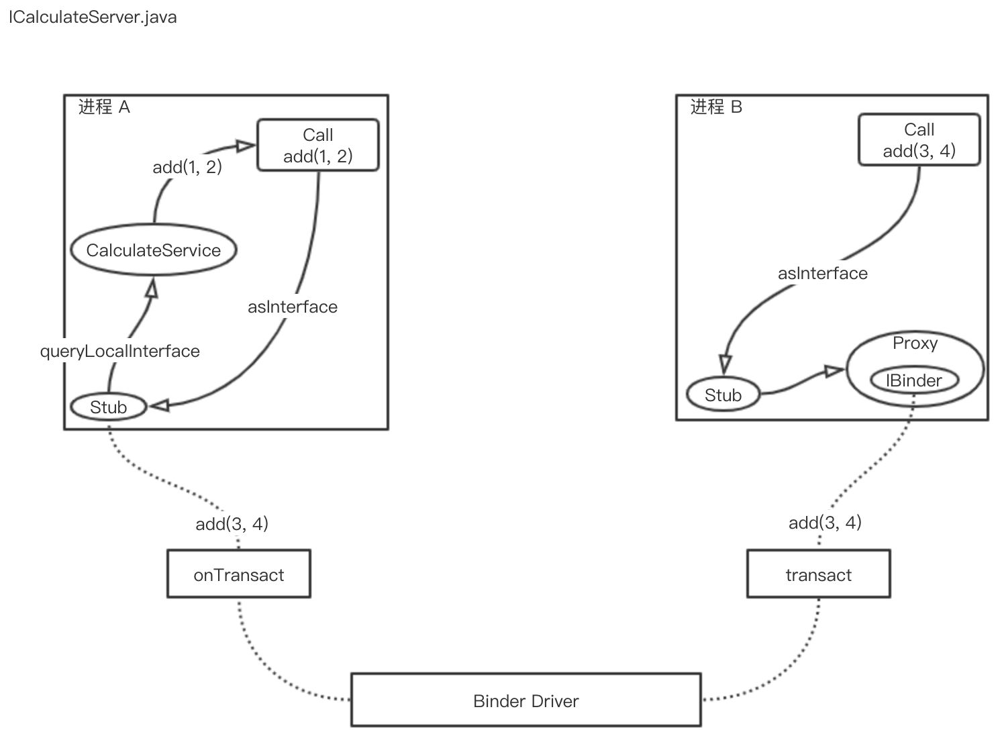

Binder 是 Android 实现跨进程通信（IPC）的一种手段，Android 中每个应用都运行个独自的进程中，每个应用想要正常工作都需要系统服务提供支持，它们之间的信息传递就是基于 Binder 实现。只是因为 Android 对 Binder 层层封装起来普通开发任务接触不到 Binder 层面的接口，所以 Binder 才显示有点神秘。本篇文章将从 Service 组件做为起点，用实例演示 Binder 是如何进行跨进程通信的。

## 如何使用 Binder
Binder 属于 C-S 结构，客户端与服务端属于不同的进程。相信大家第一次使用 Binder 是学习 Service 组件时写的 Hello World 程序。
```java
// Service
public class CalculateService extends Service {

    private final IBinder mBinder = new CalculateBinder();

    public class CalculateBinder extends Binder {
        public CalculateService getService() {
            return CalculateService.this;
        }
    }

    @Override
    public IBinder onBind(Intent intent) {
        return mBinder;
    }

    public int add(int a, int b) {
        return a + b;
    }
}

// Client
public class MainActivity extends AppCompatActivity {
    private static final String TAG = "HelloBinder";

    private CalculateService mService;
    private boolean mBound = false;

    ...

    public void clickAction(View view) {
        if (mBound) {
            Log.d(TAG, "add: " + mService.add(1, 2));
        }
    }

    @Override
    protected void onStart() {
        super.onStart();
        Intent i = new Intent(this, CalculateService.class);
        bindService(i, connection, Context.BIND_AUTO_CREATE);
    }

    @Override
    protected void onStop() {
        super.onStop();
        unbindService(connection);
        mBound = false;
    }

    private ServiceConnection connection = new ServiceConnection() {
        @Override
        public void onServiceConnected(ComponentName name, IBinder service) {
            mService = ((CalculateService.CalculateBinder) service).getService();
            mBound = true;
        }

        @Override
        public void onServiceDisconnected(ComponentName name) {
            mService = null;
            mBound = false;
        }
    };
}

// Manifest
<service android:name=".services.CalculateService" />
```
如果将这 CalculateService 改成跨进程的 Service 只需要添加添加一个 .aidl 文件，修改上面代码中类型换成部分就 ok 了。在 Android Studio 中右键项目显示菜单，选择 AIDL 项，文件如下
```java
// ICalculateService.aidl
package com.iyh.simpleclient;
interface ICalculateService {
    int add(int a, int b);
}
```
其它代码替换如下
```java
// service
public class CalculateService extends Service {

    // 删除 CalculateBinder 类，并使用以下方式获取 binder
    private ICalculateService.Stub binder = new ICalculateService.Stub() {
        @Override
        public int add(int a, int b) throws RemoteException {
            return CalculateService.this.add(a, b);
        }
    };
    ... 隐藏部分与之前程序相同 ...
}

// client
public class MainActivity extends AppCompatActivity {
    private static final String TAG = "HelloBinder";

    private ICalculateService mService; // 此处 Service 就为 ICalculateService

    ... 隐藏部分与之前程序相同 ...

    private ServiceConnection connection = new ServiceConnection() {
        @Override
        public void onServiceConnected(ComponentName name, IBinder service) {
            mService = ICalculateService.Stub.asInterface(service); // 类型转换使用 Stub 提供的方法
            mBound = true;
        }
        ... 隐藏部分与之前程序相同 ...
    };
}

// Manifest
<service android:name=".services.CalculateService"
        android:process=":other"/>
```
可以发现实现跨进程后，代码好象比之前还要简单。这是因为使用 AIDL，Android Studio 根据 ICalculateService.aidl 自动生成 ICalculateService.java，此 java 类利用 Binder 封装了进程交互操作，使调用者不需要关心具体实现。下图描述 ICalculateService.java 运行过程



图中所示 CalculateService 位于进程 A，在进程 A 中调用 `add(1, 2)` 时，`ICalculateService.Stub.asInterface()` 方法会根据 `IBinder.queryLocalInterface(descriptor)` 是否获取 CalculateService 做不同处理。方法名中有个 local 就可以知道它查询的是本地服务，即同进程中的服务，因为调用者与 Service 都在进程 A 中，所以可以获取到 ICalculateService 实例，直接返回对象完成方法调用。

如果获取不到服务代表当前进程中没有 ICalculateService 对象，如从进程 B 中调用 `add(3, 4)` 方法，此时会向调用者返回 Proxy 类，使用此类完成跨进程调用，调用过程如图虚线所示，调用 `transact(...)` 方法将计算数据（3和4）传到服务端，服务端完成计算后将结果通过 `onTransact(...)` 方法传回。transact 和 onTransact 都是通过序列化数据完成的，它们实现如下
```java
// transact
public int add(int a, int b) throws android.os.RemoteException {
    android.os.Parcel _data = android.os.Parcel.obtain();
    android.os.Parcel _reply = android.os.Parcel.obtain();
    int _result;
    try {
        // DESCRIPTOR 为 ICalculateService 全限定类名
        _data.writeInterfaceToken(DESCRIPTOR);
        _data.writeInt(a);
        _data.writeInt(b);
        mRemote.transact(Stub.TRANSACTION_add, _data, _reply, 0);
        _reply.readException();
        _result = _reply.readInt();
    } finally {
        _reply.recycle();
        _data.recycle();
    }
    return _result;
}

// onTransact
@Override
public boolean onTransact(int code, android.os.Parcel data, android.os.Parcel reply, int flags) throws android.os.RemoteException {
    java.lang.String descriptor = DESCRIPTOR;
    switch (code) {
        ...
        case TRANSACTION_add: {
            data.enforceInterface(descriptor);
            int _arg0;
            _arg0 = data.readInt();
            int _arg1;
            _arg1 = data.readInt();
            // 此处 add 方法调用 CalculateService 中的 add 方法完成计算
            int _result = this.add(_arg0, _arg1);
            reply.writeNoException();
            reply.writeInt(_result);
            return true;
        }
        ...
    }
}
```
以上是 Binder 机制的上层 API 接口，下面会介绍 Binder 底层实现原理。

## Binder 的底层原理