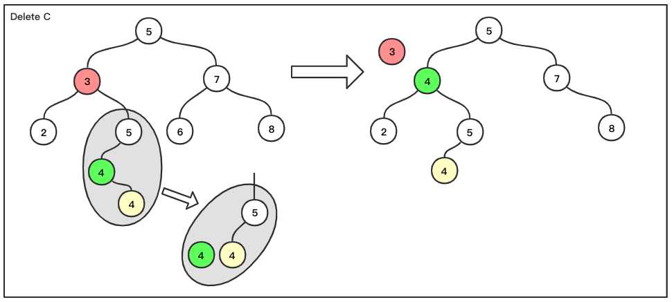
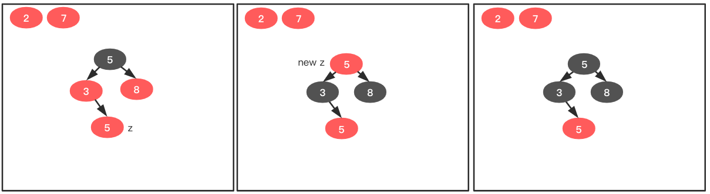
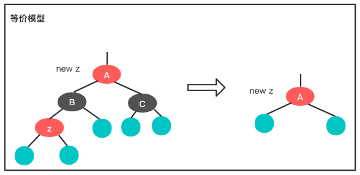

java 集合 HashMap 的 TreeNode 就是棵红黑树。

红黑树只有以下 5 条性质（很简单，很好记，最好按顺序记忆）

1. 树中结点只有两种颜色，红色和黑色
2. 树的根是黑色结点
3. 每个叶结点（`nit[T]` 也叫哨兵结点）都是黑色结点
4. 红色结点的子红点必须为黑色结点
5. 对任意结点，从它到它子孙叶结点的所有路径上包含相同数目的黑色结点

红黑树特点：查找效率高，即使在最坏情况下也有很好的性能，因为红黑树最长路径（红黑相间）高度不会比最短路径（全是黑结点）多出一倍。红黑树是一种特殊的二叉查找树，理解红黑树的构建、插入、删除操作，需要先明白以下概念

1. 二叉查找树
2. 中序遍历（LDR 遍历）
3. 前趋、后继
4. 左旋、右旋

本文会从上面的概念说起，最终会讲解如何修正红黑树。

## 二叉查找树
为了方面叙说，作以下说明：
如果 k 为一个结点，那么 `key[k]` 为结点 k 的值，`left[k]` 为结点 k 的左孩子结点，`right[k]` 为结点 k 的右孩子结点，`p[k]` 为结点 k 的父结点。
`root(T)` 为二叉树的根结点

二叉查找树是一棵有序的树，对于树中的结点 k 来说，它的任意左子孙结点 l 都有如下规则: `key[l] <= key[k]`；它的任意右子孙结点 r 都服从 `key[k] <= key[r]` 规则。比如下面两个都是二叉查找树

### 插入
现在使用这两个树展示插入操作，插入值为 6：

图中每条蓝色的线代表一次比较操作，很明显向 B 中插入一个数所需的步骤比较多，这种情况是由于树太‘偏’造成的，如果所有的树都像 A 这样‘正’就完美了。

### 删除
删除结点有三种情况 
情况一：待删除结点 k 是叶子结点，比如 A 中的 2 5 6 8 结点，B 中的 5 6 8 结点，对于这些结点直接删除就可以了，删除后不会破坏二叉查找树特性，因为除了被删除的结点，其它结点没有任何变化； 
**情况二**：待删除结点 k 有一个孩子，如 B 中的 2 3，对于这些结点删除后用它的子结点直接放到删除结点的位置 
情况三：待删除结点 k 有两个孩子，如 A 中的 5 3 7 结点，B 中的 7 5 结点，此时将 k 删除，取出 k 中序遍历的后继放到 k 的位置，就完成了删除处理

下图解释了什么是中序遍历，什么是前趋和后继

不知道是谁把 LDR 遍历翻译成了中序遍历，反正我总是把它与前序遍历后序遍历搞混。感觉直接记 LDR、LRD、DLR 会比较知道是什么顺序。

OK，知道如何找 LDR 顺序的后继了，下面用图表示，如果删除有两个孩子的结点。最简单的一种情况如下（红色代表待删除结点，绿色代表后继，有红绿色盲的姥爷对不住了。。。）

上面两种操作本质是一样的，待删除结点的后继都没有孩子结点，这种情况，直接将后继替换掉红色结点就完成删除操作了。但是另外一种情况需要多处理一步，比如下图：

此时绿色节点有个右孩子（绿色结点为红色结点 LDR 序的后继，所以它不可能有左孩子），需要先对灰色部分处理，处理方式如 **情况二** 先对绿色结点进行删除，然后使用绿色节点替换红色节点最终完成删除操作。

### 左旋与右旋

回头看一下最开始的两个二叉树 A 和 B，从根结点角度看，B 树明显向右偏了，造成查找困难，需要对它左旋操作来纠正这个问题。下面图片展示如何旋转

图中青色结点代表任意子树，注意绿色线条的变化。现在对二叉树 B 进行旋转

经过几次旋转，最终将二叉树 B 转换成二叉树 A 的样子。在做转换的过程中如何选取结点进行旋转是靠肉眼看的，谁也不知道脑子是如何计算的，但是利用红黑树可以做到使树一直处于较平衡状态。

## 红黑树

红黑树中每个结点都包含五个域：color, key, left, right 和 p。如果某个结点没有一个子结点或父结点，那么这个结点的相应指针域为 `nil[T]`（`nil[T]` 称为哨兵，它的 color 为黑）。红黑树长这样：

这棵树满足了红黑树的 5 个特性。方便起见，以后不再画出哨兵结点。

### 从零开始构建一棵红黑树
构建过程要遵循以下顺序

1. 新添加的结点 color 为红色
2. 添加结点要保持二叉查找树特性：`key[left[k]] <= key[k] <= key[right[k]]`
3. 添加完成后，如果此结点破坏了红黑树 5 个性质，则需要将此树处调整为红黑树后，再继续下面操作
4. 重复 1 到 3 步骤，直到构建完成

以文章开始的树结点为例，全程构建一个红黑树，现在有一组数：2 7 5 3 8 5

向空红黑树中添加一个结点，记为 z，添加后发现它破坏了性质 2，需要对其进行处理，因为它本身是个 root，所以直接涂黑就满足条件了

再向红黑树中添加一个结点，记为 z，添加后数了数 5 个性质，发现一个都没有破坏，不需要处理

再向树中添加一个结点，记为 z，巧了，还是没有破坏红色树性质，不需要处理

再向树中添加一个结点，记为 z，这此破坏了性质 4，需要进行处理。

遇到这种情况需要看 z 结点的叔叔结点（就是结点 8），结点 8 颜色为红色，所以将 `p[z]` 与 z 的叔叔结点涂成黑色，并将 `p[p[z]]` 涂成红色，然后把 `p[p[z]]` 当成新的 z 结点，现在旧的 z 结点已经处理完毕了，new z 又破坏了性质 2，但是 new z 为根结点，所以直接将其涂黑，结束。现在解决了这棵树又是一个正常红黑树了。暂时不清楚“这种情况”是什么情况没关系，先走完这个构建过程，后面为解释清楚“各种情况”实质上就四种，每种都有对应的处理方式。一会回过头看一眼就清楚了。

剩下的两个结点都不会对红黑树产生破坏，所以最终构建完成。

从上面的步骤可以看出，插入新结点前，当前所有结点都满足红黑树性质，而且新添加的结点肯定会取代某个哨兵结点，而这个哨兵结点的父结点要么是红色，要么是黑色（空树只有一个哨兵，也是黑色的），如图

敲黑板。现在开始分析上文说的 “四种情况”，如图所示，我们把左边的这种情况称为“情况一”。

情况一特征：插入结点的父结点（图中结点 A）为黑色。添加一个红色结点后，只有以下两种情况：

局部不会破坏红黑树性质，而且其它部分没有改动，所以“情况一”时，添加直接添加就可以了，不需要额外处理。下面看其它情况

图中青色结点代表符合红黑树性质的子树

情况二特征：新插入结点 z 的父结点、叔叔结点都为红色。

此时结点 z 破坏了性质 4，为了修正这个问题，把 B 涂成黑色，但是 B 涂成红色后，又会破坏性质 5，所以把 C 也得涂黑，此时局部树（以 A 为根的树）没有问题了，但是会有全局问题。因为性质 5 是对全部结点来说的，将 B C 涂黑后，这两条路径上就多出来个黑色结点，所以在全局看会破坏性质 5，因此需要将 A 结点涂成红色，此时以 A 为根的局部树没有问题了，全局树起码没有性质 5 问题了，有没有其它问题暂时不清楚，所以此时就得把结点 A 当作新的结点 new z，然后对 new z 进行新一轮处理，处理过程与处理旧 z 过程一致，这个过程中会不断将问题结点上移，最终会解决所有问题。

暂时不去管 A 变为红色结点后会有什么问题，先看看情况三、情况四如何处理，其实将情况四进行一次左旋就变成情况三了，如图

情况三特征：z 的叔叔结点是黑色，而且 z 是左孩子。对于情况三，z 破坏了性质 4，所以要把 B 涂黑，涂黑 B 后会发现又破坏了性质 5，将 A 涂成红色，发现还是不满足性质 5，此时对结点 B 做一次右旋操作，最终解决问题。情况三不会产生 new z，因为起初 A 结点颜色为黑色，处理完成后 B 结点颜色也为黑色，所以保证局部树没问题，全局树也就没问题了。

目前红黑树插入问题还有两个问题没有解决，第一，情况二还有个 new z 问题没有处理呢；第二，这四种情况都是对 `p[z]` 是左孩子的情况，`p[z]` 为右孩子的情况还没说。先说第二个问题，`p[z]` 为右孩子的情况与上面说的处理方式一样，只是在旋转时方向相反而已。

对于第一个问题，可以将上面处理图中的哨兵结点替换成青色的结点（代表一个子树，这个子树是个红黑树），对于 new z 就可以转换成这个图了

因为以 A 为根的局部树满足红黑树性质，青色结点又代表符合红黑树性质的子树，所以左边的图形等价于后面的图形，这就回到了问题的起点，此时处理过程与之前操作一样，是个递归（循环）问题。

### 红黑树删除处理
红黑树的删除比二叉查找树稍稍复杂一点，复杂点在于完成删除后有可能会破坏红黑树性质，需要重新调整使其再次满足红黑树。为了方便描述，需要知道以下符号：z, y, x, w。

z: 待删除点
y: z 的后继
x: 将 y 移到 z 后，x 将移到 y 处
w: x 的兄弟（结点）

它们在图中的位置如下：

根据后继（LDR 顺序）的定义，知道在 “删除 z 前” 图示中 w 必定为哨兵结点，w 的作用是为了修正红黑树，所以在“删除 z 前” w 没有任何意义。从 “删除 z 后” 图示可以看出红黑树已经被破坏的不成样子了，此时 w 就有了意义，后面会使用 w 修正违规的红黑树。明白各字母含义后，现在开始删除红黑树结点操作。

先搞定容易删除的结点，如果 `color[y]` 为红色，那么直接将 y 结点替换 z 结点，并将 `color[z]` 赋值给 `color[y]` 就完成了，此时树依然满足 5 个性质，因为删除 z 后，y 填上 z 的坑，并且颜色与 z 一致，此时对说 z 的路径来说什么也没有改变；对于 y 原来的那条路径来说，因为是少了个红色结点，x 会替换 y 的位置，对照那 5 个性质，发现也不会破坏任何性质。因此如果 y 为红色，直接替换 z 并将颜色改为 `color[z]` 就可以了，不需要进行调整。

如果 y 为黑色，直接替换 z 后，原来 y 位置（现在的 x 位置）就会出现三个问题

1. 如果 y 为根节点，x 为红色节点，那么 x 将会成为根结点，破坏了性质 2
2. x 与 `p[y]`(与 `p[x]` 为同一个点)都为红色，破坏了性质 4
3. 删除 y 后，导致先前包含 y 的任意路径黑结点个数少了 1 个，破坏了性质 5

解决这三个问题，最容易的办法就是给 x 再添加一个黑色，说白了，就是相当于原来的 y 还依然存在，只是把它放到 x 中了。现在来看，上面的三个问题都消失了。换来了个新问题，x 结点，现在即不是红色也不是黑色，违反了性质 1。只需要解决了这个问题，也就修正了红黑树。下面是 x 的尴尬图示

图中 ？代表当前不知道它是什么颜色。紫色代表 x 的两种状态：红黑、黑黑。现在的问题就换成了如何“脱去”包在 x 外面的黑皮问题。

青色结点代表子红黑树，说个题外话，其实在整个红黑树中，可以把每个结点都表示为一个结点连接两个青色结点（子树）的结构，这样特殊的问题就变成了普适的问题，找到解决普适问题的流程，就可以修正树中任意结点的问题，最终全部问题都会得以解决。

开始去 x 的黑皮，开始之前，老规矩，分情况处理

情况一：`w` 为红色。

根据红黑树性质，可以推出 `p[x]`，`left[w]`，`right[w]` 都为黑色，即图中的 B、C 和 E。

第一步：将 `p[x]` 置为红色；
第二步：左旋 `p[x]`。

调整后变成最右边的模样，调整前与调整后对比，局部根结点颜色没有发生变化，结点 C 和 E 的颜色也没有发生变化，所以调整只影响到目前可见部分，影响路径有三条：根 -> A、根 -> C、根 -> E。它们之间都是增加或减少了一个红色结点，所以也没有影响。所以这样调整后没有添加新的破坏操作，只是将情况一转换成了其它情况。

情况二：w 是黑色，而且 `left[w]`、`right[w]` 都为黑色

第一步：将 x 的黑皮与 w 的黑色上移置 `p[x]`，结束。

这一步有点意思，再次转移了问题。再看这一步造成的影响，因为 A C E 结点下面的子树没有发生变化，B 结点上面的也没有变化，所以还是可见范围内的影响。如果 B 原来为黑色，B 到 C、E 的黑色结点数为 2（B+D），B 到 A 的黑色结点数为 2（B+A'，A' 代表附加的黑色），B 变为黑黑后，B 到 C、E 的黑色结点数还是 2（B+B），B 到 A 的数也一样是 2(B+B)；同理，如果 B 原来为红色，就变成了红黑。数数 B 到 A C D 中的黑色结点数，也不会发生变化。这一步只是将原来的异常结点 x 转移到 `p[x]` 上了。这一步的意义就在于，如果 `p[x]` 是根，就可以将异常根结点直接置为黑色，问题就会消失。

情况三：w 是黑色，`left[w]` 为红色，`right[w]` 为黑色。

步骤一：交换 w 与 `left[w]` 的颜色
步骤二：右旋 w 结点，原来的 `left[w]` 成了新 new w

这两步操作，只影响以 w 为根的子树，可以根据 5 性质推出，这样修改后不会引入新问题。需要注意点是右旋 w 后，图中 D 的左子树是最初 C 结点的右子树，因为 C 为红色结点，所以它的子树根结点一定为黑色，所以直接转到红色结点 D 上是没有问题的。现在到了情况四，情况四可以直接消除问题结点。

情况四：w 为黑色结点，`right[w]` 为红色结点

第一步：将 w 的颜色置为 `color[p[x]]`
第二步：将 `p[x]` 和 `right[w]` 置为黑
第三步：左旋 `p[x]` 然后去除 x 结点的附加黑色，问题结点已修正

现在分析，这三步的意义。第一步，将 D 的颜色与 B 保持一致，这样做是为了将 D 挪到 B 位置后不会对 B 上的结构产生影响，但是这样有可能将 D 改成了红色，如果 C 也是红色的话就会出现性质 4 问题，暂时先不处理这个问题，看第二步。这此将 `p[x]`、`right[w]` 都改成了黑色，问题来了，E 由红色变成了黑色，那么这条路径上肯定会多出一个黑色结点，违反性质 5。最后看看神来一笔的第三步，对 `p[x]` 左旋操作，此过程将 D 的左子树 C 直接丢给了 B，因为 C 的新父结点 B 为黑色，所以不需要管 C 是什么颜色，因此第一步引入的问题也就不存在了。左旋把黑色结点 B 挪走了，所以第二步中多个的一个黑色结点问题也不存在了。左旋还使 A 多出一个黑色父结点，因为之前为了简化问题，A 一个位置表示两个结点（附加一个黑色），此时由于新黑色结点（B）的加入使得 A 路径上多出一个黑色结点，所以为了符合性质 5 只能挪掉一个黑色结点，正好 A 有一个多余的黑色，去除后这个局部树性质 5 问题就消失了，同时，性质 1 问题也不存在了，问题最终得以解决。

上前只是分析了 x 为 `left[p[x]]` 结点时的操作，如果 x 为 `right[p[x]]` 时，处理步骤是一样的，只是把相关操作取反就可以了。

> 思路及示例来自《算法导论》（第二版）第 12 13 章

