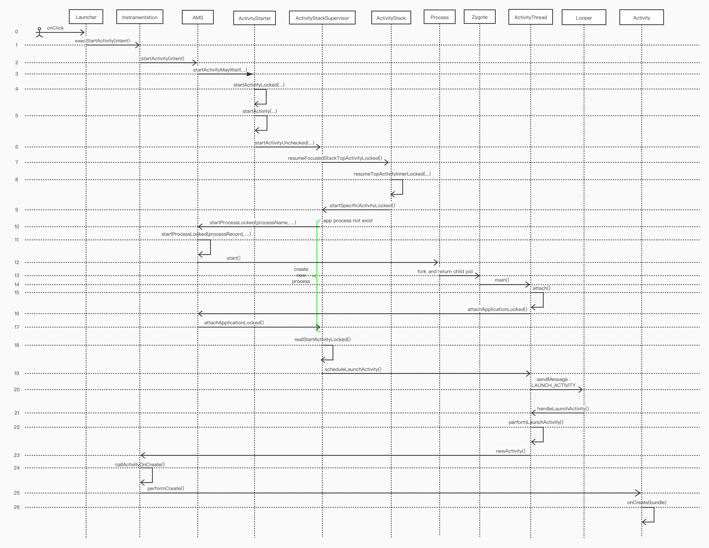

设备启动后会启动 InitProcess 进程，此进程会生成许多硬件相关的守护进程，比如 android debug 守护进程，USB 守护进程等，它们主要负责处理硬件接口信息。之后会启动大名鼎鼎的 'zygote' 进程，它会初始化一个非常原始的 Dalvik VM，并且会提前加载一些 framework 或已安装应用的通用类，之后会进入就绪状态，等待通知随时进行自我复制。zygote 准备就绪后，init 进入 `runtime process`。

zygote 首先会 fork 出一个叫做 SystemServer 的进程，许多核心服务（如 AMS, WMS, PMS 等）由 SystemServer 进行初始化。所有核心服务加载完毕后，系统已准备好加载应用程序了。zygote 会 fork 出第一个应用进行--桌面应用（Launcher）进行展示。

下图描述从用户点击桌面图标到 `Activity.onCreate()` 回调过程中的关键步骤



上图是从网上找到的，内容来自 aosp 较早版本，好多代码已经被移除（ActivityManagerProxy, ActivityManagerNativeProxy）或者被标记过时（ActivityManagerNative），但是主体流程过程是没啥问题的。下面会以 Android_8.0.0_r36 源码为基础分析应用启动过程。

## 启动 Activity
### 模拟启动 TargetApp
使用 Android Studio 创建一个空白项目（TargetApp），包名为：`com.iyh.targetapp`，包含一个组件 `MainActivity`。在某个 Activity 中启动 `TargetApp.MainActivity` 为起点，分析系统在启动应用时的处理步骤，以下为打开 `TargetActivity.ManiActivity` 的代码
```java
// SomeActivity
Intent intent = getPackageManager().getLaunchIntentForPackage("com.iyh.targetapp");
startActivity(intent);
```
`context.getPackageManager()` 和 `PackageManager.getLaunchIntentForPackage()` 方法都是抽象方法，根据 context 继承体系知道 context 的实现类为 `ContextImpl` 在 `ContextImpl.getPackageManager()` 方法可以知道 `PackageManager` 的实现类为 `ApplicationPackageManager`，现在可以知道 `intent` 对象构建过程
```java
@Override
public Intent getLaunchIntentForPackage(String packageName) {
    Intent intentToResolve = new Intent(Intent.ACTION_MAIN);
    intentToResolve.addCategory(Intent.CATEGORY_INFO);
    intentToResolve.setPackage(packageName);
    List<ResolveInfo> ris = queryIntentActivities(intentToResolve, 0);

    if (ris == null || ris.size() <= 0) {
        // reuse the intent instance
        intentToResolve.removeCategory(Intent.CATEGORY_INFO);
        intentToResolve.addCategory(Intent.CATEGORY_LAUNCHER);
        intentToResolve.setPackage(packageName);
        ris = queryIntentActivities(intentToResolve, 0);
    }
    if (ris == null || ris.size() <= 0) {
        return null;
    }
    Intent intent = new Intent(intentToResolve);
    intent.setFlags(Intent.FLAG_ACTIVITY_NEW_TASK);
    intent.setClassName(ris.get(0).activityInfo.packageName,
            ris.get(0).activityInfo.name);
    return intent;
}
```

此处 ris 相当于 `AndroidManifest.xml` 中声名的各组件根据 `<intent-filter>` 过滤后的 ActivityInfo 列表，每个元素都包含相应 Activity 的信息。由此处代码可知 `CATEGORAY_INFO` 与 `CATEGORY_LAUNCHER` 都属于 LaunchIntent 且 `CATEGORAY_INFO` 的优先级更高。最终获取到的 Intent 对象相当于以下代码
```java
Intent intent = new Intent(Intent.ACTION_MAIN);
intent.addCategory(Intent.CATEGORY_LAUNCHER);
intent.setPackage("com.iyh.targetapp");
intent.setFlags(Intent.FLAG_ACTIVITY_NEW_TASK);
intent.setClassName("com.iyh.targetapp", "com.iyh.targetapp.MainActivity");
```
这就是 AMS 启动一个 Activity 所需的最原始信息，接着进入 `activity.startActivity(intent)` 方法，跳过重载方法调用链，进入执行体
```java
// Activity.startActivityForResult
public void startActivityForResult(@RequiresPermission Intent intent, int requestCode, @Nullable Bundle options) {
    if (mParent == null) {
        options = transferSpringboardActivityOptions(options);
        Instrumentation.ActivityResult ar =
            mInstrumentation.execStartActivity(
                this, mMainThread.getApplicationThread(), mToken, this,
                intent, requestCode, options);
        ...
    } else {
        ...
    }
}
```
此处传入参数 requestCode 为 -1；options 为 null。一般情况 mParent 为空，在 Android 3.2 之前有个组件叫 ActivityGroup，类似 ViewGroup 它将可以包含子 Activity，在这个子 Activity 中 mParent 才不为空，不过随着 Fragment 的验证流行，这个组件已经过时退出历史了。options 类型为 Bundle 但实际确是由 `ActivityOptions.toBundle()` 方法转换而来，作用是传递 Activity 非功能性参数，比如 Activity 间的转场动画等。`transferSpringboardActivityOptions(options)` 方法判断 options 如果为 null 则会使用当前 Activity 中的 options 替换原 options。·


## 参考链接
> [Android Application Launch explained: from Zygote to your Activity.onCreate()](https://android.jlelse.eu/android-application-launch-explained-from-zygote-to-your-activity-oncreate-8a8f036864b)

