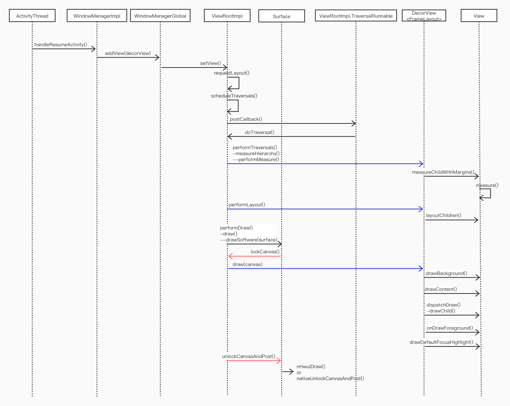

## 概要
本篇基于 Android 8.0 源码介绍 Activity 根 View 图层的绘制过程，包括根 View（DecorView）的 measure、layout 和 draw 方法处理逻辑，**不包括** native 底层如何将 canvas 数据打印到屏幕。由 [setContentView() 背后的故事](https://blog.csdn.net/weixin_46221133/article/details/104264011)可以了解 DecorView 创建过程，简要地说，正常情况下 DecorView 在调用 `setContentView()` 方法时被创建，创建完成后只是个孤零零的 View 并不会马上显示到屏幕上。直到 ActivityThread 执行 `handleResumeActivity()` 方法，DecorView 才会被添加到 ViewRootImpl 对象中。此时 DecorView 已经与 window 建立了联系，添加到 ViewRootImpl 过程中会触发 `ViewRootImpl.requestLayout()`，此方法会调用 `performTraversals()`。`performTraversals()` 方法相当复杂，涉及 window 窗口发生变化（比如软键盘对 window 的影响）时的处理， mSurface 不可用时的处理，还会调用到本文主要介绍的 `performMeasure()`、`performLayout()`、`performDraw()` 方法。

下图是整个流程的时序图


## 第一次 traversal
我们知道在 `Activity.onResume()` 回调方法中获取 `contentView` 中某个 view 的宽高时，不管使用 `view.getWidth()` 还是 `view.getMeasuredWidth()` 最后都是返回的 0，即使使用固定数值设置 view 宽高，比如 `setWidth(100)` 或 `LayoutParams(100, 100)`，最终结果也是 0。归根结底都是因为执行 `onResume()` 时，整个 Activity 的视图层还没有进行 ‘traversal’。Android View 的宽高有三种表述，`match_parent`、`wrap_content` 和具体值，其中 `match_parent` 需要知道父 view 大小才能确定，`wrap_content` 需要清楚子 view 大小才能确定，所有的 view 都处于一个 window 中，处于同一个视图层，需要从根到叶遍历至少一次才能确定宽高，这里的的遍历就是 `traversal`。

需要进入 ActivityThread 类中查看什么时候 Activity 会执行第一次 traversal，下面代码简要说明 Activity 生命周期回调时机
```java
// ActivityThread.handleLaunchActivity
private void handleLaunchActivity(ActivityClientRecord r, Intent customIntent, String reason) {
    ...
    // performLaunchActivity 方法中会触发 onCreate 及 onStart 回调
    Activity a = performLaunchActivity(r, customIntent);

    if (a != null) {
        r.createdConfig = new Configuration(mConfiguration);
        reportSizeConfigurations(r);
        Bundle oldState = r.state;
        // 会执行 performResumeActivity 方法，performResumeActivity 会触发 onResume 回调
        handleResumeActivity(r.token, false, r.isForward,
                !r.activity.mFinished && !r.startsNotResumed, r.lastProcessedSeq, reason);

        ...
    } else {
        // 启动 Activity 时出现错误，通知 activity manager 取消相关事务
        try {
            ActivityManager.getService()
                .finishActivity(r.token, Activity.RESULT_CANCELED, null,
                        Activity.DONT_FINISH_TASK_WITH_ACTIVITY);
        } catch (RemoteException ex) {
            throw ex.rethrowFromSystemServer();
        }
    }
}
```
`performLaunchActivity()` 方法会调用 Activity `onCreate()` 和 `onStart()` 回调，在 `onCreate()` 方法中会有 `setContentView()` 初始化 DecorView，这个方法不是今天的重点所以不展开细说了。下面是 `handleResumeActivity()` 方法体
```java
final void handleResumeActivity(IBinder token,
            boolean clearHide, boolean isForward, boolean reallyResume, int seq, String reason) {
    ActivityClientRecord r = mActivities.get(token);
    ...
    // 调用 activity.performResume() 方法触发 onResume() 回调
    r = performResumeActivity(token, clearHide, reason);

    if (r != null) {
        final Activity a = r.activity;

        if (localLOGV) Slog.v(
            TAG, "Resume " + r + " started activity: " +
            a.mStartedActivity + ", hideForNow: " + r.hideForNow
            + ", finished: " + a.mFinished);

        final int forwardBit = isForward ?
                WindowManager.LayoutParams.SOFT_INPUT_IS_FORWARD_NAVIGATION : 0;

        // 为了避免闪烁添加的标记
        boolean willBeVisible = !a.mStartedActivity;
        if (!willBeVisible) {
            try {
                // AMS 会查找 activity stack 来确定是否为 true
                willBeVisible = ActivityManager.getService().willActivityBeVisible(
                        a.getActivityToken());
            } catch (RemoteException e) {
                throw e.rethrowFromSystemServer();
            }
        }
        if (r.window == null && !a.mFinished && willBeVisible) {
            r.window = r.activity.getWindow();
            View decor = r.window.getDecorView();
            decor.setVisibility(View.INVISIBLE);
            ViewManager wm = a.getWindowManager();
            WindowManager.LayoutParams l = r.window.getAttributes();
            a.mDecor = decor;
            l.type = WindowManager.LayoutParams.TYPE_BASE_APPLICATION;
            l.softInputMode |= forwardBit;
            if (r.mPreserveWindow) {
                a.mWindowAdded = true;
                r.mPreserveWindow = false;
                // 重用 decor view 时的处理
                ViewRootImpl impl = decor.getViewRootImpl();
                if (impl != null) {
                    impl.notifyChildRebuilt();
                }
            }
            if (a.mVisibleFromClient) {
                if (!a.mWindowAdded) {
                    a.mWindowAdded = true;
                    // wm 实现类为 WindowManagerImpl
                    wm.addView(decor, l);
                } else {
                    // The activity will get a callback for this {@link LayoutParams} change
                    // earlier. However, at that time the decor will not be set (this is set
                    // in this method), so no action will be taken. This call ensures the
                    // callback occurs with the decor set.
                    a.onWindowAttributesChanged(l);
                }
            }
        } else if (!willBeVisible) {
            if (localLOGV) Slog.v(
                TAG, "Launch " + r + " mStartedActivity set");
            r.hideForNow = true;
        }
        ...
    } else {
        // resume 过程中出现异常就取消 activity
        try {
            ActivityManager.getService()
                .finishActivity(token, Activity.RESULT_CANCELED, null,
                        Activity.DONT_FINISH_TASK_WITH_ACTIVITY);
        } catch (RemoteException ex) {
            throw ex.rethrowFromSystemServer();
        }
    }
}
```
这里有个 willBeVisible 的变量，它代表 `activity.mStartedActivity` 成员变量，在 reuqestCode 不为 0 时这个值就会生效，它防止 activity 跳转中的闪烁问题，比如打开 Activity-A 时，它需要启动 Activity-B（startActivityForResult）获取必要信息，此时就不去显示 Activity-A，即 willBeVisible 为 false，等从 Activity-B 返回后再显示 Activity-A，这样就可以避免 Activity-A 的闪烁问题。因为代码是基于首次运行 Activity，所以这里的 `r.window` 为空，最终会走到 `wm.addView(decor, l)` 代码，这个就是本篇的起点了，它会创建 ViewRootImpl 对象，traversal 过程就是从 ViewRootImpl 开始的。wm 是个抽象接口 `ViewManager`，它的实现类为 WindowManagerImpl。现在分析这个 `addView()` 中都有什么操作
```java
// WindowManagerImpl.addView
public void addView(@NonNull View view, @NonNull ViewGroup.LayoutParams params) {
    applyDefaultToken(params);
    // mGlobal 类型为 WindowManagerGlobal
    mGlobal.addView(view, params, mContext.getDisplay(), mParentWindow);
}

// WindowManagerGlobal.addView
public void addView(View view, ViewGroup.LayoutParams params, Display display, Window parentWindow) {
    ...
    final WindowManager.LayoutParams wparams = (WindowManager.LayoutParams) params;
    ...
    ViewRootImpl root;
    View panelParentView = null;

    synchronized (mLock) {
        ...
        // 创建 ViewRootImpl，此处的 view 就是 DecorView
        root = new ViewRootImpl(view.getContext(), display);

        view.setLayoutParams(wparams);

        mViews.add(view);
        mRoots.add(root);
        mParams.add(wparams);

        try {
            // 将 DecorView 添加到 ViewRootImpl 中，可以开始绘制了
            root.setView(view, wparams, panelParentView);
        } catch (RuntimeException e) {
            ...
        }
    }
}
```
WindowManagerGlobal 类是个单例，它持有应用进程内所有 window 的根视图，mViews、mRoots、mParams 索引值一一对应，分别代表 DecorView，ViewRootImpl 和 DecorView 使用到的 LayoutParams（从 window 中获取到的）。`ViewRootImpl.setView()` 方法会调用 `ViewRootImpl.requestLayout()`，然后执行 `scheduleTraversals()` 方法
```java
void scheduleTraversals() {
    if (!mTraversalScheduled) {
        // 防止多次 traversal
        mTraversalScheduled = true;
        // 向 MessageQueue 中添加同步屏障，只要不释放这个屏障，队列中的其它同步 Message 都不会被执行
        mTraversalBarrier = mHandler.getLooper().getQueue().postSyncBarrier();
        // mChoreographer 是 Choreographer 对象，它负责协调动画，输入或 draw 的时机
        // 它接收定时脉冲（timing pulses），比如 Vsync 信号，协调帧输出。
        mChoreographer.postCallback(
                Choreographer.CALLBACK_TRAVERSAL, mTraversalRunnable, null);
        if (!mUnbufferedInputDispatch) {
            scheduleConsumeBatchedInput();
        }
        notifyRendererOfFramePending();
        pokeDrawLockIfNeeded();
    }
}
```
这里需要注意 mTraversalRunnable 对象，它是个 Runnable 对象，它的 `run()` 方法中只有一个方法 `doTraversal()`
```java
void doTraversal() {
    if (mTraversalScheduled) {
        mTraversalScheduled = false;
        mHandler.getLooper().getQueue().removeSyncBarrier(mTraversalBarrier);

        if (mProfile) {
            Debug.startMethodTracing("ViewAncestor");
        }
        // 绘制的起点
        performTraversals();

        if (mProfile) {
            Debug.stopMethodTracing();
            mProfile = false;
        }
    }
}
```

## performTraversals
`performTraversals()` 是一个越长的方法，有 780 多行代码，View 的 measure、layout 和 draw 方法都包含在这个方法中。简要说明一下这个方法中的标识变量

| 变量                  | 作用                                                                                                                                                                                                                                                                                                                                                      |
| :-------------------- | :-------------------------------------------------------------------------------------------------------------------------------------------------------------------------------------------------------------------------------------------------------------------------------------------------------------------------------------------------------- |
| mIsInTraversal        | 标记是否处于 traversal 中，在 performTraversals 方法起始位置设置为 true， 终止位置设置为 false。确保在 traversal 过程中不会执行 `doDie()` 方法（销毁或释放所有绘图相关资源）                                                                                                                                                                              |
| mWillDrawSoon         | 标记是否将要执行 draw 方法，这个标记在 performTraversals 方法起始位置设置为 true，在调用 `performLayout()` 方法之后设置为 false。这个属性与 `invalidate()` 方法相关，invalidate 表示某块画布上的数据无效需要重绘（不进行 measure 和 layout），mWillDrawSoon 可以避免不必要的重绘。在一个 traversal 中无论有多少个无效区域，只需要执行一次 draw 就可以了。 |
| mLayoutRequested      | 与 mWillDrawSoon 类似，标记有是否有 view 请求 layout，如何多个 view 都有请求的话，只需要处理一次就可以                                                                                                                                                                                                                                                    |
| mFirst                | 是否为第一次执行 `performTraversals()` 方法                                                                                                                                                                                                                                                                                                               |
| mFullRedrawNeeded     | 是否需要重绘整个视图层，否则只绘制 dirty 部分。                                                                                                                                                                                                                                                                                                           |
| mReportNextDraw       | 首次 draw window 时需要设置这个值，用于后面使用 `pendingDrawFinished()` 方法通知该 window 已经 draw 过了。（具体为什么要这样设置暂时不清楚）                                                                                                                                                                                                              |
| mApplyInsetsRequested | 与 fitsSystemWindows 相关                                                                                                                                                                                                                                                                                                                                 |
| mInLayout             | 标记 DecorView 是否在 layout 过程中（即，执行 View.layout() 前后改变 mInLayout 的值）                                                                                                                                                                                                                                                                     |
| mSurface              | 提供 canvas 对象，traversal 过程最终会将各 view 的 draw 到 canvas 上，然后交给 native 层显示到屏幕上                                                                                                                                                                                                                                                      |

上面就 `performTraversals()` 方法用到的标记变量，它们有效地避免了重复的 layout 和 draw 操作。

## performMeasure

```java
// ViewRootImpl.performMeasure
private void performMeasure(int childWidthMeasureSpec, int childHeightMeasureSpec) {
    if (mView == null) {
        return;
    }
    Trace.traceBegin(Trace.TRACE_TAG_VIEW, "measure");
    try {
        mView.measure(childWidthMeasureSpec, childHeightMeasureSpec);
    } finally {
        Trace.traceEnd(Trace.TRACE_TAG_VIEW);
    }
}
```
此处的 mView 就是 DecorView，childXxxMeasureSpec mode 都为 MATCH_PARENT，size 取自 desiredWindowWidth/Height
```java
// ViewRootImpl.performTraversal
final Configuration config = mContext.getResources().getConfiguration();
// lp 为 WindowManager.LayoutParams
if (shouldUseDisplaySize(lp)) {
    // 获取设备屏幕宽高，一般就是硬件屏幕的真实尺寸（pixel）
    Point size = new Point();
    mDisplay.getRealSize(size);
    desiredWindowWidth = size.x;
    desiredWindowHeight = size.y;
} else {
    // 获取应用屏幕宽高，这里的高度不包括系统窗口
    desiredWindowWidth = dipToPx(config.screenWidthDp);
    desiredWindowHeight = dipToPx(config.screenHeightDp);
}
```
mView 为 DecorView，它继承自 FrameLayout，但是 DecorView 与 FrameLayout、ViewGroup 都没有重写 `measure()` 方法，所以 `mView.measure()` 代码如下
```java
public final void measure(int widthMeasureSpec, int heightMeasureSpec) {
    boolean optical = isLayoutModeOptical(this);
    // 视觉布局，比如阴晦和光晕效果
    if (optical != isLayoutModeOptical(mParent)) {
        Insets insets = getOpticalInsets();
        int oWidth  = insets.left + insets.right;
        int oHeight = insets.top  + insets.bottom;
        widthMeasureSpec  = MeasureSpec.adjust(widthMeasureSpec,  optical ? -oWidth  : oWidth);
        heightMeasureSpec = MeasureSpec.adjust(heightMeasureSpec, optical ? -oHeight : oHeight);
    }
    ...
    if (forceLayout || needsLayout) {
        ...
        int cacheIndex = forceLayout ? -1 : mMeasureCache.indexOfKey(key);
        if (cacheIndex < 0 || sIgnoreMeasureCache) {
            // 这里执行者为 DecorView.onMeasure()
            onMeasure(widthMeasureSpec, heightMeasureSpec);
            mPrivateFlags3 &= ~PFLAG3_MEASURE_NEEDED_BEFORE_LAYOUT;
        } else {
            long value = mMeasureCache.valueAt(cacheIndex);
            // Casting a long to int drops the high 32 bits, no mask needed
            setMeasuredDimensionRaw((int) (value >> 32), (int) value);
            mPrivateFlags3 |= PFLAG3_MEASURE_NEEDED_BEFORE_LAYOUT;
        }
        ...
    }

    mOldWidthMeasureSpec = widthMeasureSpec;
    mOldHeightMeasureSpec = heightMeasureSpec;
    ...
}
```
开始 measure 整个视图层前，我们知道 DecorView 的宽高为应用屏幕宽高和 mode 为 `MeasureSpec.EXACTLY`，而且知道整个视图层以 DecorView 为根的所有 view。这里重点说一下这里的 `MeasureSpec.EXACTLY` 是什么东西，它属于 `MeasureSpec` 三种 mode 中的一个，它们的含意如下

- **UNSPECIFIED：** 父容器没有给子 view 施加任何约束，子 view 可以为任意大小
- **EXACTLY：** 父容器给子 view 指定大小，不管子 view 需要多大的空间，最终只能使用由父容器指定的大小
- **AT_MOST：** 父容器给子 view 指定最大值，子 view 不能超过这个值

平时在 layout 中添加 view 时，必需添加 `android:layout_width/height` 属性，它们的值有三种：wrap_content（即 ViewGroup.WRAP_CONTENT）对应的是 -2，match_parent（即 ViewGroup.MATCH_PARENT）对应的是 -1，positiveNumber 对应的是非负整数。它们代表当前 view 需要的尺寸，与上面说的 MeasureSpec 的关系可以通过下面这个方法说明
```java
// ViewGroup.getChildMeasureSpec
// spec 为父容器的 measureSpec，childDimension 为子 view 的尺寸（layoutParams.width/height）
public static int getChildMeasureSpec(int spec, int padding, int childDimension) {
    int specMode = MeasureSpec.getMode(spec);
    int specSize = MeasureSpec.getSize(spec);
    // 父容器可以提供的最大值
    int size = Math.max(0, specSize - padding);
    // 最终需要将这两个值赋值到子 view 中，子 view 再去测量它的子 view，最终会测量完全部 view
    int resultSize = 0;
    int resultMode = 0;

    switch (specMode) {
    // 父容器强行设置子 view 的大小
    case MeasureSpec.EXACTLY:
        if (childDimension >= 0) {
            // 准确值不受父容器限制
            resultSize = childDimension;
            resultMode = MeasureSpec.EXACTLY;
        } else if (childDimension == LayoutParams.MATCH_PARENT) { // condition-1
            resultSize = size;
            resultMode = MeasureSpec.EXACTLY;
        } else if (childDimension == LayoutParams.WRAP_CONTENT) { // condition-2
            // 子 view 需要的尺寸是由内容（content）确定的，这个需要各 View 自己计算自己的内容大小，所以才能确定
            // 比如 TextView 在 onMeasure() 方法中可以根据字体大小、样式、数量等计算出 TextView 需要的大小，此时
            // mMeasuredWidth/Height 值就有效了
            resultSize = size;
            resultMode = MeasureSpec.AT_MOST;
        }
        break;

    // 父容器设置子容器最大值
    case MeasureSpec.AT_MOST:
        if (childDimension >= 0) {
            // 准确值不受父容器限制
            resultSize = childDimension;
            resultMode = MeasureSpec.EXACTLY;
        } else if (childDimension == LayoutParams.MATCH_PARENT) { // condition-3
            // 子 view 需要与父容器一样大，但是父容器也不知道自己有多大，所以 resultMode 就不能设置为 EXACTLY 了
            resultSize = size;
            resultMode = MeasureSpec.AT_MOST;
        } else if (childDimension == LayoutParams.WRAP_CONTENT) { // condition-4
            resultSize = size;
            resultMode = MeasureSpec.AT_MOST;
        }
        break;

    // 父容器询问子 view 需要的大小
    case MeasureSpec.UNSPECIFIED:
        if (childDimension >= 0) {
            resultSize = childDimension;
            resultMode = MeasureSpec.EXACTLY;
        } else if (childDimension == LayoutParams.MATCH_PARENT) {
            resultSize = View.sUseZeroUnspecifiedMeasureSpec ? 0 : size;
            resultMode = MeasureSpec.UNSPECIFIED;
        } else if (childDimension == LayoutParams.WRAP_CONTENT) {
            resultSize = View.sUseZeroUnspecifiedMeasureSpec ? 0 : size;
            resultMode = MeasureSpec.UNSPECIFIED;
        }
        break;
    }
    return MeasureSpec.makeMeasureSpec(resultSize, resultMode);
}
```

测量开始前系统知道两部分信息，第一就是 DecorView 的宽高和 mode 值，第二是知道每个 view 的 LayoutParams 值，这样就可以最终确定所有 view 的宽高了。下面会用实例介绍整个 DecorView 是如何测量的。现在我们需要知道整个视图树都有哪些元素（DecorView 中有哪些 View），在 [setContentView() 背后的故事](https://blog.csdn.net/weixin_46221133/article/details/104264011) 一文中，我们知道 `setContentView(R.layout.activity_main)` 方法将 `activity_main` 添加到 DecorView 中，在 `android:theme="@android:style/Theme.Holo"` 主题下 `activity_main` 代表的 view 最终会被添加到 `content` 代表的容器中。

```xml
<?xml version="1.0" encoding="utf-8"?>
<com.android.internal.widget.ActionBarOverlayLayout android:theme="?actionBarTheme" android:id="@id/decor_content_parent" android:layout_width="fill_parent" android:layout_height="fill_parent" android:splitMotionEvents="false"
  xmlns:android="http://schemas.android.com/apk/res/android">
    <FrameLayout android:id="@id/content" android:layout_width="fill_parent" android:layout_height="fill_parent" />
    <com.android.internal.widget.ActionBarContainer android:gravity="top" android:id="@id/action_bar_container" android:layout_width="fill_parent" android:layout_height="wrap_content" android:layout_alignParentTop="true" android:transitionName="android:action_bar" android:touchscreenBlocksFocus="true" android:keyboardNavigationCluster="true" style="?actionBarStyle">
        <com.android.internal.widget.ActionBarView android:id="@id/action_bar" android:layout_width="fill_parent" android:layout_height="wrap_content" style="?actionBarStyle" />
        <com.android.internal.widget.ActionBarContextView android:id="@id/action_context_bar" android:visibility="gone" android:layout_width="fill_parent" android:layout_height="wrap_content" style="?actionModeStyle" />
    </com.android.internal.widget.ActionBarContainer>
    <com.android.internal.widget.ActionBarContainer android:gravity="center" android:id="@id/split_action_bar" android:visibility="gone" android:layout_width="fill_parent" android:layout_height="wrap_content" android:touchscreenBlocksFocus="true" android:keyboardNavigationCluster="true" style="?actionBarSplitStyle" />
</com.android.internal.widget.ActionBarOverlayLayout>
```
现在是


## performLayout

## performDraw

> [optical bounds](https://developer.android.com/about/versions/jelly-bean#43-optical-bounds)
> [Android 4.3中的视觉边界布局](http://blog.chengyunfeng.com/?p=512)