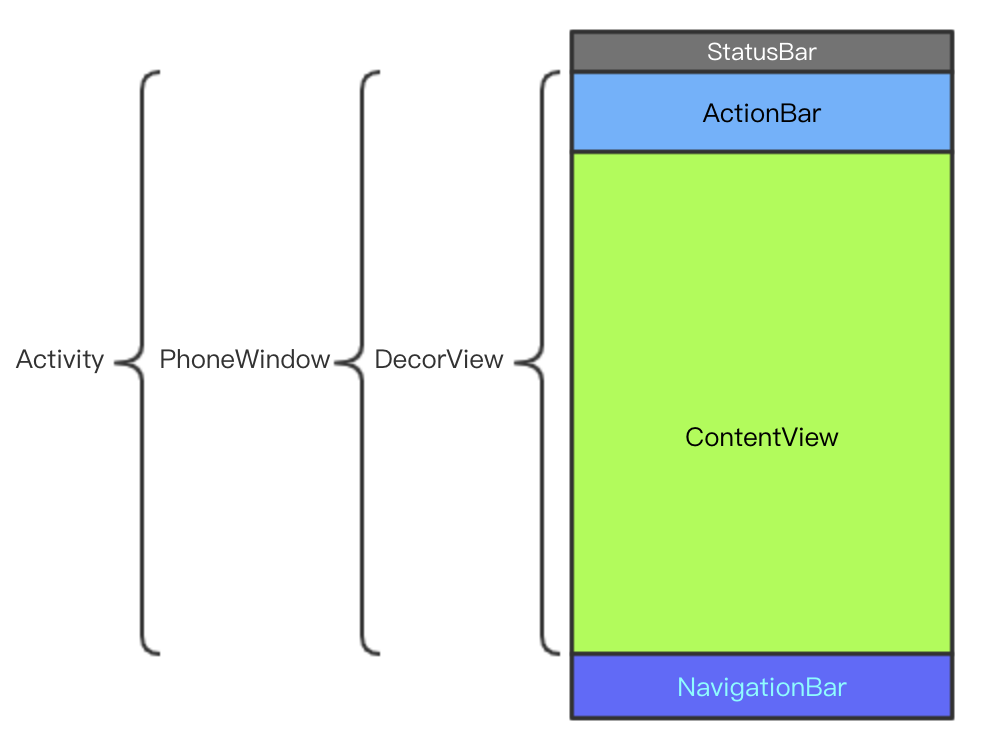

## 概述
本篇文章将介绍 `Activity.onCreate(bundle)` 方法中 `setContentView(R.layout.some_layout)` 方法的执行逻辑。主要包括 DecoView 的生成以及如何从 `R.layout.some_layout` 导出 View。

刚开始接触 Android 时，写界面都是使用 Activity 和 Fragment，都是写完布局文件直接 `setContentView` 然后加点为动画就完成了，整个过程特别简单根据不会注意到什么是 Window。所以就会给人一种感觉，界面是显示在 Activity 上的。这种感觉很不精确，其实一个屏幕界面大致可以分为三个区域



其中状态栏（StatusBar）和导航栏（NavigationBar）属于系统界面，ActionBar 和 ContentView 才属于应用内的视图。每个 Activity 都会有一个 PhoneWindow 对象，PhoneWindow 里有叫 DecorView 的 View，Activity 的各种 View 都是添加到 DecorView 里的，然后 DecorView 又会加入到 ViewRootImpl，ViewRootImpl 不是 View，可以将它看成 DecorView 视图层的控制器。ViewRootImpl 有个 Surface 对象，Surface 对象会将 DecorView 整个 View 树中的 Canvas 数据传给 SurfaceFlinger 最终经过 Skia 引擎将 UI（2D）绘制到屏幕上。这些过程前一部分，即 DecorView 加入到 ViewRootImpl 之前的部分发生在 `setContentView()` 方法中，后一部分发生在 `resume` 过程中。

## setContentView
```java
// Activity.setContentView
public void setContentView(@LayoutRes int layoutResID) {
    getWindow().setContentView(layoutResID);
    initWindowDecorActionBar();
}
```
`getWindow()` 方法返回的是一个抽象类 `Window`，可以在 `Activity.attach(...)` 方法中看到它的实例对象为 `PhoneWindow`， `PhoneWindow.setContentView(layoutResId)` 方法体如下

```java
public void setContentView(int layoutResID) {
    if (mContentParent == null) {
        installDecor();
    } else if (!hasFeature(FEATURE_CONTENT_TRANSITIONS)) {
        mContentParent.removeAllViews();
    }
    // FEATURE_CONTENT_TRANSITIONS 代表 Window 间是否有转场动画
    if (hasFeature(FEATURE_CONTENT_TRANSITIONS)) {
        // Scene 内部会调用 mLayoutInflater.inflate(layoutResID, mContentParent) 添加 contentView
        final Scene newScene = Scene.getSceneForLayout(mContentParent, layoutResID,
                getContext());
        // Activity 间的动画最终交给 TransitionManager 来完成
        transitionTo(newScene);
    } else {
        // 不需要动画则直接将 contentView 添加到 mConentParent
        mLayoutInflater.inflate(layoutResID, mContentParent); 
    }
    // 此处 requestApplyInsets 最终调用 ViewRootImpl.requestFitSystemWindows 方法
    mContentParent.requestApplyInsets();
    final Callback cb = getCallback();
    if (cb != null && !isDestroyed()) {
        cb.onContentChanged();
    }
    mContentParentExplicitlySet = true;
}
```
从这个方法就可以看出 `setContentView` 其实与 Activity 没有什么关系，传入到 `layoutResID` 最终通过 `mLayoutInflater.inflate(layoutResID, mContentParent)` 添加到 `mContentParent` View 中。[`installDecor()`](http://androidxref.com/8.0.0_r4/xref/frameworks/base/core/java/com/android/internal/policy/PhoneWindow.java#2639) 方法会调用 [`generateDecor(-1)`](http://androidxref.com/8.0.0_r4/xref/frameworks/base/core/java/com/android/internal/policy/PhoneWindow.java#2286) 生成 `mDecor`，这里的 mDecor 类型为 DecorView，它继承自 FrameLayout。创建完 mDecor 后会调用 [`generateLayout(mDecor)`](http://androidxref.com/8.0.0_r4/xref/frameworks/base/core/java/com/android/internal/policy/PhoneWindow.java#2308) 生成 mContentParent，这里主要看 mContentParent 的创建过程
```java
protected ViewGroup generateLayout(DecorView decor) {
    // 这此获取 TypedArray 的源文件在 /../sdk/platforms/android-26/data/res/values.xml
    // TypedArray 对应属性值即 AndroidManifest <activity> 标签的 android:theme 属性指定的文件
    TypedArray a = getWindowStyle();
    ...
    // 将 theme 中的根据提取到本对象中
    mIsFloating = a.getBoolean(R.styleable.Window_windowIsFloating, false);
    int flagsToUpdate = (FLAG_LAYOUT_IN_SCREEN|FLAG_LAYOUT_INSET_DECOR)
            & (~getForcedWindowFlags());
    if (mIsFloating) {
        setLayout(WRAP_CONTENT, WRAP_CONTENT);
        setFlags(0, flagsToUpdate);
    } else {
        setFlags(FLAG_LAYOUT_IN_SCREEN|FLAG_LAYOUT_INSET_DECOR, flagsToUpdate);
    }
    ...

    // Inflate the window decor.

    int layoutResource;
    int features = getLocalFeatures();
    // 根据不同的 features 确定不同的 layoutResource
    if ((features & (1 << FEATURE_SWIPE_TO_DISMISS)) != 0) {
        layoutResource = R.layout.screen_swipe_dismiss;
        setCloseOnSwipeEnabled(true);
    } slse if ...
    } else if ((features & (1 << FEATURE_NO_TITLE)) == 0) {
        // If no other features and not embedded, only need a title.
        // If the window is floating, we need a dialog layout
        if (mIsFloating) {
            TypedValue res = new TypedValue();
            getContext().getTheme().resolveAttribute(
                    R.attr.dialogTitleDecorLayout, res, true);
            layoutResource = res.resourceId;
        } else if ((features & (1 << FEATURE_ACTION_BAR)) != 0) {
            // R.layout.screen_action_bar 文件处于 android.jar 中
            layoutResource = a.getResourceId(
                    R.styleable.Window_windowActionBarFullscreenDecorLayout,
                    R.layout.screen_action_bar);
        } else {
            layoutResource = R.layout.screen_title;
        }
    } else if ...

    mDecor.startChanging();
    // 此方法里会使用 mLayoutInflater 将 layoutResource 添加到 mDecor 中
    mDecor.onResourcesLoaded(mLayoutInflater, layoutResource);

    // 此处 ID_ANDROID_CONTENT 值为 com.android.internal.R.id.content
    ViewGroup contentParent = (ViewGroup)findViewById(ID_ANDROID_CONTENT);
    ...
    return contentParent;
}
```
这个方法主要完成两件事情，第一把 android:theme 定义的属性获取到 phoneWindow 相关变量上；第二是将 contentParent 添加到 mDecor 中。从 contentParent 变量名可以看出它就是 content 的父 View。这里以 `android:theme="@android:style/Theme.Holo"` 为例可以确定到 layoutResource 对应的文件是 `screen_action_bar.xml`，这个文件在 android.jar 包中，android.jar 位于 sdk platform 中，可以使用 `apktool d android.jar` 将其解压，在 res/layout 目录中就可以找到 `screen_action_bar.xml` 文件。下面是 `screen_action_bar.xml` 源码
```xml
<?xml version="1.0" encoding="utf-8"?>
<com.android.internal.widget.ActionBarOverlayLayout android:theme="?actionBarTheme" android:id="@id/decor_content_parent" android:layout_width="fill_parent" android:layout_height="fill_parent" android:splitMotionEvents="false"
  xmlns:android="http://schemas.android.com/apk/res/android">
    <FrameLayout android:id="@id/content" android:layout_width="fill_parent" android:layout_height="fill_parent" />
    <com.android.internal.widget.ActionBarContainer android:gravity="top" android:id="@id/action_bar_container" android:layout_width="fill_parent" android:layout_height="wrap_content" android:layout_alignParentTop="true" android:transitionName="android:action_bar" android:touchscreenBlocksFocus="true" android:keyboardNavigationCluster="true" style="?actionBarStyle">
        <com.android.internal.widget.ActionBarView android:id="@id/action_bar" android:layout_width="fill_parent" android:layout_height="wrap_content" style="?actionBarStyle" />
        <com.android.internal.widget.ActionBarContextView android:id="@id/action_context_bar" android:visibility="gone" android:layout_width="fill_parent" android:layout_height="wrap_content" style="?actionModeStyle" />
    </com.android.internal.widget.ActionBarContainer>
    <com.android.internal.widget.ActionBarContainer android:gravity="center" android:id="@id/split_action_bar" android:visibility="gone" android:layout_width="fill_parent" android:layout_height="wrap_content" android:touchscreenBlocksFocus="true" android:keyboardNavigationCluster="true" style="?actionBarSplitStyle" />
</com.android.internal.widget.ActionBarOverlayLayout>
```
文件中 `@id/content` 就是上面的 `com.android.internal.R.id.content`，也就是说 `setContentView(id)` 最终的 View 会添加到这个 FrameLayout 中。

## layoutInflater.inflate
编程过程中一般会使用 LayoutInflater 加载一个布局文件生成 View，这个过程起始于 `LayoutInflater.from(ctx)`，它的方法体如下
```java
// LayoutInflater.from
public static LayoutInflater from(Context context) {
    LayoutInflater LayoutInflater =
            (LayoutInflater) context.getSystemService(Context.LAYOUT_INFLATER_SERVICE);
    if (LayoutInflater == null) {
        throw new AssertionError("LayoutInflater not found.");
    }
    return LayoutInflater;
}
```
居然是个 system service，需要进入 `ContextImpl` 查看获取到的什么服务，最终在 `SystemServiceRegistry` 类的静态块中找到 `LAYOUT_INFLATER_SERVICE` 对应的服务
```java
// SystemServiceRegistry.registerService
registerService(Context.LAYOUT_INFLATER_SERVICE, LayoutInflater.class,new CachedServiceFetcher<LayoutInflater>() {
    @Override
    public LayoutInflater createService(ContextImpl ctx) {
        return new PhoneLayoutInflater(ctx.getOuterContext());
    }
});
```
找到具体类是为了快速定位使用其父类作调用者时的真正执行体。现在进入 `inflate` 方法
```java
public View inflate(@LayoutRes int resource, @Nullable ViewGroup root, boolean attachToRoot) {
    final Resources res = getContext().getResources();
    final XmlResourceParser parser = res.getLayout(resource);
    try {
        return inflate(parser, root, attachToRoot);
    } finally {
        parser.close();
    }
}
```
简要介绍下这里的 `Resources` 对象的产生及加载过程。在 build 过程中， aapt2 会对项目 res 目录的资源进行编译，将非 `res/values` 目录下的文件单个编译，比如将 `activity_main.xml` 编译成 `activity_main.xml.flat`；将 `res/values` 目录下的文件，生成表格（table）文件，如 `strings.xml` 编译成 `values-en_strings.arsc.flat` 文件，`.flat` 是针对 Android 平台优化过的（aptimized）的文件格式。aapt2 在 link 阶段会把编译阶段产生的各 flat 文件都打包到 apk 中，此阶段会产生 `R.java` 文件（R 文件里的 id 对应于 arsc 文件中的 id，运行时 AssetManager 通过这些 id 定位文件或变量值）。启动应用时在 `bindApplication` 阶段会将 apk 包中的资源位置信息加载到内存中，即存放到 Resources 对象中。Resources 对象包含所有资源 id （apk 中 resources.arsc 文件），需要加载某个资源时，AssetManager 会通过这个 id 找到相应文件，然后通过相应的文件解析器将目标文件解析为 View 了或其它属性，比如这里使用到的解析器为 `res.getLayout(resource)`，从名子就可以想到这里的 parser 代表的是解析 `layout` 文件的解析器。

`XmlResourceParse` 是一个接口类，它的实现类为 `XmlBlock.Parse`，`XmlBlock` 主要功能都是 native 方法提供的，就是说 xml 文件的解析过程发生在 native 层。下面是 `inflate(parser, root, attachToRoot)` 方法
```java
// LayoutInflater.inflate
public View inflate(XmlPullParser parser, @Nullable ViewGroup root, boolean attachToRoot) {
    synchronized (mConstructorArgs) {
        Trace.traceBegin(Trace.TRACE_TAG_VIEW, "inflate");

        final Context inflaterContext = mContext;
        final AttributeSet attrs = Xml.asAttributeSet(parser);
        Context lastContext = (Context) mConstructorArgs[0];
        mConstructorArgs[0] = inflaterContext;
        View result = root;

        try {
            ...
            final String name = parser.getName();
            ...
            // TAG_MERGE 为 "merge"
            if (TAG_MERGE.equals(name)) {
                if (root == null || !attachToRoot) {
                    throw new InflateException("<merge /> can be used only with a valid "
                            + "ViewGroup root and attachToRoot=true");
                }

                rInflate(parser, root, inflaterContext, attrs, false);
            } else {
                // temp 代表 layout 布局文件中的根 view
                final View temp = createViewFromTag(root, name, inflaterContext, attrs);

                ViewGroup.LayoutParams params = null;

                if (root != null) {
                    ...
                    // 获取 root（setContentView(view, parentView) 方法中的 parentView）LayoutParams
                    params = root.generateLayoutParams(attrs);
                    // attachToRoot 作用为：是否将 temp 添加到 root 中，如果不添加，则需要把 root 中的 params 传给 temp
                    if (!attachToRoot) {
                        temp.setLayoutParams(params);
                    }
                }
                ...
                // 开始创建目标 view
                rInflateChildren(parser, temp, attrs, true);
                ...
                // attachToRoot 为真时，将 temp 添加到 root 中
                if (root != null && attachToRoot) {
                    root.addView(temp, params);
                }

                if (root == null || !attachToRoot) {
                    result = temp;
                }
            }

        } catch (XmlPullParserException e) ...
        }

        return result;
    }
}
```
之前写 RecyclerView.Adapter 创建 View 时使用的 `mLayoutInflater.inflate(R.layout.item_example, parent, false)` 方法，一直对最后这个 boolean 值的作用不知所以然，只知道写 false 就行了。。。从源码看就十分清楚了，它的作用就是判断是否将新生成的 view 添加到 parent 中。`inflate` 方法里有两个创建 view 的调用，`createViewFromTag` 和 `rInflateChildren`。

```java
// LayoutInflater.createViewFromTag
View createViewFromTag(View parent, String name, Context context, AttributeSet attrs,
            boolean ignoreThemeAttr) {
    ...
    try {
        View view;
        // 可以使用 setFactory 或 setFactory2 设置工厂类接替创建 View 的默认流程
        if (mFactory2 != null) {
            view = mFactory2.onCreateView(parent, name, context, attrs);
        } else if (mFactory != null) {
            view = mFactory.onCreateView(name, context, attrs);
        } else {
            view = null;
        }

        // 系统调用 setPrivateFactory 设置 mPrivateFactory 作用与上面的 factory 相同
        if (view == null && mPrivateFactory != null) {
            view = mPrivateFactory.onCreateView(parent, name, context, attrs);
        }

        if (view == null) {
            final Object lastContext = mConstructorArgs[0];
            mConstructorArgs[0] = context;
            try {
                if (-1 == name.indexOf('.')) {
                    // name 属于 android.view、android.widget、android.webkit、android.app 包下的 View 
                    view = onCreateView(parent, name, attrs);
                } else {
                    // 其它包下的 View
                    view = createView(name, null, attrs);
                }
            } finally {
                mConstructorArgs[0] = lastContext;
            }
        }

        return view;
    } catch ...
}
```
这里 `name.indexOf` 逻辑就说明了为什么布局文件中有的控件可以直写控件名就可以，有的必须写控件名的全限定符。比如下面的布局文件
```xml
<?xml version="1.0" encoding="utf-8"?>
<FrameLayout xmlns:android="http://schemas.android.com/apk/res/android"
    android:layout_width="match_parent"
    android:layout_height="match_parent">

    <android.support.v7.widget.RecyclerView
        android:id="@+id/my_recycler_view"
        android:layout_width="match_parent"
        android:layout_height="match_parent"
        android:scrollbars="vertical" />
</FrameLayout>
```
布局文件中有两个控件即，`name = "FrameLayout"` 或 `name = "android.support.v7.widget.RecyclerView"`，因为 FrameLayout 属于 android.widget 包下的控件，在 PhoneLayoutInflater 有个 `sClassPrefixList` 变量，定义如下：
```java
// PhoneLayoutInflater.sClassPrefixList
private static final String[] sClassPrefixList = {
    "android.widget.",
    "android.webkit.",
    "android.app."
};
```
再看 PhoneLayoutInflater 与 LayoutInflater 的 `onCreateView` 方法
```java
// PhoneLayoutInflater.onCreateView
protected View onCreateView(String name, AttributeSet attrs) throws ClassNotFoundException {
    for (String prefix : sClassPrefixList) {
        try {
            View view = createView(name, prefix, attrs);
            if (view != null) {
                return view;
            }
        } catch ...
    }

    return super.onCreateView(name, attrs);
}

// LayoutInflater.onCreateView
protected View onCreateView(String name, AttributeSet attrs)
        throws ClassNotFoundException {
    return createView(name, "android.view.", attrs);
}
```
这里简短的控件名会在 onCreateView 中添加上缺失的前缀。下面是利用反射创建 view 的过程
```java
public final View createView(String name, String prefix, AttributeSet attrs)
            throws ClassNotFoundException, InflateException {
    Constructor<? extends View> constructor = sConstructorMap.get(name);
    ...
    Class<? extends View> clazz = null;

    try {
        Trace.traceBegin(Trace.TRACE_TAG_VIEW, name);

        if (constructor == null) {
            // Class not found in the cache, see if it's real, and try to add it
            clazz = mContext.getClassLoader().loadClass(
                    prefix != null ? (prefix + name) : name).asSubclass(View.class);

            if (mFilter != null && clazz != null) {
                boolean allowed = mFilter.onLoadClass(clazz);
                if (!allowed) {
                    failNotAllowed(name, prefix, attrs);
                }
            }
            constructor = clazz.getConstructor(mConstructorSignature);
            constructor.setAccessible(true);
            sConstructorMap.put(name, constructor);
        } else {
            ...
        }
        ...
        // 创建 view
        final View view = constructor.newInstance(args);
        ...
        return view;

    } catch ...
}
```
`rInflateChildren` 方法过程是个递归过程，结构如下
```java
// LayoutInflater.rInflate
while (((type = parser.next()) != XmlPullParser.END_TAG ||
                parser.getDepth() > depth) && type != XmlPullParser.END_DOCUMENT) {

    if (type != XmlPullParser.START_TAG) {
        continue;
    }

    final String name = parser.getName();

    if (TAG_REQUEST_FOCUS.equals(name)) {
        pendingRequestFocus = true;
        consumeChildElements(parser);
    } else if (TAG_TAG.equals(name)) {
        parseViewTag(parser, parent, attrs);
    } else if (TAG_INCLUDE.equals(name)) {
        if (parser.getDepth() == 0) {
            throw new InflateException("<include /> cannot be the root element");
        }
        parseInclude(parser, context, parent, attrs);
    } else if (TAG_MERGE.equals(name)) {
        throw new InflateException("<merge /> must be the root element");
    } else {
        final View view = createViewFromTag(parent, name, context, attrs);
        final ViewGroup viewGroup = (ViewGroup) parent;
        final ViewGroup.LayoutParams params = viewGroup.generateLayoutParams(attrs);
        // 递归 inflate 子 view
        rInflateChildren(parser, view, attrs, true);
        viewGroup.addView(view, params);
    }
}
```
可以看出整个过程是对布局文件的遍历，while 循环各兄弟结点，然后递归遍历子 view，如果 name 对应的是个 viewName 就调用 `createViewFromTag` 创建 View。待执行完毕后， `LayoutInflater.inflate()` 会返回创建好的 View。然后这个 view 按要求会添加到 DecorView 的 content 视图层中。

## 参考
> [aapt2](https://developer.android.com/studio/command-line/aapt2)<br/>
> [Android Window 机制探索](https://juejin.im/entry/5a123c31f265da430d579cda)