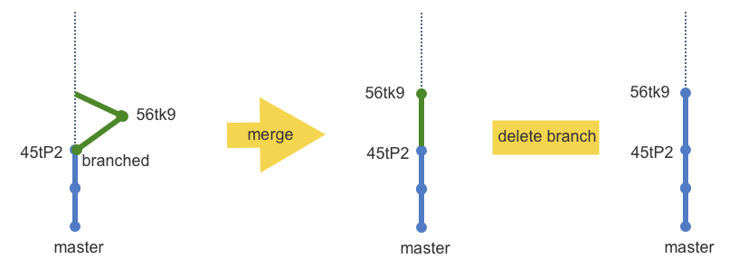

# Git fast forwards and branch management
[原文](https://confluence.atlassian.com/bitbucket/git-fast-forwards-and-branch-management-329977726.html)

在某种情况下，合并一个超前检出分支时，Git会执行一次”快进“操作。考虑下面分支以及合并后的状态：

看图可知：绿色分支与蓝色 master 分支的历史中都有 45tP2 提交。合并前，绿色分支有一个提交结点（可以是多个）。在合并结点处，绿色分支在 master 之前。master 没有新的提交结点，合并后 master 不会有分叉。

这次合并中，Git 能识别出这种情况，所以它将 master 分支的 HEAD 结点沿着绿色分支”快进“到合并后的位置。可以从合并信息中得知如何快进的：
```
git merge greenbranch
Updating 45tP..56tk9
Fast forward
some.src | 1 -
 1 files change, 0 insertions(+), 1 deletions(-)
```
合并之后，如果不再使用绿色分支，用户就可以将它删除了，master 分支会保有绿色分支的提交。如果从来没有将该分支推送到远程 Bitbucket 云仓库，就尽量将此分支删掉。

”不快进“合并指的是 master 分支包含绿色分支的提交结点，也包含合并后的提交结点。这种情形下，用户可以使用 [rebase](https://git-scm.com/book/en/v2/Git-Branching-Rebasing#The-Perils-of-Rebasing) 命令来模拟快进，而不是使用 merge 命令（主分支会分叉）。变基（rebase）是通过舍弃提交结点与新建结点来工作的。

在公有仓库（多人协作）环境中，变基可能会导致问题。rebase 可能增加协作者合并时的工作量。你可能想在他们开始之前避免这些问题，[Branch permissions](https://confluence.atlassian.com/bitbucket/branch-permissions-385912271.html) 部分可以帮助你做到这一点。

### 限制推送（push）权限
可以通过设置来限制谁可以推送到分支。例如，可以允许某组用户可以推送到 master 分支。可以使用通配符来匹配分支，它可以设置某些分支而不用一个一个的来设置。

举例来说，设想你正在一个分支修复 bug 同时其它开发者在功能分支上工作。你使用问题名来命名你修复问题的分支。可以在功能分支添加一个合适的前缀。在 [Branch permissions](https://confluence.atlassian.com/bitbucket/branch-permissions-385912271.html) 查看如何做这些事儿。


### 翻译感想
可能是自己英文水平不行，总感觉原文作者写作思路不清晰，表达不顺畅，具体哪里不清晰也说不出来。