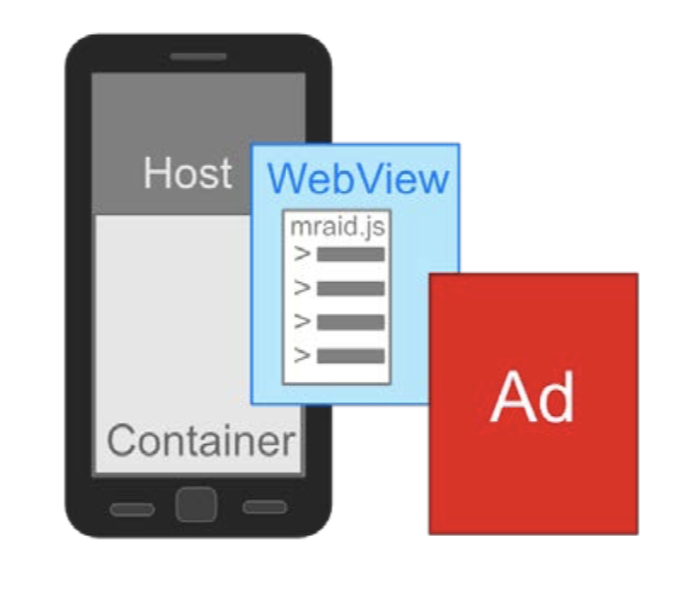
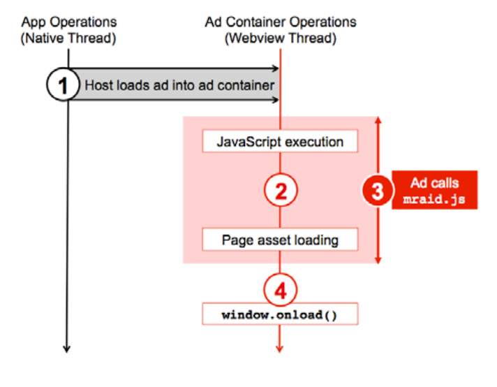
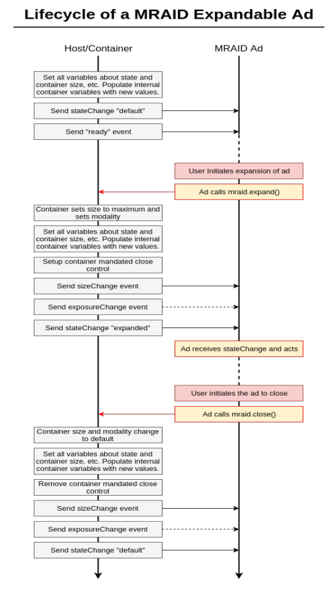
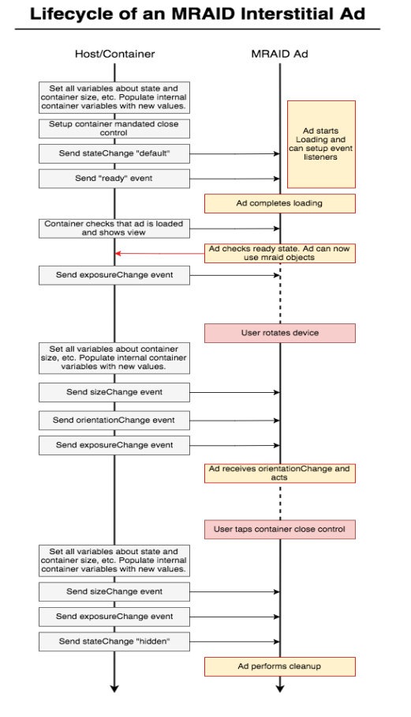

[原文](https://iabtechlab.com/wp-content/uploads/2018/06/MRAID_3.0_FINAL_June_2018.pdf)

# 移动端富媒体广告接口标准（MRAID）
版本 3.0
更新于 2018.06.21

## 移动端富媒体广告接口标准（MRAID）3.0 版本
MRAID 3.0 版本（MRAID 3.0）引入了许多提升用户广告体验的新特性。新版本 MRAID 广告通过测量视听能力，检测 MRAID 环境并获取定位信息来向用户展示尽可能好的体验。此外，还有关于提前加载和广告准备向用户展示的手册。MRAID 附属标准--视频播放器广告接口标准（VPAID）现在已经完全囊括在 MRAID 说明中了。

此版本 MRAID 由 IAB 技术实验室移动端广告接口标准（MRAID）工作组开发完成。

## 关于 IAB 技术实验室
IAB 技术实验室是一个独立的，国际的，研究与发展，为了生产或帮助公司实现全球工业技术标准而成立的联盟。IAB 由数字出版商、广告技术公司、营销商、代理商以及其它对交互市场有兴趣的公司组成，它的目标是降低数字广告与市场供应链联接障碍，同时致力于该工业健康、安全的增长。更多关于 IAB 技术实验室内容请看[这里](https://www.iabtechlab.com/)

此文档在 IAB 的网址为：<a>https://www.iab.com/mraid</a>

下面是前面提到的工作组里的部分 IAB 成员公司：

1. AccuWeather.com 
2. AdColony
3. Adform
4. AdGear 
5. Technologies, Inc.
6. Adobe
7. Adsiduous Media ADTECH AdTheorent ADVR
8. AerServ
9. Alliance for Audited Media (AAM)
10. Amazon
11. AOL
12. BabyCenter
13. Bazaarvoice
14. Bonzai
15. Cedato Technologies Ltd
16. Celtra
17. Conversant Media
18. Cyber Communications Inc.
19. Digital Advertising Consortium Inc.
20. Dominion Enterprises
21. DoubleVerify Flashtalking
22. FOX Networks Group FreeWheel
23. Google
24. Gruuv Interactive
25. Hulu
26. IAB
27. Improve Digital International B.V.
28. Innovid
29. Integral Ad Science
30. Leaf Group
31. Liquidus
32. LogoBar Enterprises MGID
33. Microsoft Advertising MoPub/ Twitter Inc.
34. mPlatform NinthDecimal PadSquad
35. Pixalate RhythmOne
36. Shazam Sizmek Taboola
37. The Media Trust Company
38. The New York Times Company
39. Thinknear by Telenav
40. Time Inc.
41. Tremor Video
42. Turner Broadcasting System
43. Vdopia
44. Vertebrae
45. Verve
46. ViralGains Visible Measures Westwood One White Ops
47. Yahoo Yieldmo YuMe
48. Zynga

## 概要

MRAID 是 Mobile Rich Media Ad Interface Definition 的首字母缩写。它使广告与移动 app 可以间接地交换信息，从而使广告拥有交互式体验。

如果没有 MRAID，广告开发者不得不为每个投放广告的系统专门设计交互式广告。这些开发花费的时间将会降低品牌在移动应用上制作出高效广告的可能性。

MRAID 提供了一个包含多个调用方法的库，广告使用这些调用方法与兼容 MRAID 的应用进行交互。当广告开发者使用 MRAID 时，移动应用支持 MRAID 库中的方法越多，广告体验的可预见性越高。

为提升移动广告执行效果，MRAID 3.0 更新了众多特性，比如，辅助跟踪广告可见度，明确广告初始化及就绪状态，对含有视频交互的广告集成了 IAB VPAID (Video Player Ad Interface Definition) 以及其它新增特性。

随着使用手机的用户日益增长，对高质量广告的需求也逐渐增长。广告主想要改进跟踪方法，应用发布者想要提升广告体验。在高质量的广告中接入或升级到 MRAID 3.0 会拥有更好的表现，也会有更优良的广告跟踪。

## 周知

MRAID 是一个广告设计者与开发者在兼容 MRAID 的应用上开发出具有交互能力的广告的协议。应用开发者或 SDK 提供者必须为应用提供一个技术构件，使应用可以设置一个广告容器或响应广告发出的 MRAID 调用。

虽然这个规范是为广告开发者、应用发布者或 SDK 提供者提供的技术指导，但是所有参与移动广告制作的人都应该熟悉此文档。

## 介绍
MRAID 规定一组 API，该 API 为富媒体广告体验与展示该广告的原生移动应用之间提供交互支持。一个应用中的 MRAID 的实现通常是由 SDK 提供，该 SDK 创建一个可以展示广告的容器和一个广告用户与应用容器交互的控制器。

符合 MRAID 标准的广告根据本规范调用方法，提供信息与其它行为。符合 MRAID 标准的原生应用同样使用本规范来提供信息，响应 MRAID 调用及其它行为。

### 1.1 定义
MRAID 包含一些移动部件（moving parts），开发者们使用这些部件制作可交互广告体验。为了清晰地描述这些部件，下面列出了文档中使用到的关键字的定义。

**host：** 移动应用中的组件，该组件提供空间（容器）来展示广告，同时提供服务（控制器），广告通过 MRAID API 可以访问这些服务。host 的实现方式可以是一个 SDK，也可以是直接在 app 内部实现。

**MRAID 实现（MRAID Implementation）：** host 给广告提供 MRAID 方法的特性。包含 JavaScript 属性，广告可以通过它检验 MRAID 的状况，开启 MRAID 并且可以调用 MRAID 服务。

**SDK：** 是 Software Developtment Kit 的首字母缩写。以 MRAID 为例，SDK 指的是广告提供者提供给移动应用发布者的代码或说明的实现。

**SDK 提供者（SDK provider）：** 对于本文档来说，SDK 提供者代表为移动应用发布者开发 MRAID 代码实现的移动广告技术服务提供商。

**广告容器 (ad container）：** 应用中特意保留的一块展示广告的区域。应用发布者可以将广告容器放到应用内容里面（内置），也可以把这个容器放到应用内容的上面（插屏）。一个应用中可以有多个容器。

**webview：** 移动应用系统中用来展示 web 内容并执行 JavaScript 脚本的组件。MRAID 不强制使用 webview，但是在典型的 MRAID host 中 ad 容器通常含有一个 webview，广告在 webview 中作为 HTML 文档的顶级结点。

**原生层（native layer）：** 在原生应用内部进行沟通与操作的技术层。

**广告（ad）：** 对于本文档的主旨来说，广告通常表示一个移动环境下的 MRAID 广告，它包括所有的创意，包含任意 MRAID 方法的依赖库（代码及其它文件）。

### 1.2 范围
每个 MRAID 实现都为开发者提供一份唯一的功能集。本文档将解释该如何对这些功能做出响应，包括设置，初始化，方法，属性，事件和可预见的行为，但不包括操作的一些细节。以下功能的示例就超出了本文档的讨论范围：

* 从广告服务器，广告网络或本地资源中检索（获取）广告。
* 上报
* IDE 集成
* 安全与隐私
* 国际化
* 错误上报
* 日志
* 账单与支付
* 广告尺度与广告行为
* 下载资源到本地文件系统，以备缓存或离线使用

SDK 提供者必须能够在广告位区域渲染 web 内容。对于大多数情况来说，这些功能已经被 webview 所支持，但是开发者可能会开发额外的方法来支持该规格说明中的特性。

MRAID 不仅限于本文档中描述的特性。我们鼓励开发者创新或添加文档中没有的特性。但是，为了维护基准特性的互通性，额外的特性集必须在 MRAID 名称空间外实现。可能需要有添加额外功能集或集成实现的意识来完成文档中提到的功能。

### 1.3 MRAID 是如何工作的
作为一个两系统之间的协议，每个系统必须配备另一系统匹配的调用及响应。简单来说，这两个系统就是广告与移动应用，一个系统主动调用另外一个，然后被调用方作出回应。但实际中，广告与应用不会直接交互。

移动广告服务商（提供商）构建一套组件，该组件将广告对移动应用开发者受到影降到最小。广告技术员代表一个可以实现 MRAID 中特定方法的人或平台，他帮助使用 MRAID 的广告设计者或广告开发者实现交互功能。广告设计者或广告开发者制作包含所有预置功能广告之后，广告技术员使用脚本将这些方法规整为 MRAID 规定的方法。提供商可能会提供一些简化技术设计的其它方法。

同理，对于应用来说，提供商开发的这这些交互组件包含一个容器，容器里有简单的 JavaScript 启动标签。这容器就是一个类浏览器环境或 webview 的组件，广告可以在容器里执行标准化的交互协议。应用可能会初始化一个 "listener" 来监听广告发出的某种跟踪交互或响应事件。

下面的图片展示了部分 MRAID 系统的工作示意：


### 1.4 版本
保证完全兼容旧版本是 MRAID 项目的目标之一。在 MRAID 3.0 更新版本中，工作组保留了 2.0 版本中确立的 6 个关键结果：

* **高通用性（High interoperability）：** 已制作完成的广告在一个 MRAID 容器中可以正常运行，那么该广告在其它平台和操作系统上的 MRAID 容器中也可以正常运行。
* **优雅降级（Graceful degradation）：** 已制作完成的广告在使用所有 MRAID 中高级功能的同时，也能在需要的时候优雅地使用低版本功能。这对 MRAID 版本升级过程中持续加入可使用设备来说尤为重要。
* **进阶性复杂度（Progressive complexity）：** 使用简单的 API 进行广告设计，在必要的时候才使用复杂 API。
* **广告操作的一致性（Consistent means for ad operation）：** 无论是需要扩展还是打开一个应用里的内置浏览器（或没有内置浏览器情况下打开设备浏览器），MRAID 都会提供给广告一个统一的交互方式。
* **退出控制的一致性（Consistent exit controls）：** MRAID 广告保证会有一个统一的方式让用户退出广告并返回应用或内容页。
* **对发布者的灵活性（Flexibility for publishers）：** 尽管符合 MRAID 的 SDK 必须支持所有 MRAID 功能，但是应用发布者或广告主可以自由地选择使用或禁止广告使用 MRAID 特性。即，MRAID 支持富媒体广告，但是不强制所有的富媒体广告主必须支持所有 MRAID 特性。

**1.0 版本**

每 1 版本的 MRAID 包含的方法及事件仅提供了最低要求的富媒体广告（所需的信息），主要展示可以在一个固定的容器中改变大小的 HTML 广告（比如，从 banner 尺寸扩展成较大尺寸或全屏尺寸）和插屏广告。

**2.0 版本**

MRAID 2.0 版本对 1.0 版本进行扩展，通过 `resize()` 方法，给广告设计者在可扩展广告上提供更多的控制力。2.0 版本同时提供了 `supports()` 方法，作为一个查询设备某些功能的标准方式。其它特性包括：统一处理视频创意，添加设备日历入口，在设备相册中存储图片。

**MRAID 视频附加项**

2.0 版本发布后，工作组在 MRAID 基础上起草了一份关于使用 IAB 视频播放接口定义（VPAID）的附录。这个视频附加项对如何初始化 VPAID 以及 host 如何使用 VPAID 中的事件跟踪这些交互提供了指导。

#### 1.4.1 MRAID 3.0 版本中的更新
MRAID 3.0 版本是一次重大修改，集成了 2.0 版本附录中的 VPAID，可视性变更，及其它加强富媒体广告体验的特性。MRAID 3.0 更新内容如下：

* **可视性（Viewability）：** 可视性的度量必须考虑多个因素，而不能仅仅判断当前 webview 是否正在显示。MRAID 3.0 将 `isViewable()` 方法标记为过时，保留它是为了保证版本兼容性。推荐使用 *exposureChange* 事件取代 `isViewable()` 来获取广告更好的可视性交互。
* **MRAID 检测与初始化（MRAID detection and initialization）：** 之前版本的 MRAID 不论是不是运行在符合 MRAID 标准的 webview 中，都不知道广告何时进行初始化。3.0 版本更新中引入了 *MRAID_ENV* 对象促使在广告初始化时，尽早地传入版本号及其它重要属性。
* **修改 MRAID 事件实现（Revised MRAID events implementation）：** 该版本对 host 与广告以及明确的事件序列实现之间的适当交互提供了指导。
* **可听性度量（Audibility measurement）：** 加入新的事件，些事件可以检查音频是否能被听到以及音量变化情况。
* **定位（Location）：** `supports` 功能中的一个新特性，用来指示定位功能是否可用，如果可用的话，还能提供位置信息。
* **预加载（Pre-loading）以及广告就绪（ad readiness）：** 之前版本的 MRAID 缺少广告资源是否已被加载以及广告是否可以播放的交互的指导，有时会导致展示空白屏的糟糕体验。MRAID 3.0 对 host 如何在播放前检测广告是否就绪及如何正确预加载插屏广告提供了指导。
* **卸载方法（unload method）：** *添加新方法*为广告运行出现异常时提供一种了优雅的退出的机制。当广告不想继续展示给用户时，此机制允许广告去通知 host 去关闭 webview 。
* **过时 Two-part 广告（Two-part ads deprecated）：** MRAID 3.0 依旧会保留 MRAID 2.0 中的 two-part 广告的特性，所以依然可以在 MRAID 3.0 中使用 two-part 广告，但是 MRAID 3.0 新增特性不再支持 two-part 形式的广告。
* **VPAID 事件（VPAID Events）：** 为支持初始化 VPAID 及上报某些事件而添加到 MRAID 2.0 的一个附录。MRAID 3.0 集成了这个附录并且为 host 提供可选集成，使 host 可以支持同时使用 MRAID 和 VPAID 标准制作的广告。
* **useCustomClose()：** 此方法在 MRAID 3.0 中会被标记为过时。
  
## 2 概述
MRAID 是为了使原生应用可以利用标准化的 web 技术而设计的一个标准。本章将讲述 MRAID 是如何利用这些技术的背景信息。

### 2.1 Web 技术支持
为了通用性，MRAID 应该只适用于符合 web 标准的标记语言与脚本语言。虽然 MRAID 是代码无关的，但是我们假设开发者使用了 HTML, JavaScript 和 CSS。 广告设计者应保证广告可以在 web 浏览器中开发和测试。如果设计者使用只被某个或某些浏览器支持的标签，样式或方法，比如，WebKit 中的 CSS3，那么就应该标明此广告只兼容某些设备。

当有新的跨浏览器的 web 标准出现时，我们鼓励广告设计者们使用它们。比如示例中出现的协议，像 sms: 和 tel:

MRAID 2.0 发布时，HTML5 已经被正式发布了，所以要尽可能使用 H5。广告设计者应该知道，尽管通用性一直在增长，但已知的协议和实现依然不能保证可以在所有设备和平台上正常运行。

#### 2.1.1 广告服务器（Ad Server）
用来投放移动富媒体广告的服务器应该支持使用 JavaScript 的 HTML 广告

#### 2.1.2 渲染广告（Ad Rendering）
符合 MRAID 标准的应用必须可以展示任何形式的 HTML 广告。这个程序包括一个 HTML 文件，此文件中有用来初始化广告渲染引擎的 JavaScript 标签。在这个 HTML 文件里，引擎就是显示 HTML 的 "webview"。

尽可能地将 webview 包含设备 web 浏览器的所有功能。比如，iOS 开发者可以使用 WKWebView。手机应用可以初始化多个相互独立表现的 webview。一个广告可以制作多个组件，这些组件展示在不同的 webview 里。

### 2.2 广告控制（Ad Control）
希望使用 MRAID 标准制作广告的设计者们在广告加载之前必须调用 `mraid.js` 脚本（详情看第 3 节初始化部分）。一旦调用脚本后，广告容器就可以将 MRAID JavaScript 注入到广告文件中了。

之后 host 就在后台工作了，广告设计者可以通过 host 控制广告的播放。当广告需要与应用交互时，host 将会处理这个交互。由 host 对广告与 MRAID 之间的交互进行管理后，可将其对广告设计者或应用开发者影响降至很低或无影响。

如果广告没有使用到任何设备特性的话，就没有必要使用 MRAID，但是如果没有 MRAID 的话，host 会把广告当作一个简单的播放类广告。下面是广告可能会利用到的 MRAID API 提供的特性：

* 打开一个内置的 web 浏览器
* 监测展示状况及广告交互
* 将 banner 广告扩展到一个更大的尺寸
* 响应点击、摇晃、定位或其它用户约定的活动行为

广告设计者应该依赖 MRAID 提供的功能去处理上面的行为。即使是简单展示类型的广告也要考虑使用 MRAID 标准，这样如果广告中含有超链接的话也能获得一致性的表现。

### 2.3 接口（Interface）
广告设计者可以访问如下方法、属性和事件：
|Methods|Description|
|---|---|
|getVersion|广告检查 MRAID 的版本<br/>实现些方法后备 host 使用。|
|addEventListener|广告为某个事件注册监听方法|
|removeEventListener|广告移除某个事件的监听方法|
|open|广告使用一个新的 webview 打开一个指定 URL|
|close|广告回退广告容器的状态|
|useCustomClose|MRAID 3.0 中已过时<br/>在 MRAID 3.0 版本的 host 中调用此方法将被忽略。|
|unload|由于无法加载或渲染的原因，广告调用此方法去关闭或移除 webview。Host 可能会移除这个 webview，也可能会用另一个 HTML 文档或重新请求一个广告来替换它。|
|expand|广告请求广告容器放大|
|isViewable（过时）|广告询问 host 屏幕上的广告容器的状态|
|playVideo|广告请求在原生播放器播放视频|
|resize|广告请求改变广告容器大小来适应新广告尺寸|
|storePicture|广告提示用户将一个图片保存到设备上|
|createCalendarEvent|广告提示用户添加一个事件到设备日历上|
|VPAID 中的方法|在 MRAID 环境下管理 VPAID 类视频，其方法集如下：<br/><ul><li>initVpaid</li><li>vpaidObject.subscribe</li><li>vpaidObject.startAd</li><li>vpaidObject.unsubscribe</li><li>vpaidObject.getAdDuration</li><li>vpaidObject.getAdRemainingTime</li></ul>|
|Properties||
|supports|广告请求获取 host 支持的特性的细节|
|getPlacementType|广告请求确认广告位置是一个内置位置还是插屏位置|
|getOrientationProperties|广告请求屏幕方向的细节|
|getCurrentAppOrientation|广告请求当前应用的方向|
|getCurrentPosition|广告请求当前广告容器的坐标位置|
|getDefaultPosition|广告请求广告容器的默认坐标位置|
|getState|广告请求当前广告容器的状态，包括：正在加载（loading），默认（default），扩张（expand），重置大小（resized），隐藏（hidden）|
|getExpandProperties|广告请求当前扩张的属性|
|setExpandProperties|广告设置新的扩张属性|
|getMaxSize|广告请求广告容器最大支持的尺寸|
|getScreenSize|广告请求设备屏幕的尺寸|
|getResizeProperties|广告请求当前广告容器重置大小后的尺寸|
|setResizeProperties|广告设置广告容器的重置尺寸|
|getLocation|广告请求当前设备的坐标位置|
|Events||
|error|host 反馈一个错误（error）|
|ready|host 反馈 MRAID 库已被加载|
|sizeChange|host 反馈广告容器尺寸发生改变|
|stateChange|host 反馈广告容器的状态发生改变|
|exposureChange|host 反馈广告容器露出的百分比发生变化|
|audioVolumeChange|host 反馈音量发生变化|
|viewableChange（过时）|host 反馈广告容器的可见度百分比发生变化|

### 2.4 离线请求与指标（Metrics）
当设备没有连接网络时，富媒体广告可以存储用户如何及何时与广告进行的交互，之后（连接后）再处理这个指标。

MRAID 通过可以集成普通的 API（common APIs）来实现存储并转发广告展示，浏览或其它广告活动等指示，但是，这些指标是如何被监测以及如何上报的细节实现已经超出了 MRAID 的范围。

### 2.5 DAA 广告标记实现（DAA Ad Marker Implementation）
数字广告联盟（the Digital Advertising Alliance, DAA）对数字广告为用户隐私建立了一些原则。为了将这此原则用在移动环境，DAA 开发出实现了一些指南，包括标记布置，通过此标记用户可以获取关于广告的信息以及选择退出。

[DAA 移动端广告标记实现指南](http://www.aboutads.info/resource/Ad_Marker_Guidelines_Mobile.pdf)发布于 2014 年 4 月，2015 年 9 月 1 日起，移动环境下强制使用隐私原则。

MRAID 已经并一直都支持在广告上展示一个小图标（icon）且可以打开一个窗口提供给用户更多关于广告的信息，所以 MRAID 3.0 无需对这方面内容做升级。广告开发者和移动供应商应该审查 Interest-Based Advertising（IBA）原则，这些原则是广告制作与投放策略的一部分。

## 3 初始化及设置
在 host 中初始化一个可以执行或展示广告的容器后，MRAID 就可以在原生应用环境下完成广告中的复杂交互。下面将介绍初始化程序。

### 3.1 初始化概要
MRAID 通过实现一个可以展示广告的容器来管理广告与应用之前的交互。广告设计者必须使用 `marid.js` 脚本，但 host 则需要使用 webview 来支持 JavaScript 库。

webview 需要保证调用 `mraid.js` 引用时，相应的 JavaScript 库是都是可以的才行。webview 通过发送 `ready` 事件来确保这些库已准备好了。

下面分步总结这些行为，包括广告与 MRAID 容器是如何参与广告初始化的，还有 MRAID API 库的注册。
 1. host 创建 webview 用来执行广告
 2. 在广告加载之前，host 初始化 *MRAID_ENV* 对象，广告可以根据些对象识别 MRAID 规范。
 2. 广告加载完成之前，广告通过调用 MRAID 脚本标签来识别 MRAID 规范。详情看 3.1.1
 2. （可选）host 检测 MRAID 脚本调用。
 2. host 为广告提供 MRAID 桥接器。
 2. host 提供一个带有限制的 MRAID 对象，此对象状态为加载中（state = 'loading'）并且可以查询状态
 2. 广告必须等到 `mraid.js` 加载完成后，才能访问 mraid 对象，才能使用`mraid.js` 中的 `createElement` 方法。广告需要确定 `mraid.js` 是可用的，必须监听 `ready` 事件来监测 `mraid.js` 完全可用。
 2. 广告执行 `mraid.getState() == 'loading'` 为 `true` 之后，使用 `mraid.addEventListener('ready')` 来监听 `ready` 事件。
 2. host 将 MRAID 库加载至 webview
    1. 将 MRAID 状态置为 'default'，并且发送 `stateChange` 事件
    2. 触发 MRAID `ready` 事件。
 2. 广告事件监听对象收到 `ready` 事件，并且可以访问 MRAID 中广告所需的特性了。

#### 3.1.1 检测 MRAID 广告加载完成
当 webview 中包含广告的页面（document）被解析并且它的所有子资源（包含广告物料）被加载完成后，此时广告就处于加载完成状态了。这时，`ocument.readyState` 被置成 `complete`，`load` 事件会被发送到 `window` 对象。

此检测不一定被所有广告类型所需要，比如，小尺寸的 banner 广告可能不需要这个。但是所有大尺寸广告都必须检测，比如，插屏或其它渲染前需要加载重多物料的广告。

host 可以通过下面的方法检测 webview 以及它所包含广告物料的组件已经加载完成了：
 1. 在 Android 端，使用 onPageFinished() 处理器（handler）。
 2. 在 iOS* 通过轮询（polling）webview 广告页（document）的 `document.readyState` 来检测，直到它被置为 `complete` 并且 `load` 事件被发送到 `window` 对象上。

host 在 iOS 上也可以使用 `webViewDidFinishLoad()` 方法，但是此方法有时触发的太早了。所以在 iOS 也必须同时使用 `document.readyState` 来验证广告加载状态。

当未知原因导致广告未被加载时，广告需要通过 `mraid.unload()` 方法通知 SDK 广告没有展示。

#### 3.1.2 声明 MRAID 环境细节（Environment Details）
之前版本的 MRAID，尽可能早地给广告提供识别一个 MRAID 广告的指导（guidance，用 `mraid.js` 识别），但是广告不能访问它将要填入的容器的信息。某些情况下，广告供应商同时提供一个有 MRAID 的版本与一个无 MRAID 的版本，广告服务器收集环境的详情后就不去在不支持 MRAID 的环境上调用 `mraid.js` 特性了。

MRAID 3.0 版本的广告容器提供了一个 `MRAID_ENV` 对象，此对象可以检验该容器是否符合 MRAID 标准并包含环境的信息，如 MRAID 版本，SDK 版本以及其它可以给广告提供便利的信息。即使广告没有加载 `mraid.js` 脚本，`MRAID_ENV` 对象也是可以使用的。

`MRAID_ENV` 对象声名了 MRAID 环境、SDK 容器的信息，并且只要创意一旦上传后，这些信息就可以使用。广告可以使用这些详细信息去发布更好体验的广告并提升数据分析效果。

下面的脚本是 `MRAID_ENV` 对象的一种示例：
```
<script>
window.MRAID_ENV = {
    version: '3.0',
    sdk: 'SDK Name',
    sdkVersion: '1.0.0',
    appid: 'com.iab.myapp',
    ifa: '01234567-89ab-cdef-0123-456789abcdef',
    limitAdTracking: true,
    coppa: false
</script>
```

**MRAID_ENV 属性（Attribute）：**

下面是广告中使用到的 MRAID_ENV 对象中的属性，此对象是当广告请求时，由 host 提供的。

|属性|描述|
|---|---|
|version*|（string）此 SDK 实现的 MRAID 的版本。它必须与 mraid 接口的 getVersion 方法返回的值一致。|
|sdk*|（string）运行此 webview 的 SDK 的名称|
|sdkVersion*|（string）SDK 的版本号。如果没有可用的版本号的话，可以设为空值。|
|appId|（string）运行广告的应用的包名或应用 ID。通常被叫作 BundleID。|
|ifa|（string）广告目的的用户 ID。对 iOS来说，此值必须为 IDFA（the Identifier for Advertising）。对 Android 来说，此值必须为 Google 广告 ID（AID，the Google Advertising ID）|
|limitAdTracking|（Boolean, 设置 IFA 后使用）如果是 true 则禁止广告跟踪行为，否则，跟踪。|
|coppa|（Boolean，请求儿童类广告）设置为 ture 则为儿童类广告，否则，不是。|

*代表必须

为了方便起见，不用的可选字段可能会从对象中省略或提供一个默认值（string 类型中的空字符串，数字类型中的 0）。

这个可选字段必须设置默认值或不设置，而且*只有在应用发布者明确选项后才提供*。选项可以是应用的全局选项，或基于曝光广告的一次展示（an impression by impression basis，比如一个发布者同时支持直投 'direct sold' 和匿名投放 'anonymous inventory'）。

对于 2-part 类广告，host 只保证 MRAID_ENV 对象在广告初始化的页面（第一部分）有效。如果 2-part 广告第二部分需要这些详情的话，它必须使用在第一部分接收到的详情。

#### 3.1.3 识别（Identification）
正如 3.1.1 小节提到的那样，当加载 HTML 广告时，广告必须请求 `mraid.js` 脚本才能使用 MRAID。

可以通过以下方式请求 `marid.js`：

 * 在 HTML 广告创意里使用 `<script src="mraid.js"></script>` 标签（tag）。
 * 在创意里使用 JavaScript 的 `document.write()` 脚本标签。
 * 在创意里使用 JavaScript 脚本向 DOM 元素中插入标签。

在上面的例子，使用 JavaScript 代码可以动态插入脚本标签。脚本标签必须在广告加载完成之前插入，到 3.1.1 小节查看广告加载的细节。

这份以 MRAID 标准制作的[资源](http://www.iab.com/mraid)，展示了脚本标签在如何被指定的。

广告设计者必须避免使用 `mraid.js` 标识，此标识只能用在标识 MRAID 上（即，不要随便给一个 js 文件起一个 mraid.js 名）。多次使用 `mraid.js` 可能会引出多个 MRAID 库，导致文件体积的增加以及降低广告性能。

下面示例图解释了应用请求 `mraid.js` 的时机：



 1. host 应用将广告加载到广告容器
 2. 在广告容器内，host 在页内同步加载 JavaScript 以及其它内面资源。
 2. 广告必须在容器加载完成之前调用 `mraid.js` 。
 2. 广告应该监听 `window.load()` 事件，用来确定容器已经加载完成（广告）。

 非 MRAID 广告在一个符合 MRAID 标准的 webview 中调用或不调用 `mraid.js` 都应该可以正常打开广告。一个简单的广告为了保证其超链接的行为一致性也应该使用 MRAID，当使用 MRAID 时，所有的超链接必须使用 `mraid.open()` 来打开。

 #### 3.1.4 实现 MRAID 事件
 在 MRAID 广告中，用户交互可能触发一系列事件。为了减少广告创意的负担，MRAID 3.0 将托管这些在容器操作中发生的用户交互或创意行为的链式事件。

 一般来说，容器在发送任何事件之前，已经执行完容器所必需做的事情，如容器大小变化以及值的变化。这样广告就可以只监听一个事件而不是监听多个事件了。

 比如，以扩展类广告（广告容器可以放大缩小的广告）举例，广告将会请求 `stateChange`，`exposureChange` 和 `sizeChange` 事件来执行创意的扩展。在之前版本的 MRAID 中，广告不仅要检查状态是否改变以便‘放大’广告，而且还要检查容器大小变化是否真的是 `sizeChange` 事件。

 在 MRAID 3.0 中，容器必须执行完所有必需改变后才触发链式事件。在可扩展的示例中，将会触发 `stateChage`, `exposureChange` 和 `sizeChange` 事件。这样，广告可以只需要监真正是它需要的事件就好了，比如：`stateChange`。

 本节将会讲解可扩展广告与插屏广告示例的更多细节信息。

**可扩展广告（Expandable Ad）**

MRAID 的一种典型用法是，根据用户操作，广告可以由 banner 状态扩展成全屏状态。


当用户点击广告时，广告借助 MRAID javascript 层调用 `mraid.expand()` 方法去请求扩展。MRAID 请求扩展广告，容器通知应用广告正在扩展，容器暂停一切活动来防止用户此时交互。之后容器重置大小，webview 在右上角保留一个响应关闭事件的位置，并放到一个关闭按钮。

当用户点击关闭按钮或广告调用 `mraid.close()` 方法时，广告重置到原来大小，容器通知应用它可以响应正常方法了。

一般会触发 `exposureChange` 事件，但是如果广告未注册监听器，为了节省计算资源，SDK 可能选择不触发此事件。

**插屏广告**

插屏广告操作与可扩展广告非常相似，但点击插屏广告的关闭按钮后，它不会重置容器大小，并且广告状态会变成 `hidden`。因为广告只显示一次，所有关闭时要移除注册的事件监听器。



#### 3.1.5 加载并显示插屏广告
插屏广告有时会在所有资源加载完成之前展示给用户，有可能会展示一个加载了一部分的广告或一个空白广告。在这种情况下，这种不好的用户体验可能导致用户在浏览广告之前就关掉它。为了防止展示一个不完整的广告，host 必须保证等到广告完全加载完成后才展示给用户。

广告必须加载到一个游离在屏幕外或一个隐藏的 webview 中，直到所有资源被加载完成为止。查看 3.1.1 小节介绍了识别广告已加载完成的方法。

host 必须在同一个 webview 里加载并展示插屏广告。host 不应将广告加载到一个临时的 webview 中，之后将广告再加载到一个新的未在屏幕上的 webview 中再展示它。这样做会导致广告被重复加载，进而可能会导致广告请求和像素跟踪器（pixel trackers）的重复计数，进而增加的动态广告的额外的按每个广告计费（per-ad）的服务成本。

#### 3.1.6 使用 iframe
由于一个广告可能使用到多个平台的服务，比如，有时一个 MRAID 广告是一个容器，它里面使用 `iframe` 加载另外一个 MRAID 广告。这可能会导致广告在一系列嵌套的 iframe 里。

当 MRAID 方法嵌套在 iframe 里时，访问原生 MRAID 实现技术上来说非常困难或不可能实现。MRAID 不能直接支持嵌入在 iframe 中的广告。如果想在嵌套于 iframe 中的广告访问 MRAID 方法的话，可以使用广告最外层的 frame 为嵌套的 iframe 提供一套专属的机制。

嵌套的 iframe 解决方案已超出 MRAID 的范围。

#### 3.1.7 视窗（Viewport）与默认容器设置
MRAID 方法需要知道广告容器的默认设置，并可以覆盖这些默认设置去适应适当的广告。广告可以像查询网页设置一样去查询容器的默认设置。MRAID 默认设置包括：容器的宽和高，缩放程度（scale）和用户是否可以缩放容器。

当 MRAID 没有为容器创建任何新参数（parameters）或控制时，广告必须检查并判断初始展示的参数是否满足需求。

#### 3.1.8 初始展示的标准图像（Standard Image for Initial Display）
广告设计者应该提供一个初始展示的标准图片。可以通过 `` 标签提供这个初始资源，当其它资源在后台加载时可以显示这个资源。一旦所有额外资源都就绪了，广告的任何元素都可以替换掉该简单图片。

#### 3.1.9
事件处理（Event handing）是 MRAID 功能的关键。自然情况下，web 层与原生层的交互是异步的。通过事件处理，广告可以监听某些事件并在需要的时候响应这些事件。MRAID 提倡广播式（broadcast-style）的事件来支持大量特性与高度一致的灵活性。

## 4 特性与操作（Operation）
MRAID 可以使富媒体广告在手机进行交互，比如，扩展，重置大小以及跟踪多种指标。为了保证所有的 MRAID 都可以流畅操作，开发者必须理解广告与应用的操作的顺序和相应的响应。

本节将描述这些功能与操作的细节。第 3 节讲了初始化与设置。第 5 － 7 节讲指定方法、属性和事件的详细情况。第 8 节讲在原生层与设备特性协调的细节，比如创建日历事件与存储图片。第 9 节讲集成 IAB VPAID 广告在原生播放器 IAB VPAID 中的操作与跟踪。

### 4.1 可见性（Viewability）
当广告展示在 web 浏览器中时，广告中的 JavaScript 代码会检查 DOM 图层的属性并收集图形尺寸信息来决定广告的可见性。然而，这种技术不适用在原生应用容器里展示广告。JavaScript 代码不能检查原生 UI 中的尺寸信息，即，它不知道用户是否可以看到 weview。

对于可见性更完整的描述涉用户交互过程中检测展示的变化情况。MRAID 3.0 引入 `exposureChange` 事件，而不是跟踪当前活动 webview 的可见性。在 7.5 小节可以看到这个事件的详细情况。

MRAID 3.0 更新了可见性相关的内容，其指导原则如下所示：
 
 * **性能（Performance）：** 减少测量给用户端用户体验带来的影响，包括动画的流畅性与电量损耗。
 * **最小化影响（Minimal impact）：** 只向容器添加可以获取更好可见效果所必需的附件（additions）.
 * **永不过时的（Future-proof）：** 避免指定明确阈值，以支持即将到来的测量标准，应该提供最大限度的创意灵活性。
 * **向后兼容（Backwards compatible）：** 当前符合 MRAID 标准的容器必须保持兼容，比如，已存在 API 的含意不应该被重新定义新的含意。

可见性是一个测量指标，用来检测广告是否处于一个用户可以在他们设备上看到的位置。

媒体评级委员会（MRC, the Media Rating Council）在 2016 年公布了测量移动广告可见性的指南。应该使用[这些指南](http://mediaratingcouncil.org/062816%20Mobile%20Viewable%20Guidelines%20Final.pdf)在移动 web 和应用内为跟踪可见广告的展示制定策略。对于移动广告测量来说，MRAID 3.0 的 `exposureChange` 事件与 MRC 的指导是一致了。

`isViewable()` 方法与 `viewableChange` 事件在 MRAID 3.0 中已经过时。在当前版本中保留这些功能只是为了向后兼容性。

#### 4.1.1 轮询速率（Polling Rates）与事件阈值
升级的一贯准则就是要保持性能，MRAID 3.0 对 `exposureChange` 事件的处理必须不能影响 UI 动画的流畅性或加剧电量消耗。

host 平台升级 MRAID 3.0 实现的同时必须避免与 JavaScript 进行过多的交流。这种结合升级要保证在广告可见区域报告 `expsureChange` 事件后，下次该事件的报告间隔不少于 200 毫秒。当使用轮询时，视图层必须足够频繁去获取展示中的改变，轮询频率不能小于 200 毫秒/次。

**使用示例**

下面程序展示了 `exposureChange` 事件的一次完整过程：
 1. 广告容器注册一个监听器监听 `exposureChange` 事件。比如：
 ```
 mraid.addEventListener('exposureChange', handleExposureChange);
 ```
 2. `exposureChange` 事件调用广告事件处理器并比较容器框（the contianer rectangle）广告创意的大小，比如：
 ```
 function handleExposureChange(exposedPercentage, visibleRectangle, occlusionRectangles) {
     if (exposedPercentage >= 50.0) {
         // log visible time ...
     }
 }
 ```
 3. 如果广告在可见区域取样时间过长超出了可见性阈值（the viewability threshold），就必须考虑广告是否可见。如果不需要更多的测试信息，要移除 `exposureChange` 监听器，比如：
 ```
 mraid.removeEventListener(`exposureChange`, handleExposureChange);
 ```

#### 4.1.2 实现注意事项（Implementation Considerations）
用户可应用开发者想要他们有应用有最好的性能表现。广告测量不应该降低应用的性能。MRAID 关于可见性的实现必须将以下内容纳入考虑范围：
  
**避免使用 JavaScript 进行耗时工作**

应用 webview 里展示广告是运行在两个处理器线程中的：一个线程用在原生 UI 另一个用在 webview 中的 JavaScript。当原生线程处理等待状态时，要避免 JavaScript 耗时操作。

比如，在 iOS WKWebview 使用 Objective-C 方法：
```
evaluateJavaScript:completionHandler
```
*此方法没有阻塞 UI 线程的副作用。推荐使用这个方法来替代 webview。*

**使用低延时（low-latency）的 API**

原生平台含有 UI 发生变化时高效低延时地发送通知的 API。实现 MRAID 新事件 `exposureChange` 时，必须使用此类通知，特别是在低轮询率或低功率（back-off）作用下。在 Android 平台下，可以 `ViewTreeObserver` 事件就是这么一个高效的 API。

**防止阻塞操作**

不要在操作系统应用生命周期回调中执行阻塞操作。

在 iOS 中，包括以下 `UIApplicationDelegate` 方法：

 * applicationWillResignActive
 * applicationDidEnterBackground
 * applicationWillEnterForeground
 * applicationDidBecomeActive

NSNotificationsCenter 相应事件也添加到阻塞操作。

在 Android 中，阻塞操作包含以下的 Activity 方法：
 
 * onPause
 * onStop
 * onStart
 * onResume

如果这些方法在几秒内没有返回值，操作系统会终止应用。

**在不阻塞原生操作下将事件加入队列**

有时一个广告中的 JavaScript 可能是错误的或是恶意的。当这些代码因为太长而执行不了时，后面的事件会被延时或阻塞。 MRAID 实现在入队事件（enqueueing events）时一定要避免阻塞原生线程。无论在原生线程还是在 webview 中，入队事件只可以在之前的 MRAID 事件监听器返回结果后再加入。

### 4.2 控制广告展示
除初始化显示外，广告设计者应该有理由来控制广告的展示：

 * 应用可能加载后台加载广告视图来缓解延时问题，此时广告已经请求了，但是用户可不到广告。
 * 广告可能超出应用内容默认尺寸
 * 用户交互完成后，广告可能会返回默认尺寸

4.2.1 到 4.2.4 小节将解释如何控制高级广告的展示，比如扩展广告和插屏广告。

#### 4.2.1 广告状态以及状态是如何改变的

每个执行广告的 webview 都会处于以下的某个状态：
 
 * **loading：** webview 还未准备好与 MRAID 实现进行交互
 * **default：** 初始状态，容器的尺寸就是被应用和 SDK 放置的尺寸。
 * **expanded：** 广告容器被扩展到视图层顶部，覆盖在应用内容之上。
 * **resized：** 广告容器已使用 `resize()` 方法改变过尺寸。
 * **hidden：** 可交互广告的关闭状态。如果支持的话，banner 广告关闭时也会被置为隐藏。

调用：`expand()`, `resize()`, `close()`, 或 `unload()` 方法时，webview 的状态会发生改变。调用这些方法的影响大概如下表所示：
|初始状态|expand()|resize()|close()|unload()|
|---|---|---|---|---|
|loading|不变|不变|不变|不适用*|
|default<br/>(banner)|变为 “expanded”|变为 “resized”|变为 “hidden” (如果支持的话)|不适用|
|expanded|不变|不变|变为 “hidden”|不适用|
|resize|变为 “expanded”|变为 “resized” 并且更新了值|变为 “default”|不适用|
|hidden|不变|不变|不变|不适用|

*不适用 因为 `unload()` 方法是用在广告不再展示给用户时的。在这种情况下，host 可以隐藏（dismiss）或移除 webview，然后使用其它的文档（document）来替换它，或使用另一个广告刷新 webview。

two-part 扩张（expandable）类的广告以及插屏广告状态流程会有些许不同：

 **可扩张 Two-Part 广告**

 可扩张 Two-Part 广告使用两个不同的 webview ，广告组件可以彼此独立扩展。因为 MRAID 广告同一时间只有种状态，可扩张 two-part 广告只要被扩张的视图在屏幕上，它就会一直处于 expanded 状态。

 新特性，扩张的 webview 会处于 loading 状态，直到 MRAID 可用时。当触发 ready 事件时，广告状态变为 expanded。对于 banner 来说，two-part 广告的第一部分也会改变它的状态，从 default 变为 expanded。

 **插屏广告**
 
 对于插屏广告，webview 从 loading 变为 default，当插屏广告关闭时，状态变为 hidden。

`getState()` 方法可以获取当前状态，该状态是由最后触发 stateChange 事件的行为确定的。此特性分别会在 6.7 和 7.4 做进一步介绍。

#### 4.2.2 检查屏幕与广告的位置及尺寸