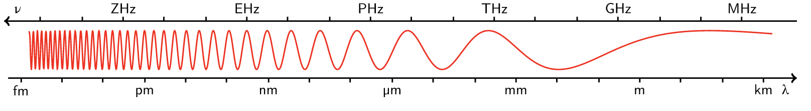

# 电磁波

## 产生
电磁波是能量的一种，凡是高于绝对零度（约为 -273.15 摄氏度）的物体，都会释放电磁波。

电磁波是电磁场的一种运动形态。电流会产生磁场，变动的磁场会产生电流。变化的电磁场在空间的传播形成了电磁波。

## 电磁波谱

波长：波的一个周期所走过的距离

频率：波在一个单位时间内走过的周期数

波的速度与光一样（光也是一种波），所以单位时间内电磁波所走的距离是一样的，频率（f），波长（λ）与光（c）之间的关系：f = c/λ。可以得出单位时间内，波长越长，波频率越低。

按照波长从短到长（即波频率从高到低）划分电磁波为：

|名称|频率|波长|能量|其它|
|:--|:--:|:--:|--|--|
|超高能量伽马射线|||||
|伽马射线（γ-rays）|300～30EHz|1~10pm|1.24MeV ~ 124keV||
|X射线（X-rays）|30EHz ~ 30PHz|10pm ~ 10nm|124keV ~ 124eV||
|紫外线（ultraviolet）|||||
|可见光（visible light）|300THz 左右|1um 左右|1.24ev||
|红外线（infrared）|||||
|太赫兹辐射（T-rays）|||||
|微波（microwaves）|30THz ~ 3THz|10um ~ 100um|124meV ~ 12.4meV||
|无线电波（radio waves）|300GHz ~ 3Hz|1mm ~ 100Mm|1.24meV ~ 12.4feV||

微波与无线电波分为：
 1. 极高频（EHF），超高频（SHF），特高频（UHF），甚高频（VHF）
 2. 高频（HF），中频（MF），低频（LM）
 3. 甚低频（VLF），特低频（ULF），超低频（SHF），极低频（EHF）

## 无线电传递信息
回想一下，声波是如何传递消息的。
1. （提供内容）大脑想出要说的话
2. （发音及调制）声带振动发出声音，舌头、口腔及气流等对声音的音调、强度进行调节，发出声波
3. （传播）声波在空气中传播
4. （接收及解调）声波到达耳膜，引起耳膜振动，耳膜将声波转换成大脑能处理的数据
5. （获得内容）大脑处理数据后获得有效信息

无线电传递类似声波
1. 待传送信息，如声音
2. 将声音转换成电信号，产生电磁波，调制器根据内容调节电磁波参数（话筒，调频振荡器，调制器等参与调节）
3. 发射天线发送电磁波
4. 接收天线获取电磁波，解调后获得电信号（接收机，解调器等参与）
5. 电信号换成声音
### 参考
> https://en.wikipedia.org/wiki/Electromagnetic_radiation
> https://blog.csdn.net/tjcwt2011/article/details/81842897
> http://www.kepu.net.cn/gb/special/2009_ybxsddb/4.html